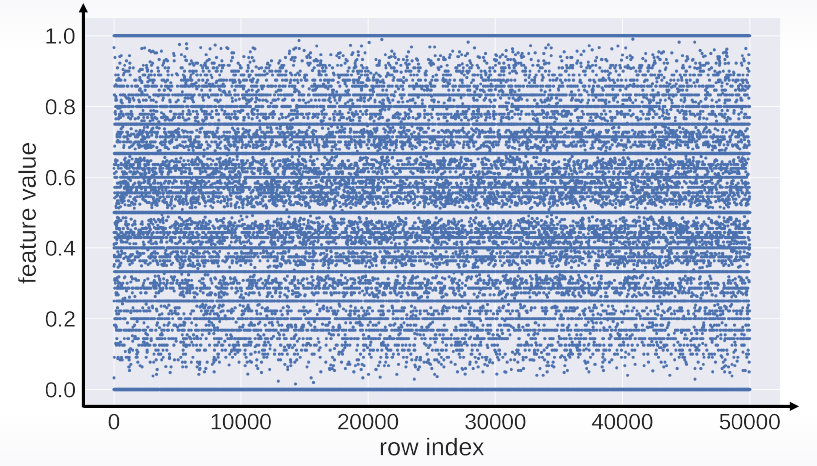
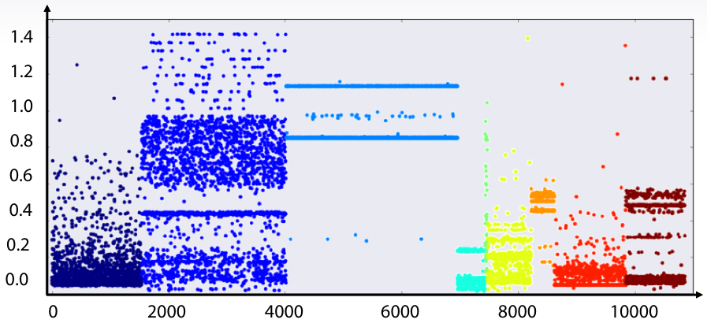
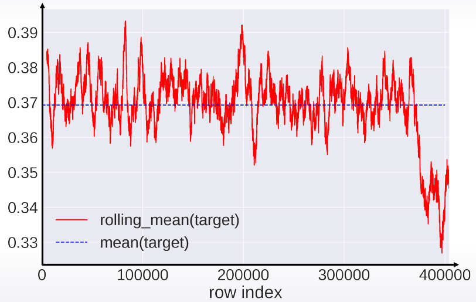
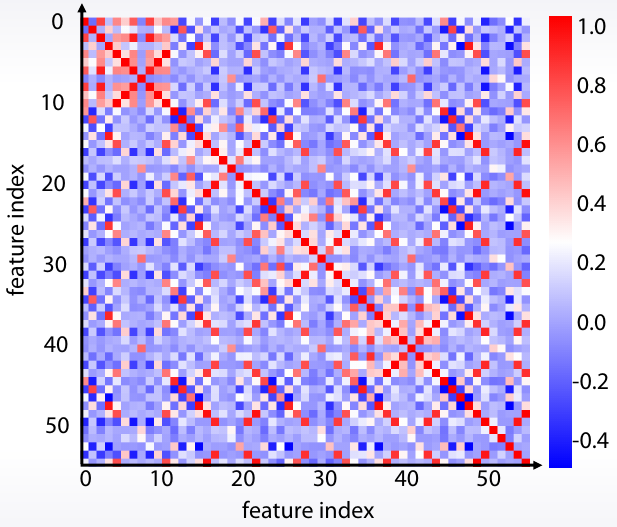
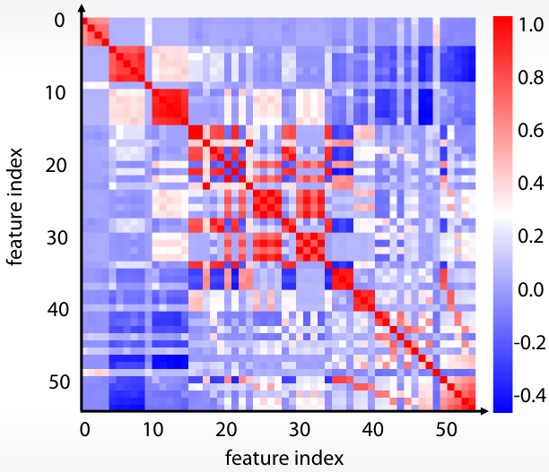
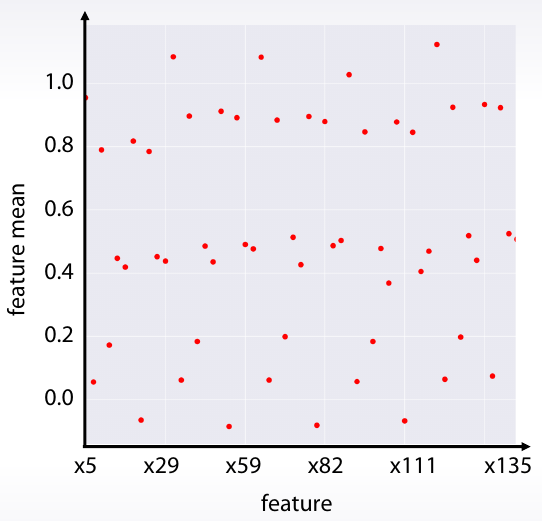
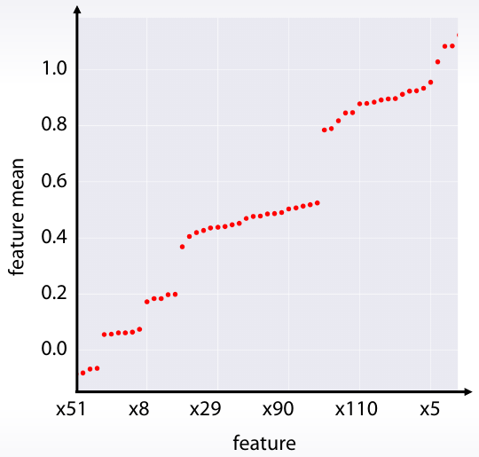

<p align="center"></p>


El Análisis Exploratorio de Datos (por sus siglas EDA en inglés) es una parte fundamental de cualquier proyecto de análisis de datos. En este capítulo veremos cuáles son las técnicas y herramientas más comunes para realizar nuestras visualizacionbes en Python.


## Librerías

<table>
  <tr>
    <th><a href="https://matplotlib.org/gallery"></a></th>
    <td>Matplotlib es un paquete para la generación de gráficos. Es la librería más usada, pero necesita muchas líneas de código para generar gráficos más complejos</td>
  </tr>
  <tr>
    <th width="200"><a href="https://seaborn.pydata.org/examples"></a></th>
    <td>Seaborn es un paquete para Python que permite generar fácilmente elegantes gráficos estadísticos. Seaborn está basada en Matplotlib y proporciona una interfaz de alto nivel que es realmente sencilla de aprender.</td>
  </tr>
  <tr>
    <th ><a href="https://altair-viz.github.io/gallery"></a></th>
    <td>Altair es un paquete de Python para la visualización de datos basado en Vega y Vega-Lite, que a su vez están basados en D3. Altair utiliza lo que se conoce como “grammar of graphics”, donde se pone énfasis es en describir la apariencia visual y el comportamiento interactivo de la visualización.</td>
  </tr>
  <tr>
    <th><a href="https://plot.ly/python"></a></th>
    <td>Plotly es una librería para gráficos interactivos. Es particularmente útil para cuando queremos hacer gráficos en 3 dimensiones. Plotly está disponible como una biblioteca para Python, R, JavaScript, Julia y MATLAB.</td>
  </tr>
  <tr>
    <th><a href="https://github.com/pandas-profiling/pandas-profiling"></a></th>
    <td>Una librería que nos permite realizar un EDA completo de nuestro dataframe con tan solo un par de lineas de código.</td>
  </tr>
    <tr>
    <th><a href="https://github.com/fbdesignpro/sweetviz"></a></th>
    <td>Otra librería al igual que Pandas Profiling que nos permite realizar un EDA con pocas líneas.</td>
  </tr>
</table>

Otros
- Bokeh
- [ggplot](http://ggplot.yhathq.com/) for Python
- Graph visualization with [NetworkX](https://networkx.org)

<h1 align="center">📊 Gráficas</h1>
<h4 align="center">Ver <a href="https://python-graph-gallery.com">Python Graph Gallery</a> y <a href="https://www.data-to-viz.com">From Data to Viz</a></h4>


<h1 align="center">Análisis Univariante</h1>

## Variable numérica: Distribución

<table>
<tr>
    <td><a href="https://python-graph-gallery.com/histogram">
        </td>
    <td><a href="https://python-graph-gallery.com/density-plot">
        </td>
    <td><a href="https://python-graph-gallery.com/boxplot">
        </td>
    <td><a href="https://python-graph-gallery.com/violin-plot">
        </td>
    <td></td>
</tr>
<tr>
    <th>Histogram</th>
    <th>Density plot</th>
    <th>Box plot</th>
    <th>Violin plot</th>
</tr>
<tr>
    <td>df.plot.hist()<br>sns.distplot()</td>
    <td>df.plot.kde()<br>sns.kdeplot()</td>
    <td>df.plot.box()<br>sns.boxplot()</td>
    <td>sns.violinplot()</td>
</tr>
</table>


## Variable Numérica: Evolución
<table>
  <tr>
    <td></td>
    <td></td>
    <td></td>
    <td></td>
  </tr>
  <tr>
    <th>Line chart</th>
    <th>Area chart</th>
    <th>Stacked area chart</th>
    <th>Stream graph</th>
  </tr>
</table>

El grafico de index vs value, es decir, el numero de la fila contra el valor de la variable es especialmente util para:
- Ver la evolucion de una variable, si hay alg'un patron temporal
- Ver si el dataset fue mezlado o no (shuffled)

<table>
  <tr>
    <td></td>
    <td></td>
    <td></td>
  </tr>
  <tr>
    <td>plt.plot(x,".")</td>
    <td>plt.scatter(range(len(x)), x, c=y)</td>
  </tr>
</table>


<h1 align="center">Análisis Bivariante</h1>


## Variable numérica + variable numérica
<table>
  <tr>
    <td></td>
    <td></td>
    <td></td>
    <td></td>
    <td></td>
    <td></td>
  </tr>
  <tr>
    <th>Scatter plot</th>
    <th>Line plot</th>
    <th>Bubble plot</th>
    <th>Heatmap</th>
    <th>Density plot 2D</th>
    <th>Correlogram</th>
  </tr>
  <tr>
    <td>df.plot.scatter()<br>plt.scatter()<br>sns.scatterplot()</td>
    <td></td>
    <td></td>
    <td>plt.matshow(np)<br>plt.imshow(np)<br>sns.heatmap(df)</td>
    <td>df.plot.hexbin()</td>
    <td>scatter_matrix(df)<br>sns.pairplot()</td>
  </tr>
</table>

<h1 align="center">Análisis Multivariante</h1>


## Matriz de correlación
Calcular **distancias entre N variables** y guardarlas en una matriz de tamaño NxN.
- **Correlación** (cuánto se paracen las variables entre si)
  - Standard correlation coefficient: `df.corr()` o `df.corr(method='pearson')`
  - Spearman rank correlation: `df.corr(method='spearman')`
  - Kendall Tau correlation coefficient: `df.corr(method='kendall')`
- A parte de la correlación, se pueden calcular otras matrices:
  - Cuántas veces una variable es más grande que otra.
  - Cuántas combinaciones distintas tienen 2 variables.

Una vez calculadas estas matrices de correlación (o cualquer otra matriz personalizada) podemos **ordenarla para encontrar grupos** gracias a [Biclustering algorithms for sorting corrplots](https://scikit-learn.org/stable/auto_examples/bicluster/plot_spectral_biclustering.html), [otra forma de clustering](https://wil.yegelwel.com/cluster-correlation-matrix/)

| Matriz de correlación    | Matriz de correlación ordenada por grupos |
|--------------------------|-------------------------------------------|
|         |                   |
| `sns.heatmap(df.corr())` | `sns.heatmap(cluster_corr(df.corr()))`    |

```python
import scipy
import scipy.cluster.hierarchy as sch

def cluster_corr(corr_array, inplace=False):
    pairwise_distances = sch.distance.pdist(corr_array)
    linkage = sch.linkage(pairwise_distances, method='complete')
    cluster_distance_threshold = pairwise_distances.max()/2
    idx_to_cluster_array = sch.fcluster(linkage, cluster_distance_threshold, criterion='distance')
    idx = np.argsort(idx_to_cluster_array)
    
    if not inplace:
        corr_array = corr_array.copy()
    
    if isinstance(corr_array, pd.DataFrame):
        return corr_array.iloc[idx, :].T.iloc[idx, :]
    return corr_array[idx, :][:, idx]
 ```

### Plot de una agragación

| Media de cada variable      | Media de cada variable (ordenada)         |
|-----------------------------|-------------------------------------------|
|             |                    |
| `df.mean().plot(style=".")` | `df.mean().sort_values().plot(style=".")` |


### Reducción dimensional


### Ranking
<table>
  <tr>
    <td></td>
    <td></td>
    <td></td>
    <td></td>
    <td></td>
  </tr>
  <tr>
    <th>Bar plot</th>
    <th>Lollipop plot</th>
    <th>Parallel coords.</th>
    <th>Radar chart</th>
    <th>Word cloud</th>
  </tr>
    <tr>
    <td>plt.scatter()<br>sns.scatterplot()</td>
    <td></td>
    <td>parallel_coordinates(df, 'cls')</td>
    <td></td>
    <td></td>
  </tr>
</table>

### Grupos
<table>
  <tr>
    <td></td>
    <td></td>
    <td></td>
    <td></td>
    <td></td>
    <td></td>
  </tr>
  <tr>
    <th>Stacked bar plot</th>
    <th>Pie chart</th>
    <th>Donut chart</th>
    <th>Dendrogram</th>
    <th>Treemap</th>
    <th>Venn diagram</th>
  </tr>
</table>


# ❓ Missing values

- Missings de cada **celda** `df.isnull()`
  - Plot `sb.heatmap(df.isnull())`
- Missings de cada **variable** `df.isnull().sum(axis=0)` o `df.isnull().sum()`
  - Ordenados: `df.isnull().sum().sort_values(ascending=False)`
  - En porcentaje: `df.isnull().sum() / len(df) * 100`
- Missings de cada **fila** `df.isnull().sum(axis=1)`

### Paquete [missingno](https://github.com/ResidentMario/missingno)
```python
import missingno
```

<table>
<tr>
  <td></td>
  <td></td>
</tr>
  <tr>
    <th>missingno.matrix(df)</th>
    <th>missingno.bar(df)</th>
  </tr>
</table>

<table>
<tr>
  <td></td>
  <td></td>
</tr>
  <tr>
    <th>missingno.heatmap(df)</th>
    <th>missingno.dendrogram(df)</th>
  </tr>
</table>


## EDA automático

- Ver variables de forma individual (histogramas, valores mas comunes, media, etc)
- Correlaciones
- Valores perdidos

|         | [Pandas profiling](https://github.com/pandas-profiling/pandas-profiling) | <a href="https://github.com/fbdesignpro/sweetviz"></a> |
|---------|--------------------------------------------------------------------------|-----------------------------------------------------|
| Import  | `from pandas_profiling import ProfileReport`                             | `import sweetviz as sv`                             |
| Crear   | `report = ProfileReport(df)`                                             | `report = sv.analyze(df)`                           |
| Ver     | `report.to_notebook_iframe() `                                           | `report.show_html()`                                |
| Guardar | `report.to_file("report.html")`                                          |                                                     |
|  |  |  |


**[PandasGUI](https://github.com/adamerose/pandasgui)** es otra opción.


> ## Referencias
> - [**Kaggle learn: data visualization**](https://www.kaggle.com/learn/data-visualization)
