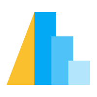

El Análisis Exploratorio de Datos (por sus siglas EDA en inglés) es una parte fundamental de cualquier proyecto de análisis de datos. En este capítulo veremos cuáles son las técnicas y herramientas más comunes para realizar nuestras visualizacionbes en Python.

## Librerías

<table>
  <tr>
    <th></th>
    <td>Matplotlib es un paquete para la generación de gráficos. Es la librería más usada, pero necesita muchas líneas de código para generar gráficos más complejos</td>
  </tr>
  <tr>
    <th width="200"></th>
    <td>Seaborn es un paquete para Python que permite generar fácilmente elegantes gráficos estadísticos. Seaborn está basada en Matplotlib y proporciona una interfaz de alto nivel que es realmente sencilla de aprender.</td>
  </tr>
  <tr>
    <th ></th>
    <td>Altair es un paquete de Python para la visualización de datos basado en Vega y Vega-Lite, que a su vez están basados en D3. Altair utiliza lo que se conoce como “grammar of graphics”, donde se pone énfasis es en describir la apariencia visual y el comportamiento interactivo de la visualización.</td>
  </tr>
  <tr>
    <th></th>
    <td>Plotly es una librería para gráficos interactivos. Es particularmente útil para cuando queremos hacer gráficos en 3 dimensiones. Plotly está disponible como una biblioteca para Python, R, JavaScript, Julia y MATLAB.</td>
  </tr>
  <tr>
    <th></th>
    <td>Una librería que nos permite realizar un EDA completo de nuestro dataframe con tan solo un par de lineas de código.</td>
  </tr>
    <tr>
    <th></th>
    <td>Otra librería al igual que Pandas Profiling que nos permite realizar un EDA con pocas líneas.</td>
  </tr>
</table>

<h1 align="center">📊 Gráficas</h1>
<h4 align="center">Ver <a href="https://python-graph-gallery.com">Python Graph Gallery</a> y <a href="https://www.data-to-viz.com">From Data to Viz</a></h4>

### Variable numérica: Distribución

<table>
<tr>
    <td><a href="https://python-graph-gallery.com/histogram">
        </td>
    <td><a href="https://python-graph-gallery.com/density-plot">
        </td>
    <td><a href="https://python-graph-gallery.com/boxplot">
        </td>
    <td><a href="https://python-graph-gallery.com/violin-plot">
        </td>
    <td></td>
</tr>
<tr>
    <th>Histogram</th>
    <th>Density plot</th>
    <th>Box plot</th>
    <th>Violin plot</th>
</tr>
<tr>
    <td>df.plot.hist() sns.distplot()</td>
    <td>df.plot.kde() sns.kdeplot()</td>
    <td>df.plot.box() sns.boxplot()</td>
    <td>sns.violinplot()</td>
</tr>
</table>

### Variable numérica + variable numérica
<table>
  <tr>
    <td></td>
    <td></td>
    <td></td>
    <td></td>
    <td></td>
    <td></td>
  </tr>
  <tr>
    <th>Scatter plot</th>
    <th>Line plot</th>
    <th>Bubble plot</th>
    <th>Heatmap</th>
    <th>Density plot 2D</th>
    <th>Correlogram</th>
  </tr>
  <tr>
    <td>df.plot.scatter() plt.scatter() sns.scatterplot()</td>
    <td></td>
    <td></td>
    <td>plt.imshow(np) sns.heatmap(df)
    </td>
    <td>df.plot.hexbin()</td>
    <td>scatter_matrix(df) sns.pairplot()</td>
  </tr>
</table>

### Ranking
<table>
  <tr>
    <td></td>
    <td></td>
    <td></td>
    <td></td>
    <td></td>
  </tr>
  <tr>
    <th>Bar plot</th>
    <th>Lollipop plot</th>
    <th>Parallel coords.</th>
    <th>Radar chart</th>
    <th>Word cloud</th>
  </tr>
    <tr>
    <td>plt.scatter() sns.scatterplot()</td>
    <td></td>
    <td>parallel_coordinates(df, 'cls')</td>
    <td></td>
    <td></td>
  </tr>
</table>

### Grupos
<table>
  <tr>
    <td></td>
    <td></td>
    <td></td>
    <td></td>
    <td></td>
    <td></td>
  </tr>
  <tr>
    <th>Stacked bar plot</th>
    <th>Pie chart</th>
    <th>Donut chart</th>
    <th>Dendrogram</th>
    <th>Treemap</th>
    <th>Venn diagram</th>
  </tr>
</table>

### Evolución temporal
<table>
  <tr>
    <td></td>
    <td></td>
    <td></td>
    <td></td>
  </tr>
  <tr>
    <th>Line chart</th>
    <th>Area chart</th>
    <th>Stacked area chart</th>
    <th>Stream graph</th>
  </tr>
</table>

## EDA automático

- Ver variables de forma individual (histogramas, valores mas comunes, media, etc)
- Correlaciones
- Valores perdidos

|         | [Pandas profiling](https://github.com/pandas-profiling/pandas-profiling) |  |
|---------|--------------------------------------------------------------------------|-----------------------------------------------------|
| Import  | `from pandas_profiling import ProfileReport`                             | `import sweetviz as sv`                             |
| Crear   | `report = ProfileReport(df)`                                             | `report = sv.analyze(df)`                           |
| Ver     | `report.to_notebook_iframe() `                                           | `report.show_html()`                                |
| Guardar | `report.to_file("report.html")`                                          |                                                     |
|  |  |  |

**[PandasGUI](https://github.com/adamerose/pandasgui)** es otra opción.

> ## Referencias
> - [**Kaggle learn: data visualization**](https://www.kaggle.com/learn/data-visualization)
