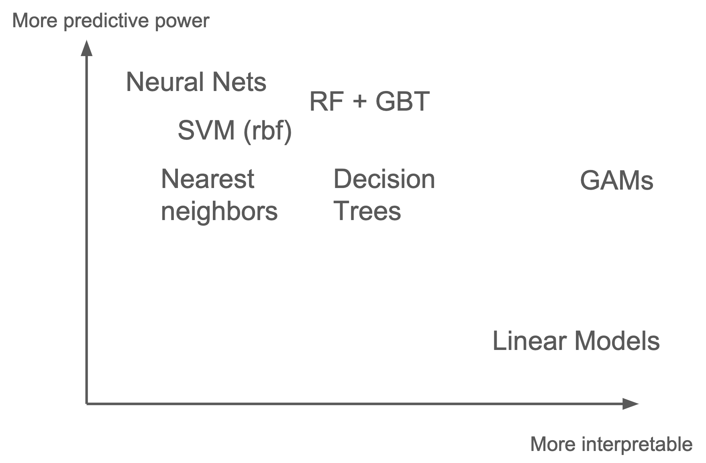

El algoritmo encargado de realizar la prediccón siepre será una combinación de:
1. Prepocesado de datos
2. Modelo de Machine Learning 

## ¿Qué modelo usar?

Los veremos más adelante, pero la regla general es:
- **Más poderosos**: Random Forest (RF), Gradient Boosting (GMB) y Redes Neuronales (NN)
- **Más interpretables**: Modelo lineal (LM), Generalized Additive Model (GAM) y Árbol de Decisión (DT)

| Modelo                | Comentario                           | Librería                   | More info |
|:---------------------:|--------------------------------------|----------------------------|-----------|
| **Decission Tree**    | Simple and explicable.               | Sklearn                    |           |
| **Linear models**     | Simple and explicable.               | Sklearn o RAPIDS           |           |
| **GAMs**              | Simple and explicable.               | pyGAM                      |           |
| **Random Forest**     | Good starting point (tree enesemble) | Sklearn o RAPIDS           |           |
| **Gradient Boosting** | Usually the best (tree enesemble)    | XGBoost, LighGBM, Catboost |           |
| **Neural Network**    | Good if lot of data.                 | Keras, Pytorch, Fast.ai    | [blog](https://hackernoon.com/gain-state-of-the-art-results-on-tabular-data-with-deep-learning-and-embedding-layers-a-how-to-guide-r17b36k8) |

