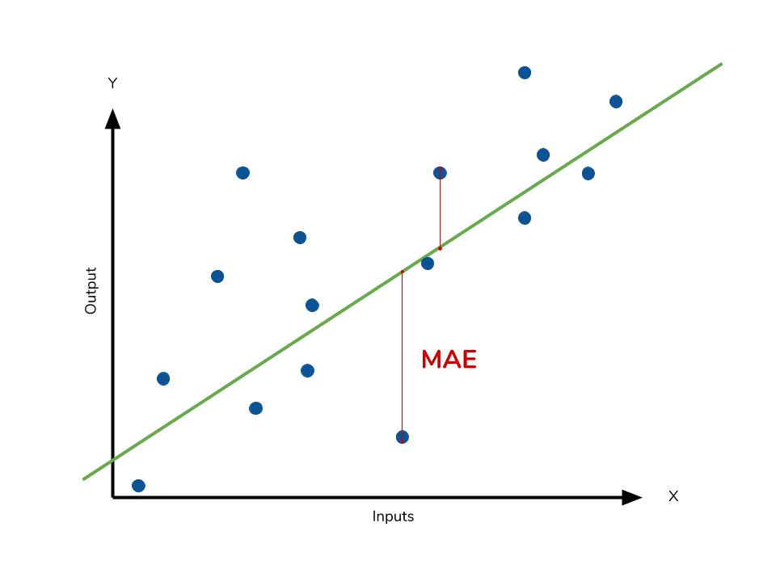
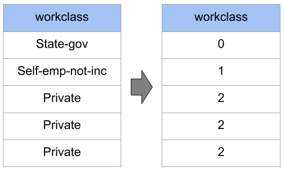

<h1 align="center">Introducción al Machine Learning</h1>

## Software

<table>
  <tr>
    <th width="200"><a href="https://scikit-learn.org"></a></th>
    <td>Scikit-learn es probablemente la librería más útil para Machine Learning en Python, es de código abierto y es reutilizable en con otras librerías. Proporciona una gran gama de algoritmos para el preprocesado de datos, aprendizaje supervisado, análisis no supervisado, y mucho más.</td>
  </tr>
</table>


## Definir el problema

<table>
  <thead>
    <tr>
      <th></th>
      <th><h3>Regresión</h3></th>
      <th><h3>Clasificación</h3></th>
      <th>Clasificación binaria</th>
      <th>Clasificacón multietiqueta</th>
    </tr>
  </thead>
  <tbody>
    <!------------------------------------- Imagen -------------------------------->
    <tr>
      <td></td>
      <td></td>
      <td></td>
      <td></td>
      <td></td>
    </tr>
    <!------------------------------------- Descripción -------------------------------->
    <tr>
      <th>Descripción</th>
      <td>Predecir cualquier valor medible</td>
      <td>Predecir 1 clase entre muchas</td>
      <td>Predecir sí/no</td>
      <td>Predecir varias clases entre muchas</td>
    </tr>
    <!------------------------------------- Métricas -------------------------------->
    <tr>
      <th>Métricas comunes</th>
      <td>
        <ul>
          <li><b>MAE</b>: Error medio</li>
          <li><b>MSE</b>: Error cuadrático medio</li>
          <li><b>RMSE</b>: Raíz cuadrada del MSE</li>
        </ul>
      </td>
      <td>
        <ul>
          <li><b>Accuracy</b>: Número de aciertos</li>
          <li><b>Bal Accuracy</b></li>
        </ul>
      </td>
      <td>
        <ul>
          <li><b>Accuracy</b></li>
          <li><b>AUC</b></li>
          <li><b>F1</b></li>
        </ul>
      </td>
      <td></td>
    </tr>
     <!------------------------------------- Datasets -------------------------------->
    <tr>
      <th>Datasets</th>
      <td>
        <ul>
          <li><a href="https://www.kaggle.com/c/house-prices-advanced-regression-techniques">House Prices</a></li>
          <li><a href="https://www.kaggle.com/c/competitive-data-science-predict-future-sales">Predict Future Sales</a></li>
        </ul>
      </td>
      <td>
        <ul>
          <li><a href="https://www.kaggle.com/uciml/iris">Iris Species</a></li>
        </ul>
      </td>
      <td>
        <ul>
          <li><a href="https://www.kaggle.com/c/titanic">Titanic</a></li>
          <li><a href="https://www.kaggle.com/wenruliu/adult-income-dataset">Adult Income</a></li>
          <li><a href="https://www.kaggle.com/c/word2vec-nlp-tutorial">IMDB sentiment analysis</a></li>
        </ul>
      </td>
      <td>
        <ul>
          <li><a href="https://www.kaggle.com/c/jigsaw-toxic-comment-classification-challenge/overview/evaluation">Toxic Comment</a></li>
        </ul>
      </td>
    </tr>
  </tbody>
</table>

- Series temporales
  - [Hourly Energy Consumption](https://www.kaggle.com/robikscube/hourly-energy-consumption)


Estos son los tipos de problema más comunes a resolver.


## ¿Qué modelo usar?

<p align="center"></p>

Los veremos más adelante, pero la regla general es:
- **Más poderosos**: Random Forest (RF), Gradient Boosting (GMB) y Redes Neuronales (NN)
- **Más interpretables**: Modelo lineal (LM), Generalized Additive Model (GAM) y Árbol de Decisión (DT)

| Modelo                | Comentario                           | Librería                   | More info |
|:---------------------:|--------------------------------------|----------------------------|-----------|
| **Decission Tree**    | Simple and explicable.               | Sklearn                    |           |
| **Linear models**     | Simple and explicable.               | Sklearn o RAPIDS           |           |
| **GAMs**              | Simple and explicable.               | pyGAM                      |           |
| **Random Forest**     | Good starting point (tree enesemble) | Sklearn o RAPIDS           |           |
| **Gradient Boosting** | Usually the best (tree enesemble)    | XGBoost, LighGBM, Catboost |           |
| **Neural Network**    | Good if lot of data.                 | Keras, Pytorch, Fast.ai    | [blog](https://hackernoon.com/gain-state-of-the-art-results-on-tabular-data-with-deep-learning-and-embedding-layers-a-how-to-guide-r17b36k8) |


<h1 align="center">Optimización de hiperparámetros</h1>

Los modelos son configurables y si de cada uno obtenemos su mejor versión para nuestros datos, obtendremos resultados todavía mejores. Esto es lo que se conoce como optimización de hiperparámetros.

> - [Optimización de hiperparámetros en Sklearn](https://scikit-learn.org/stable/modules/grid_search.html)
> - [Optimización de hiperparámetros con Hyperopt](http://fastml.com/optimizing-hyperparams-with-hyperopt/)
> - [Guía to Optimización de hiperparámetros para Gradient Boosting](https://www.analyticsvidhya.com/blog/2016/02/complete-guide-parameter-tuning-gradient-boosting-gbm-python)

<h1 align="center">Métricas</h1>


## Métricas de clasificación
- AUC no es derivable

## Métricas de regresión

| Mean Absolute Error (MAE)   |  Mean Squared Error (MSE) |
|-----------------------------|---------------------------|
|        |      |


|          |  Métrica                         | Error plot for 5, 6, 8, 9, 27        | Derivable | Mejor Constante        | Equivalente         |
|:--------:|----------------------------------|--------------------------------------|-----------|-------------------------|--------------------|
| **MAE**  | Mean Absolute Error              |                      | ✔️        | Median<br>(8)          |                    |
| **MSE**  | Mean Squared Error               |                      | ✔️        | Mean<br>(11)           | RMSE,<br>R-squared |
| **MAPE** | Mean Absolute Percentage Error   |                     | ✔️        | Weighted median<br>(6) |              |
| **MSPE** | Mean Square Percentage Error     |                     | ✔️        | Weighted mean<br>(6.6) |              |
| **MSLE** | Mean Square Logarithmic Error    |  | ✔️        | log(mean)<br>(9.11)    | RMSLE        |
| **R2**   | R-squared                        |                                      | ✔️        | |
| **r**    | Spearman's Rank Correlation Coef |                                      | ❌        | |
| **p**    | Pearson Correlation Coef         |                                      | ?          | |


> #### Información adicional
>
> - Métricas de Clasificación
>   - [Evaluation Metrics for Classification Problems: Quick Examples + References](https://queirozf.com/entries/evaluation-metrics-for-classification-quick-examples-references)
>   - [Decision Trees: “Gini” vs. “Entropy” criteria](https://www.garysieling.com/blog/sklearn-gini-vs-entropy-criteria)
>   - [Understanding ROC curves](http://www.navan.name/roc)
> - Métricas de Regresión
>   - [Metrics used for regression](https://safjan.com/kaggle-evaluation-metrics-used-for-regression-problems)
> - Métricas de Ranking
>   - [Learning to Rank Overview](https://wellecks.wordpress.com/2015/01/15/learning-to-rank-overview/)
>   - Paper [Learning to Rank using Gradient Descent](https://icml.cc/2015/wp-content/uploads/2015/06/icml_ranking.pdf): Original paper about pairwise method for AUC optimization
>   - Paper [From RankNet to LambdaRank to LambdaMART](https://www.microsoft.com/en-us/research/wp-content/uploads/2016/02/MSR-TR-2010-82.pdf): Overview of further developments of RankNet
>   - [RankLib](https://sourceforge.net/p/lemur/wiki/RankLib): Implementación de los 2 papers anteriores.
> - Métricas de Clustering
>   - Paper [Evaluation metrics for clustering](http://nlp.uned.es/docs/amigo2007a.pdf)


<h1 align="center">Validación</h1>

La selección del **conjunto de validación** es una de la cosas más importantes. Recuerda:

<h3 align="center">NUNCA USES LOS DATOS DE ENTRENAMIENTO PARA MEDIR LO BUENO QUE ES TU MODELO</h3>

- Train test split (Holdout)
- Cross validation (K-Fold)
  - Stratified K-Fold
  - Grouped K-Fold
  - Repeated K-Fold
- Leave One Out (LOO)
- Leave P Out (LPO)

> - [Validación en Sklearn](https://scikit-learn.org/stable/modules/cross_validation.html)
> - [Consejos para validar en una competición](http://www.chioka.in/how-to-select-your-final-models-in-a-kaggle-competitio/)


<h1 align="center">Preprocesamiento</h1>

<table>
  <tr>
    <tD></tD>
    <tD>
      <h3>Modelos basados en árbol</h3>
      <ul>
        <li>Decission Tree</li>
        <li>Random Forest</li>
        <li>Extra Trees</li>
        <li>Adaboost</li>
        <li>Gradient Boosting</li>
        <li>XGBoost</li>
        <li>LightGBM</li>
        <li>CatBoost</li>
      </ul>
    </tD>
    <td>
      <h3>Modelos "mutiplicativos"</h3>
      <ul>
        <li>Linear Models (LM)</li>
        <li>Generalized Additive Model (GAM)</li>
        <li>Neural Networks (NN)</li>
        <li>K-Nearest Neighbors (KNN)</li>
        <li>Suport Vector Machines (SVM)</li>
        <li>Naive Bayes (NB)</li>
        <li>Dimensionality Reduction models
          <ul>
            <li>PCA</li>
            <li>t-SNE</li>
            <li>UMAP</li>
          </ul>
        </li>
      </ul>
    </td>
  </tr>
  <tr>
    <th>Variable<br>Categórica<br>Ordinal</th>
    <td>
      <ul>
        <li><b><a href="https://scikit-learn.org/stable/modules/generated/sklearn.preprocessing.OrdinalEncoder.html">Ordinal encoding</a></b></li>
        <li>Other: Frequency encoding</li>
      </ul>
    </td>
    <td>
      <ul>
        <li><b><a href="https://scikit-learn.org/stable/modules/generated/sklearn.preprocessing.OneHotEncoder.html">One Hot encoding</a></b></li>
        <li>Other: Embedding</li>
      </ul>
    </td>
  </tr>
  <tr>
    <th>Variable<br>Numérica</th>
    <td align=Center><b>Nada</b></td>
    <td>
      <ul>
        <li><b><a href="https://scikit-learn.org/stable/modules/generated/sklearn.preprocessing.StandarScaler.html">StandarScaler</a></b> (Normalizar)</li>
        <li>MinMaxScaler</li>
        <li>Si no sigue una distribución norma (Skewed):
          <ul>
            <li>np.log(1+x)</li>
            <li>np.sqrt(x+2/3)</li>
            <li>Box-Cox</li>
          </ul>
        </li>
      </ul>
    </td>
  </tr>
  <tr>
    <th>Texto</th>
    <td colspan="2" align=Center>
        <b><a href="https://scikit-learn.org/stable/modules/generated/sklearn.feature_extraction.text.CountVectorizer.html">CountVectorizer</a></b>,
        <b><a href="https://scikit-learn.org/stable/modules/generated/sklearn.feature_extraction.text.TfidfVectorizer.html">TfidfVectorizer</a></b>,
        <b><a href="https://scikit-learn.org/stable/modules/generated/sklearn.feature_extraction.text.HashingVectorizer.html">HashingVectorizer</a></b>,
        Word embeddings
    </td>
  </tr>
</table>

```python
from sklearn import preprocessing, compose

x_preprocessing_tree = compose.ColumnTransformer(transformers=[
    ('cat', preprocessing.OrdinalEncoder(),  cat_vars),
], remainder='passthrough')

x_preprocessing_mult = compose.ColumnTransformer(transformers=[
    ('cat', preprocessing.OneHotEncoder(),  cat_vars),
    ('num', preprocessing.StandardScaler(), num_vars),
], remainder='drop') 
```

## Variables numéricas
TO-DO: Scaling and Normalization
> - [Feature Scaling and the effect of standardization for machine learning algorithms](https://sebastianraschka.com/Articles/2014_about_feature_scaling.html)

### RankGauss (aka QuantileTransformer)

Its based on rank transformation.

1. Assign a linspace to the sorted features from 0..1,
2. Apply the inverse of error function ErfInv to shape them like gaussians,
3. Substract the mean.

This works usually much better than standard mean/std scaler or min/max.

`RankGauss = QuantileTransformer(n_quantiles=100, random_state=0, output_distribution="normal")`

### Variance Threshold

- VarianceThreshold is a method of feature selection.
- It removes all features whose variance doesn’t meet some threshold. 

### [Map data to a normal distribution](https://scikit-learn.org/stable/auto_examples/preprocessing/plot_map_data_to_normal.html): Box-Cox
A Box Cox transformation is a generic way to transform non-normal variables into a **normal shape**.

| Lambda value (λ) | Transformed data |
|------------------|------------------|
| -3               | Y⁻³ = 1/Y³       |
| -2               | Y⁻² = 1/Y²       |
| -1               | Y⁻¹ = 1/Y¹       |
| -0.5             | Y⁻⁰·⁵ = 1/√Y      |
| 0                | log(Y)           |
| 0.5              | Y⁰·⁵ = √Y         |
| 1                | Y¹               |
| 2                | Y²               |
| 3                | Y³               |


## Categorical features

| Ordinal Encoding o Label Encoding    | One-Hot Encoding        |
|--------------------------------------|-------------------------|
|                  |  |

> ## Target Encoding o Mean Encoding
> 


## Ingeniería de características = CREATIVIDAD + CONOCIMIENTO DEL DOMINIO

La ingeniería de características (Feature Engineering) es la **generación** de nuevas características en base a las ya existentes. Esto facilita el trabajo a nuestros modelos.

- Si tienes el precio de la casa y los metros cuadrados, puedes añadir el precio del metro cuadrado.
- Si tines la distancia en el eje x e y, puedes añadir la distancia directa por pitagoras.
- Si tines precios, puedes añanir la parte fraccionaria pq es muy subjetiva en la gente.

> - [Discover Feature Engineering, How to Engineer Features and How to Get Good at It](https://machinelearningmastery.com/discover-feature-engineering-how-to-engineer-features-and-how-to-get-good-at-it/)
> - [Discussion of feature engineering on Quora](https://www.quora.com/What-are-some-best-practices-in-Feature-Engineering)


<h1 align="center">Fuga de datos</h1>

La fuga de datos conocida como **Data Leakage** en inglés, es cuando se introducen datos los cuales son imposibles de disponer en la vida real.

> - [Perfect score script](https://www.kaggle.com/olegtrott/the-perfect-score-script) used to probe leaderboard
> - [Page about data leakages on Kaggle](https://www.kaggle.com/docs/competitions#leakage)
> - [Another page about data leakages on Kaggle](https://www.kaggle.com/dansbecker/data-leakage)

<h1 align="center">AutoML</h1>

- H2O
- PyCaret
- TPOT
