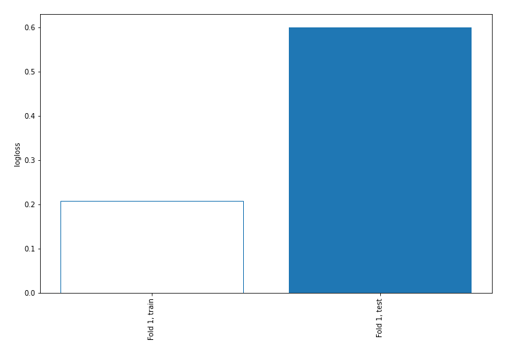
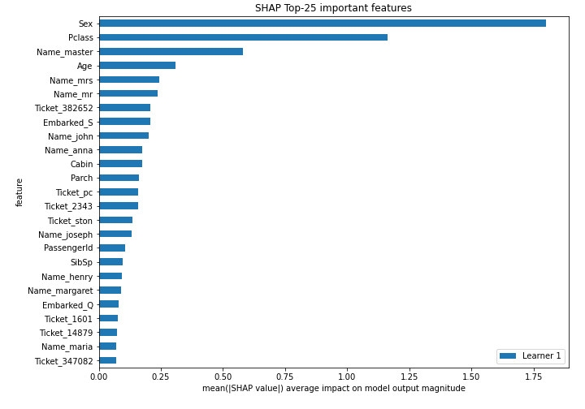

# Summary of 3_Linear

## Logistic Regression (Linear)
- **explain_level**: 2

## Validation
 - **validation_type**: split
 - **train_ratio**: 0.75
 - **shuffle**: True
 - **stratify**: True

## Optimized metric
logloss

## Training time

3.5 seconds

## Metric details
|           |    score |     threshold |
|:----------|---------:|--------------:|
| logloss   | 0.600258 | nan           |
| auc       | 0.832966 | nan           |
| f1        | 0.7109   |   0.0907052   |
| accuracy  | 0.784753 |   0.683884    |
| precision | 0.967742 |   0.952532    |
| recall    | 1        |   1.21062e-06 |
| mcc       | 0.536482 |   0.683884    |

## Confusion matrix (at threshold=0.683884)
|                     |   Predicted as negative |   Predicted as positive |
|:--------------------|------------------------:|------------------------:|
| Labeled as negative |                      87 |                      50 |
| Labeled as positive |                      11 |                      75 |

## Learning curves

## Permutation-based Importance

## SHAP Importance
