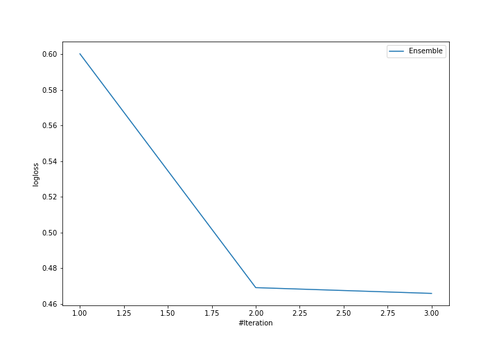

# Summary of Ensemble

## Ensemble structure
| Model          |   Weight |
|:---------------|---------:|
| 2_DecisionTree |        2 |
| 3_Linear       |        1 |

## Metric details
|           |    score |     threshold |
|:----------|---------:|--------------:|
| logloss   | 0.465834 | nan           |
| auc       | 0.854269 | nan           |
| f1        | 0.740331 |   0.403821    |
| accuracy  | 0.807175 |   0.706059    |
| precision | 0.947368 |   0.941177    |
| recall    | 1        |   1.01013e-05 |
| mcc       | 0.599535 |   0.706059    |

## Confusion matrix (at threshold=0.706059)
|                     |   Predicted as negative |   Predicted as positive |
|:--------------------|------------------------:|------------------------:|
| Labeled as negative |                     109 |                      28 |
| Labeled as positive |                      19 |                      67 |

## Learning curves
