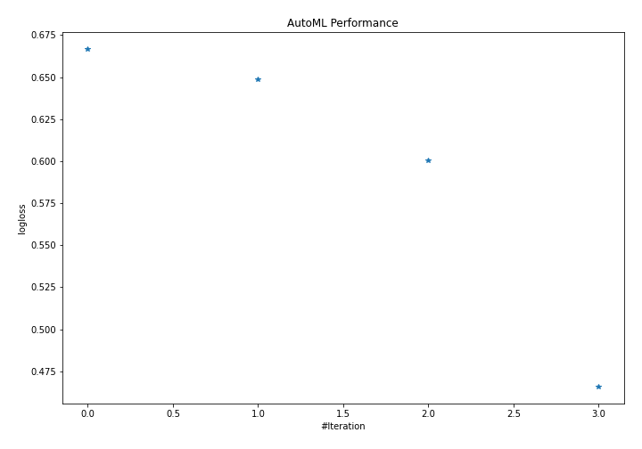
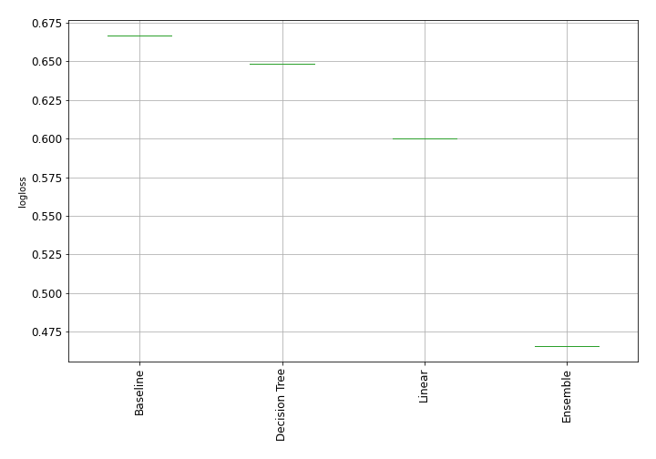

# AutoML Leaderboard

| Best model   | name           | model_type    | metric_type   |   metric_value |   train_time | Link                                     |
|:-------------|:---------------|:--------------|:--------------|---------------:|-------------:|:-----------------------------------------|
|              | 1_Baseline     | Baseline      | logloss       |       0.666775 |         0.08 | [Results link](1_Baseline/README.md)     |
|              | 2_DecisionTree | Decision Tree | logloss       |       0.648504 |         6.41 | [Results link](2_DecisionTree/README.md) |
|              | 3_Linear       | Linear        | logloss       |       0.600258 |         3.9  | [Results link](3_Linear/README.md)       |
| **the best** | Ensemble       | Ensemble      | logloss       |       0.465834 |         0.25 | [Results link](Ensemble/README.md)       |

### AutoML Performance

### AutoML Performance Boxplot
