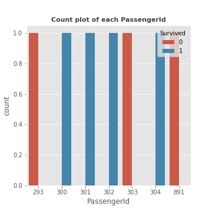
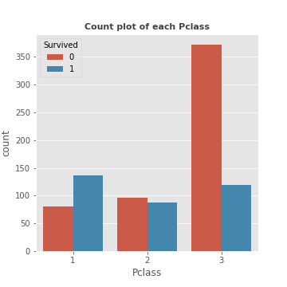
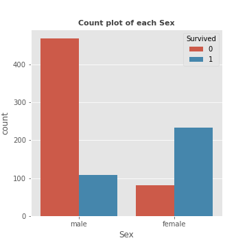
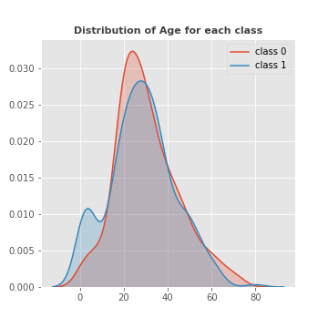
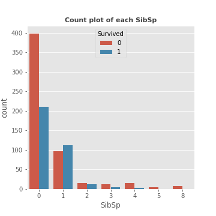
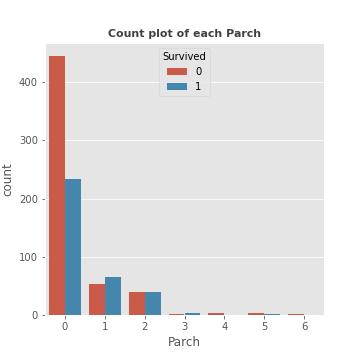
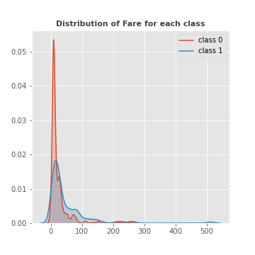
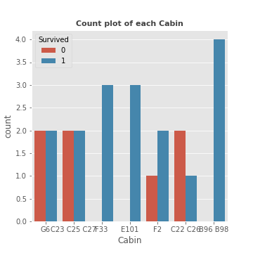
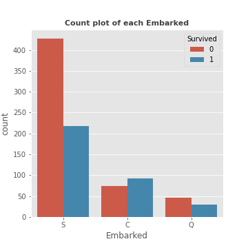
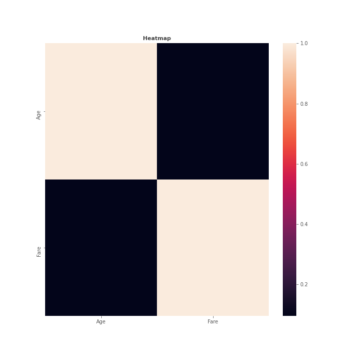

## Bivariate analysis of PassengerId feature with target

------------------------------------------------------
## Bivariate analysis of Pclass feature with target

------------------------------------------------------
## Bivariate analysis of Name feature with target

------------------------------------------------------
## Bivariate analysis of Sex feature with target

------------------------------------------------------
## Bivariate analysis of Age feature with target

------------------------------------------------------
## Bivariate analysis of SibSp feature with target

------------------------------------------------------
## Bivariate analysis of Parch feature with target

------------------------------------------------------
## Bivariate analysis of Ticket feature with target

------------------------------------------------------
## Bivariate analysis of Fare feature with target

------------------------------------------------------
## Bivariate analysis of Cabin feature with target

------------------------------------------------------
## Bivariate analysis of Embarked feature with target

------------------------------------------------------
## Heatmap

------------------------------------------------------
