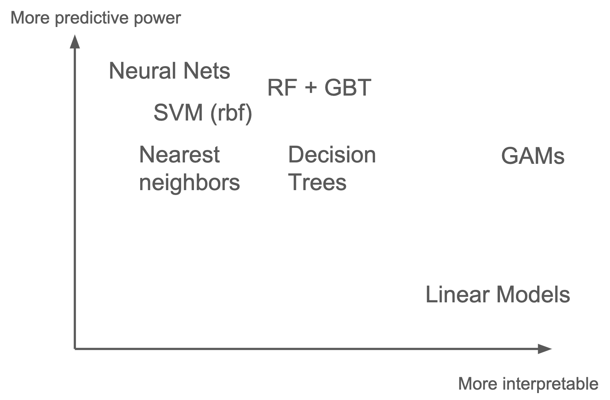
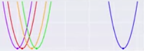
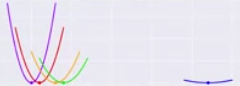
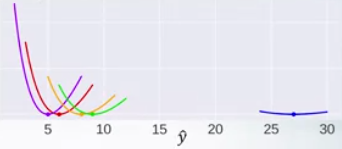

<h1 align="center">Introducción al Machine Learning</h1>

## Software

<table>
  <tr>
    <th width="200"></th>
    <td>Scikit-learn es probablemente la librería más útil para Machine Learning en Python, es de código abierto y es reutilizable en con otras librerías. Proporciona una gran gama de algoritmos para el preprocesado de datos, aprendizaje supervisado, análisis no supervisado, y mucho más.</td>
  </tr>
  <tr>
    <th></th>
    <td>H2o.ai es un framework de Machine Learning que implementa una función muy interesante llamada AutoML. AutoML es una abstracción que nos permite olvidarnos de elegir nosotros el mejor modelo para nuestros datos, ya que lo hace automáticamente.</td>
  </tr>
</table>

## Definir el problema

<table>
  <thead>
    <tr>
      <th></th>
      <th><h3>Regresión</h3></th>
      <th><h3>Clasificación</h3></th>
      <th>Clasificación binaria</th>
      <th>Clasificacón multietiqueta</th>
    </tr>
  </thead>
  <tbody>
    <!------------------------------------- Imagen -------------------------------->
    <tr>
      <td></td>
      <td></td>
      <td></td>
      <td></td>
      <td></td>
    </tr>
    <!------------------------------------- Descripción -------------------------------->
    <tr>
      <th>Descripción</th>
      <td>Predecir cualquier valor medible</td>
      <td>Predecir 1 clase entre muchas</td>
      <td>Predecir sí/no</td>
      <td>Predecir varias clases entre muchas</td>
    </tr>
    <!------------------------------------- Métricas -------------------------------->
    <tr>
      <th>Métricas comunes</th>
      <td>
        <ul>
          <li><b>MAE</b>: Error medio</li>
          <li><b>MSE</b>: Error cuadrático medio</li>
          <li><b>RMSE</b>: Raíz cuadrada del MSE</li>
        </ul>
      </td>
      <td>
        <ul>
          <li><b>Accuracy</b>: Número de aciertos</li>
          <li><b>Bal Accuracy</b></li>
        </ul>
      </td>
      <td>
        <ul>
          <li><b>Accuracy</b></li>
          <li><b>AUC</b></li>
          <li><b>F1</b></li>
        </ul>
      </td>
      <td></td>
    </tr>
     <!------------------------------------- Datasets -------------------------------->
    <tr>
      <th>Datasets</th>
      <td>
        <ul>
          <li><a href="https://www.kaggle.com/c/house-prices-advanced-regression-techniques">House Prices</a></li>
          <li><a href="https://www.kaggle.com/c/competitive-data-science-predict-future-sales">Predict Future Sales</a></li>
        </ul>
      </td>
      <td>
        <ul>
          <li><a href="https://www.kaggle.com/uciml/iris">Iris Species</a></li>
        </ul>
      </td>
      <td>
        <ul>
          <li><a href="https://www.kaggle.com/c/titanic">Titanic</a></li>
          <li><a href="https://www.kaggle.com/wenruliu/adult-income-dataset">Adult Income</a></li>
          <li><a href="https://www.kaggle.com/c/word2vec-nlp-tutorial">IMDB sentiment analysis</a></li>
        </ul>
      </td>
      <td>
        <ul>
          <li><a href="https://www.kaggle.com/c/jigsaw-toxic-comment-classification-challenge/overview/evaluation">Toxic Comment</a></li>
        </ul>
      </td>
    </tr>
  </tbody>
</table>

Estos son los tipos de problema más comunes a resolver.

## ¿Qué modelo usar?

Los veremos más adelante, pero la regla general es:
- **Más poderosos**: Random Forest (RF), Gradient Boosting (GMB) y Redes Neuronales (NN)
- **Más interpretables**: Modelo lineal (LM), Generalized Additive Model (GAM) y Árbol de Decisión (DT)

| Modelo                | Comentario                           | Librería                   | More info |
|:---------------------:|--------------------------------------|----------------------------|-----------|
| **Decission Tree**    | Simple and explicable.               | Sklearn                    |           |
| **Linear models**     | Simple and explicable.               | Sklearn o RAPIDS           |           |
| **GAMs**              | Simple and explicable.               | pyGAM                      |           |
| **Random Forest**     | Good starting point (tree enesemble) | Sklearn o RAPIDS           |           |
| **Gradient Boosting** | Usually the best (tree enesemble)    | XGBoost, LighGBM, Catboost |           |
| **Neural Network**    | Good if lot of data.                 | Keras, Pytorch, Fast.ai    | [blog](https://hackernoon.com/gain-state-of-the-art-results-on-tabular-data-with-deep-learning-and-embedding-layers-a-how-to-guide-r17b36k8) |

## Métricas de regresión

| Mean Absolute Error (MAE)   |  Mean Squared Error (MSE) |
|-----------------------------|---------------------------|
|        |      |

|          |  Métrica                         | Error plot for 5, 6, 8, 9, 27        | Derivable | Mejor Constante        | Equivalente         |
|:--------:|----------------------------------|--------------------------------------|-----------|-------------------------|--------------------|
| **MAE**  | Mean Absolute Error              |                      | ✔️        | Median (8)          |                    |
| **MSE**  | Mean Squared Error               |                      | ✔️        | Mean (11)           | RMSE, R-squared |
| **MAPE** | Mean Absolute Percentage Error   |                     | ✔️        | Weighted median (6) |              |
| **MSPE** | Mean Square Percentage Error     |                     | ✔️        | Weighted mean (6.6) |              |
| **MSLE** | Mean Square Logarithmic Error    |  | ✔️        | log(mean) (9.11)    | RMSLE        |
| **R2**   | R-squared                        |                                      | ✔️        | |
| **r**    | Spearman's Rank Correlation Coef |                                      | ❌        | |
| **p**    | Pearson Correlation Coef         |                                      | ?          | |

#### Fuentes
- https://safjan.com/kaggle-evaluation-metrics-used-for-regression-problems/

## Métricas de clasificación
- AUC no es derivable

## Selección del conjunto de validación

## Preprocesamiento

<table>
  <tr>
    <tD></tD>
    <tD>
      <h4>Tree based models</h4>
      <ul>
        <li>Decission Tree</li>
        <li>Random Forest</li>
        <li>Extra Trees</li>
        <li>Adaboost</li>
        <li>Gradient Boosting</li>
        <li>XGBoost</li>
        <li>LightGBM</li>
        <li>CatBoost</li>
      </ul>
    </tD>
    <td>
      <h4>No-tree based models</h4>
      <ul>
        <li>Linear Models (LM)</li>
        <li>Generalized Additive Model (GAM)</li>
        <li>Neural Networks (NN)</li>
        <li>K-Nearest Neighbors (KNN)</li>
        <li>Suport Vector Machines (SVM)</li>
      </ul>
    </td>
  </tr>
  <tr>
    <th>Categorical Ordinal</th>
    <td>
      <ul>
        <li><b>Ordinal encoding</b></li>
        <li>Other: Frequency encoding</li>
      </ul>
    </td>
    <td>
      <ul>
        <li><b>One hot encoding</b></li>
        <li>Other: Embedding</li>
      </ul>
    </td>
  </tr>
  <tr>
    <th>Numerical</th>
    <td><b>Nothing</b></td>
    <td>
      <ul>
        <li>MinMaxScaler</li>
        <li><b>StandarScaler</b></li>
        <li>Skewed?
          <ul>
            <li>np.log(1+x)</li>
            <li>np.sqrt(x+2/3)</li>
            <li>Box-Cox</li>
          </ul>
        </li>
      </ul>
    </td>
  </tr>
</table>

### [Map data to a normal distribution](https://scikit-learn.org/stable/auto_examples/preprocessing/plot_map_data_to_normal.html): Box-Cox
A Box Cox transformation is a generic way to transform non-normal variables into a **normal shape**.

| Lambda value (λ) | Transformed data |
|------------------|------------------|
| -3               | Y⁻³ = 1/Y³       |
| -2               | Y⁻² = 1/Y²       |
| -1               | Y⁻¹ = 1/Y¹       |
| -0.5             | Y⁻⁰·⁵ = 1/√Y      |
| 0                | log(Y)           |
| 0.5              | Y⁰·⁵ = √Y         |
| 1                | Y¹               |
| 2                | Y²               |
| 3                | Y³               |

## Categorical features

| Ordinal Encoding o Label Encoding    | One-Hot Encoding        |
|--------------------------------------|-------------------------|
|                  |  |

> ## Target Encoding o Mean Encoding
> 

## Ingeniería de características = CREATIVIDAD + CONOCIMIENTO DEL DOMINIO

La ingeniería de características (Feature Engineering) es la **generación** de nuevas características en base a las ya existentes. Esto facilita el trabajo a nuestros modelos.

- Si tienes el precio de la casa y los metros cuadrados, puedes añadir el precio del metro cuadrado.
- Si tines la distancia en el eje x e y, puedes añadir la distancia directa por pitagoras.
- Si tines precios, puedes añanir la parte fraccionaria pq es muy subjetiva en la gente.

> - [Discover Feature Engineering, How to Engineer Features and How to Get Good at It](https://machinelearningmastery.com/discover-feature-engineering-how-to-engineer-features-and-how-to-get-good-at-it/)
> - [Discussion of feature engineering on Quora](https://www.quora.com/What-are-some-best-practices-in-Feature-Engineering)
