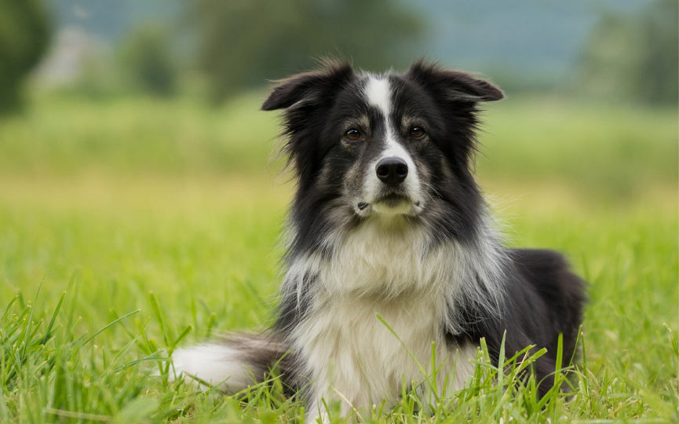

<h1 align="center">Introducción al Machine Learning</h1>

## Software

<table>
  <tr>
    <th width="200"></th>
    <td>Scikit-learn es probablemente la librería más útil para Machine Learning en Python, es de código abierto y es reutilizable en con otras librerías. Proporciona una gran gama de algoritmos para el preprocesado de datos, aprendizaje supervisado, análisis no supervisado, y mucho más.</td>
  </tr>
  <tr>
    <th></th>
    <td>H2o.ai es un framework de Machine Learning que implementa una función muy interesante llamada AutoML. AutoML es una abstracción que nos permite olvidarnos de elegir nosotros el mejor modelo para nuestros datos, ya que lo hace automáticamente.</td>
  </tr>
</table>

## Definir el problema

|          | <h3>Regresión</h3> | <h3>Clasificación</h3>   | Clasificación binaria | Clasificacón mulietiqueta |
|----------|--------------------|--------------------------|-----------------------|---------------------------|
|          |  |        |     |    |
| Descripc | Predecir cualquier valor medible | Predecir 1 clase entre muchas | Predecir si/no | Predecir varias clases entre muchas |
| Ejemplos | | | | |
| Métricas | <ul><li>MAE = Error medio</li><li>MSE = Error cuadrático</li></ul> | <ul><li>Accuracy = Número de aciertos</li><li>Bal Accuracy</li></ul> | <ul><li>Accuracy</li><li>AUC</li></ul> | |

Estos son los tipos de problema más comunes a resolver.

## Métricas de regresión

| Mean Absolute Error (MAE)   |  Mean Squared Error (MSE) |
|-----------------------------|---------------------------|
|        |      |

## Selección del conjunto de validación

## Preprocesamiento

<table>
  <tr>
    <tD></tD>
    <tD>
      <h4>Tree based models</h4>
      <ul>
        <li>Decission Tree</li>
        <li>Random Forest</li>
        <li>Extra Trees</li>
        <li>Adaboost</li>
        <li>Gradient Boosting</li>
        <li>XGBoost</li>
        <li>LightGBM</li>
        <li>CatBoost</li>
      </ul>
    </tD>
    <td>
      <h4>No-tree based models</h4>
      <ul>
        <li>Linear Models</li>
        <li>Neural Networks</li>
        <li>K-Nearest Neighbors</li>
        <li>Suport Vector Machines</li>
      </ul>
    </td>
  </tr>
  <tr>
    <th>Categorical Ordinal</th>
    <td>
      <ul>
        <li><b>Ordinal encoding</b></li>
        <li>Other: Frequency encoding</li>
      </ul>
    </td>
    <td>
      <ul>
        <li><b>One hot encoding</b></li>
        <li>Other: Embedding</li>
      </ul>
    </td>
  </tr>
  <tr>
    <th>Numerical</th>
    <td><b>Nothing</b></td>
    <td>
      <ul>
        <li>MinMaxScaler</li>
        <li><b>StandarScaler</b></li>
        <li>Skewed?
          <ul>
            <li>np.log(1+x)</li>
            <li>np.sqrt(x+2/3)</li>
            <li>Box-Cox</li>
          </ul>
        </li>
      </ul>
    </td>
  </tr>
</table>

### [Map data to a normal distribution](https://scikit-learn.org/stable/auto_examples/preprocessing/plot_map_data_to_normal.html): Box-Cox
A Box Cox transformation is a generic way to transform non-normal variables into a **normal shape**.

| Lambda value (λ) | Transformed data |
|------------------|------------------|
| -3               | Y⁻³ = 1/Y³       |
| -2               | Y⁻² = 1/Y²       |
| -1               | Y⁻¹ = 1/Y¹       |
| -0.5             | Y⁻⁰·⁵ = 1/√Y      |
| 0                | log(Y)           |
| 0.5              | Y⁰·⁵ = √Y         |
| 1                | Y¹               |
| 2                | Y²               |
| 3                | Y³               |

## Categorical features

| Ordinal Encoding o Label Encoding    | One-Hot Encoding        |
|--------------------------------------|-------------------------|
|                  |  |

> ## Target Encoding o Mean Encoding
> 

## Models

| Model                 | Comment                              | Library                    | More info |
|:---------------------:|--------------------------------------|----------------------------|-----------|
| **Decission Tree**    | Simple and explicable.               | Sklearn                    |           |
| **Linear models**     | Simple and explicable.               | Sklearn                    |           |
| **Random Forest**     | Good starting point (tree enesemble) | Sklearn                    |           |
| **Gradient Boosting** | Usually the best (tree enesemble)    | XGBoost, LighGBM, Catboost |           |
| **Neural Network**    | Good if lot of data.                 | Fast.ai v2                 | [blog](https://hackernoon.com/gain-state-of-the-art-results-on-tabular-data-with-deep-learning-and-embedding-layers-a-how-to-guide-r17b36k8) |

## Ingeniería de características = CREATIVIDAD + CONOCIMIENTO DEL DOMINIO

- Si tienes el precio de la casa y los metros cuadrados, puedes añadir el precio del metro cuadrado.
- Si tines la distancia en el eje x e y, puedes añadir la distancia directa por pitagoras.
- Si tines precios, puedes añanir la parte fraccionaria pq es muy subjetiva en la gente.
