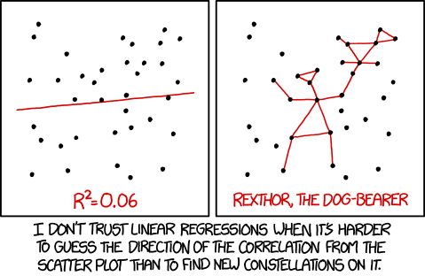

<p align="center"></p>




1. **Linear Regression**: Modelo lineal para regresión
   - How to split the data between training and test
   - Ordinary Least Squares
   - Analyzing the results of the model
2. **Logistic Regression**: Modelo lineal para clasificación
   - Sigmoid function
3. **Regulated linear models** (Penalized regression)
   - LASSO Regression (L1 Regularization)
   - Ridge Regression (L2 Regularization)
   - ElasticNet Regression (L1 & L2 Regularization)
   - LARS: Least-Angle Regression
4. **SGD**: Otra forma de modelos lineales
   - Perceptron
   - Vowpal Wabbit
5. **Variantes No Lineales**
   - Regresión Polinómica
   - Generalized Additive Models (GAM)

---


### Sowftware

#### Modelos lineales

|                                   |  Sklearn (CPU)                            | RAPIDS  (GPU)                   |
|-----------------------------------|-------------------------------------------|---------------------------------|
| Linear Regression                 | `sklearn.linear_model.LinearRegression`   | `cuml.LinearRegression`         |
| Logistic Regression               | `sklearn.linear_model.LogisticRegression` | `cuml.LogisticRegression`       |
| Ridge Regression                  | `sklearn.linear_model.Ridge`              | `cuml.Ridge`                    |
| Lasso Regression                  | `sklearn.linear_model.Lasso`              | `cuml.Lasso`                    |
| ElasticNet Regression             | `sklearn.linear_model.ElasticNet`         | `cuml.ElasticNet`               |
| MiniBatch SGD Classifier          | `sklearn.linear_model.SGDClassifier`      | `cuml.MBSGDClassifier`          |
| MiniBatch SGD Regressor           | `sklearn.linear_model.SGDRegressor`       | `cuml.MBSGDRegressor`           |
| Mutinomial Naive Bayes            |                                           | `cuml.MultinomialNB`            |
| Stochastic Gradient Descent       |                                           | `cuml.SGD`                      |
| Coordinate Descent                |                                           | `cuml.CD`                       |
| Quasi-Newton                      |                                           | `cuml.QN`                       |
| Support Vector Machine Classifier |                                           | `cuml.svm.SVC(kernel="linear")` |
| Support Vector Machine Regressor  |                                           | `cuml.svm.SVR(kernel="linear")` |


#### Modelos lineales parecidos
|                                    |  Sklearn (CPU)                            | RAPIDS  (GPU)                   |
|------------------------------------|-------------------------------------------|---------------------------------|
| Support Vector Machines Classifier | |                               cuml.svm.SVC(kernel="rbf") |
| Support Vector Machines Regressor  | |                               cuml.svm.SVR(kernel="rbf") |
| Nearest Neighbors Classification   | |                               cuml.neighbors.KNeighborsClassifier |
| Nearest Neighbors Regression       | |                               cuml.neighbors.KNeighborsRegressor |


<h3 align="center">Clasificación o Regresión?</h3>
<p align="center"></p>


# 1. Linear Regression

<p align="center"></p>

Linear Regression is a parametric model which predicts a continuous outcome feature (**Y**) from one or more explanatory features (**X**).  

beta_0 is called the intercept term, and represents the expected mean value of Y when all explanatory features equal 0.  
beta_1 is called a beta coefficient, and represents the expected change in the value of Y that results from a one unit change in X.

This is module fits a straight line to your data, where the value of the outcome feature can be calculated as a linear combination of the explanatory features. Sounds relatively simple? Afraid not, there are many nuances and conditions that need to be understood before using linear regression! We are going to delve into these assumptions and conditions and then demonstrate how to use this algorithm on the kiva dataset.


### Resources
- [Comprehensive Guide to Regression](https://www.analyticsvidhya.com/blog/2015/08/comprehensive-guide-regression/)
- [Understanding key regression statistics](http://connor-johnson.com/2014/02/18/linear-regression-with-python/)


# 2. Logistic regression

<p align="center"></p>


Logistic regression is very similar to linear regression but has a categorical outcome instead. So rather than modeling a continuous dependent variable, it models a binary classification - yes or no, true or false, 1 or 0. This is still a linear model as it assumes a linear relationship between the independent variables and the link function.  

To learn more about Logistic Regression, try to following resources:
- [Beginners guide to Logistic Regression](https://www.analyticsvidhya.com/blog/2015/11/beginners-guide-on-logistic-regression-in-r/): A good overview of the theory and mathematics behind the algorithm
- [Logistic Regression in Python](http://blog.yhat.com/posts/logistic-regression-python-rodeo.html): A thorough tutorial on a publicly available dataset in Python


# 3. Regularización
Both linear and logistic regression have a tendancy to overfit when there are a large number of features. Therefore it is important that we choose the features which have the most predictive power but how do we choose these features? We can use our EDA to a certain extent but that only goes so far.

This is where ridge and lasso regularization techniques come into play! Both of these techniques can be used to identify which features explain the most variance and should therefore be kept in the model.

Visualmente, los coeficientes (w) solo pueden tomar un valor de su eje dentro de la región azul que más se acerque al mínimo.

| L1 (LASSO)          | L2 (Ridge)          | Elastic Net               |
|---------------------|---------------------|---------------------------|
|   |   |   |
| Acerca coefficientes a 0. Good for variable selection | **Más usado**. Makes coefficients smaller | Tradeoff between variable selection and small coefficients |
| Penalizes the sum of absolute weights | Penalizes the sum of squared weights | Combination of 2 before |
| `loss + wd * weights.abs().sum()` | `loss + wd * weights.pow(2).sum()` |


> ### Más información:
> - [Complete tutorial on ridge and lasso regression in python](https://www.analyticsvidhya.com/blog/2016/01/complete-tutorial-ridge-lasso-regression-python/): A broad tutorial explaining why we use regularization techniques, touching on the mathematics behind the algorithms and giving a few examples in python.
> - [An Introduction to Statistical Learning, Chapter 6.2](http://www-bcf.usc.edu/%7Egareth/ISL/ISLR%20Sixth%20Printing.pdf): A comprehensive explanation of both Lasso and Ridge and their application in the context of statistical learning.


<p align="center"></p>

# 4. Regresión Polinómica
```python
from sklearn.preprocessing import PolynomialFeatures
from sklearn.pipeline import Pipeline

# creating pipeline and fitting it on data
poly_regr = Pipeline([('polynomial',PolynomialFeatures(degree=2)),
                      ('model', LinearRegression())])

pipe.fit(x, y)
```

<p align="center"></p>


## Regresión local (LOESS o LOWESS)

Se crean muchas regresesione lineales, donde cada una se entrena con los puntos de su región. Luego se sueviza. **Desventaja: solo vale para x con 1 varaible**.

<p align="center"></p>

```python
from statsmodels.nonparametric.smoothers_lowess import lowess

smooth = lowess(endog=y, exog=x)
index, pred = np.transpose(smooth)
```

[Video explicativo](https://www.youtube.com/watch?v=Vf7oJ6z2LCc)


# 5. Generalized Additive Model (GAM)

GAM captura los patrones no lineales de cada variable (que la regresión lineal no puede capturar) y los suma (como la regresión lineal).
<p align="center"></p>

Tradicionalemente, las no-linearidades son caputuras por binning o polinomios. Pero GAM las captura automaticamnte (mediante splines).

Lo mejor de GAM es la explicabilidad de cada variable mediante gráficos de PDP (Partial Dependency Plot):
<p align="center"></p>


Parámetros a tener en cuenta para optimizar:
- **`n_splines`**: Número de trozos para componer y juntar. (25 por defecto)
- **`lam`**: Término de penalización. (0.6 por defecto)
- **`constraints`**: Monotonically constraint. ("none" por defcto)

<p align="center"></p>


Instalar pyGAM:
```
pip install pygam
```

Ejemplo:
```python
from pygam import LinearGAM    # Para regresión
from pygam import LogisticGAM  # Para clasificación

x = df[['var1', 'var2', 'var3']]
y = df[target_var]

gam = LogisticGAM().fit(x, y)
```

#### Referencias
- [Video explicativo](https://www.youtube.com/watch?v=XQ1vk7wEI7c)
- [Blog explicativo 1](https://multithreaded.stitchfix.com/blog/2015/07/30/gam)
- [Blog explicativo 2](https://codeburst.io/pygam-getting-started-with-generalized-additive-models-in-python-457df5b4705f)
- [Blog explicativo 3](https://medium.com/just-another-data-scientist/building-interpretable-models-with-generalized-additive-models-in-python-c4404eaf5515)
- [H20 GAM documentation](https://docs.h2o.ai/h2o/latest-stable/h2o-docs/data-science/gam.html)
- [pyGAM documentation](https://pygam.readthedocs.io/en/latest/index.html)
