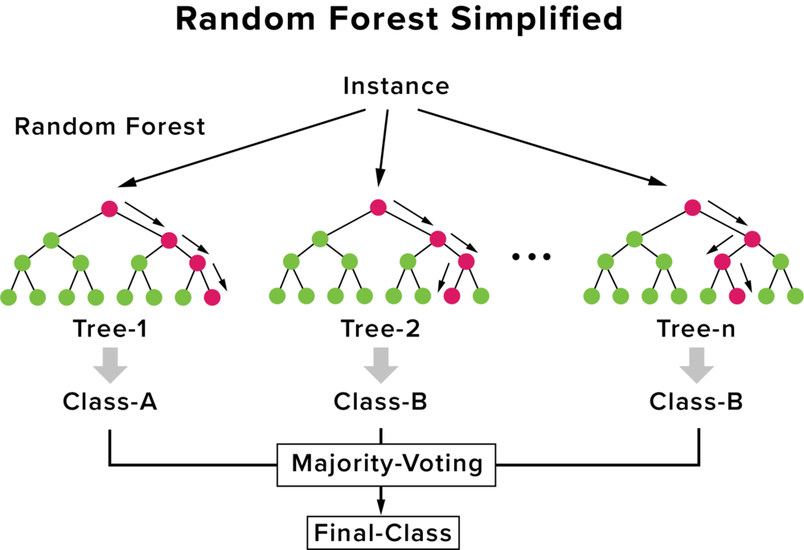
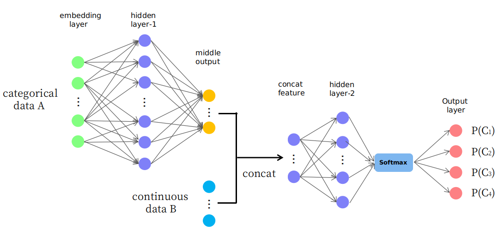

<h1 align="center">Tabular data </h1>

## Feature preprocessing

<table>
  <tr>
    <tD></tD>
    <tD>
      <h4>Tree based models</h4>
      <ul>
        <li>Decission tree</li>
        <li>Random Forest</li>
        <li>Extra trees</li>
        <li>Adaboost</li>
        <li>Gradient Boosting</li>
        <li>XGBoost</li>
        <li>LightGBM</li>
        <li>CatBoost</li>
      </ul>
    </tD>
    <td>
      <h4>No-tree based models</h4>
      <ul>
        <li>Linear Models</li>
        <li>Neural Networks</li>
        <li>K-Nearest Neighbors</li>
        <li>Suport Vector Machines</li>
      </ul>
    </td>
  </tr>
  <tr>
    <th>Categorical Ordinal</th>
    <td>
      <ul>
        <li>Ordianl encoding</li>
        <li>Other: Frequency encoding</li>
      </ul>
    </td>
    <td>
      <ul>
        <li>One hot encoding</li>
        <li>Othre: Embedding</li>
      </ul>
    </td>
  </tr>
  <tr>
    <th>Numerical</th>
    <td>Nothing</td>
    <td>
      <ul>
        <li>MinMaxScaler</li>
        <li>StandarScaler</li>
        <li>Skewed?
          <ul>
            <li>np.log(1+x)</li>
            <li>np.sqrt(x+2/3)</li>
          </ul>
        </li>
      </ul>
    </td>
  </tr>
</table>

## Models

| Model                 | Comment                              | Library                    | More info |
|:---------------------:|--------------------------------------|----------------------------|-----------|
| **Decission Tree**    | Simple and explicable.               | Sklearn                    |           |
| **Linear models**     | Simple and explicable.               | Sklearn                    |           |
| **Random Forest**     | Good starting point (tree enesemble) | Sklearn                    |           |
| **Gradient Boosting** | Usually the best (tree enesemble)    | XGBoost, LighGBM, Catboost |           |
| **Neural Network**    | Good if lot of data.                 | Fast.ai v2                 | [blog](https://hackernoon.com/gain-state-of-the-art-results-on-tabular-data-with-deep-learning-and-embedding-layers-a-how-to-guide-r17b36k8) |

We have two approaches to tabular modelling: decision tree ensembles, and neural networks. And we have mentioned two different decision tree ensembles: random forests, and gradient boosting. Each is very effective, but each also has compromises:

### Random Forest

Are the easiest to train, because they are extremely resilient to hyperparameter choices, and require very little preprocessing. They are very fast to train, and should not overfit, if you have enough trees. But, they can be a little less accurate, especially if extrapolation is required, such as predicting future time periods

### Gradient Boosting

In theory are just as fast to train as random forests, but in practice you will have to try lots of different hyperparameters. They can overfit. At inference time they will be less fast, because they cannot operate in parallel. But they are often a little bit more accurate than random forests.

|         | sklearn Random Forest | XGBoost Gradient Boosting | LightGBM Gradient Boosting | Try |
|--------------------------------------|:--------------------:|:----------------:|:----------------:|-------------|
| 🔷 Number of trees                   | N_estimators         | num_round 💡     | num_iterations 💡| 100         |
| 🔷 Max depth of the tree             | max_depth            | max_depth        | max_depth        | 7           |
| 🔶 Min cases per final tree leaf     | min_samples_leaf     | min_child_weight | min_data_in_leaf |             |
| 🔷 % of rows used to build the tree  | max_samples          | subsample        | bagging_fraction | 0.8         |
| 🔷 % of feats used to build the tree | max_features         | colsample_bytree | feature_fraction |             |
| 🔷 Speed of training                 | NOT IN FOREST        | eta              | learning_rate    |             |
| 🔶 L1 regularization                 | NOT IN FOREST        | lambda           | lambda_l1        |             |
| 🔶 L2 regularization                 | NOT IN FOREST        | alpha            | lambda_l2        |             |
| Random seed                          | random_state         | seed             | _seed            |             |

> - 🔷: Increase parameter for overfit,  decrease for underfit.
> - 🔶: Increase parameter for underfit, decrease for overfit. (regularization)
> - 💡: For Gradient Boosting maybe is better to do early stopping rather than set a fixed number of trees.

### Neural Network

Take the longest time to train, and require extra preprocessing such as normalisation; this normalisation needs to be used at inference time as well. They can provide great results, and extrapolate well, but only if you are careful with your hyperparameters, and are careful to avoid overfitting.

### Conclusion

We suggest starting your analysis with a random forest. This will give you a strong baseline, and you can be confident that it's a reasonable starting point. You can then use that model for feature selection and partial dependence analysis, to get a better understanding of your data.

From that foundation, you can try Gradient Boosting and Neural Nets, and if they give you significantly better results on your validation set in a reasonable amount of time, you can use them.
