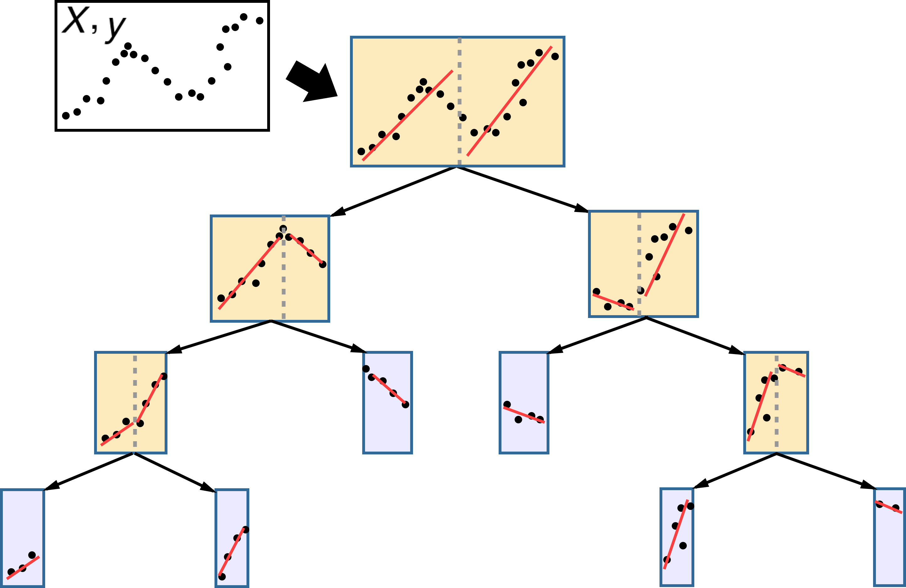
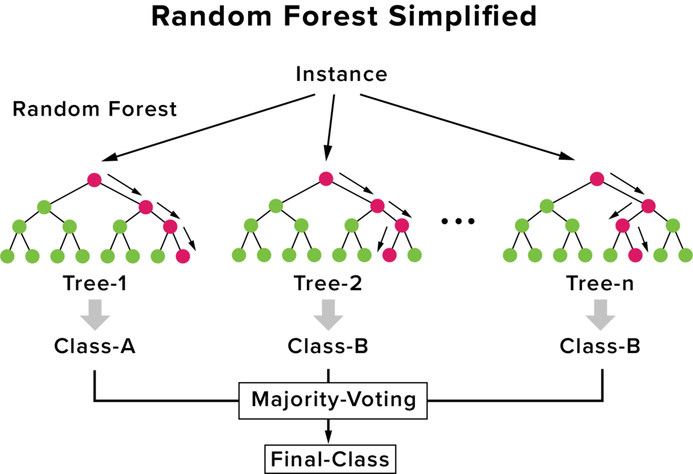
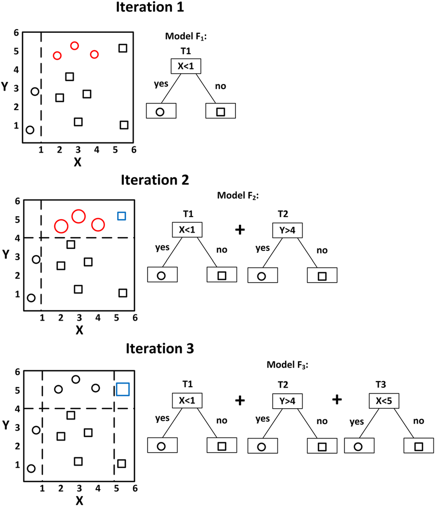
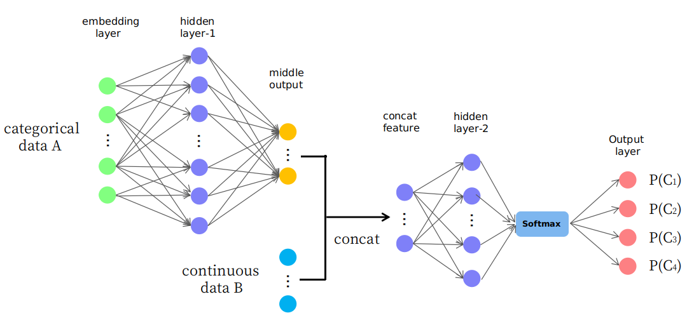

> TODO:
> - https://medium.com/ai-in-plain-english/hyperparameter-tuning-of-decision-tree-classifier-using-gridsearchcv-2a6ebcaffeda
> - Puesta en producción

## Software

<table>
  <tr>
    <th width="200"></th>
    <td>Sklearn proprocina muchos modelos de árbol como DecisionTree, RandomForest, ExtraTrees, AdaBoost y GradientBoosting. Lo malo de esta librería es que todos lo modelos corren sobre CPU y no GPU</td>
  </tr>
  <tr>
    <th width="200"></th>
    <td>La librería CuML de RAPIDS ofrece una implentación de RandomForest haciendo uso de la GPU para construir varios árboles en paralelo.</td>
  </tr>
  <tr>
    <th></th>
    <td>XGBoost significa eXtreme Gradient Boosting, y es una implementación de Gradient boosting diseñada para minimizar la velocidad de ejecución y maximizar el rendimiento. Es uno de los algoritmos que más domina recientemente en los problemas Machine Learning y las competiciones de Kaggle con datos estructurados o tabulares.</td>
  </tr>
  <tr>
    <th></th>
    <td>LightGBM es la implementación de Gradient boosting de Microsoft. Suele ofrecer buenos resultados en precisión y sobre todo en rendimiento (entrena más rapido que XGBoost).</td>
  </tr>
  <tr>
    <th></th>
    <td>CatBoost es una implementación de Gradient boosting desarrollada por Yandex especializada para trabajar con datasets con variables categóricas. Ofrece excelentes resultados gracias a sus métodos de codificación de categorías.</td>
  </tr>
</table>

## Modelos basados en Árboles

|          | Model                     | Import                                                                             |
|:--------:|---------------------------|------------------------------------------------------------------------------------|
| **DT**   | Decision Tree             | from sklearn.tree     import DecisionTreeClassifier,     DecisionTreeRegressor     |
| **RF**   | Random Forest             | from sklearn.ensemble import RandomForestClassifier,     RandomForestRegressor     |
| **RF**   | Random Forest (RAPIDS)    | from cuml.ensemble    import RandomForestClassifier,     RandomForestRegressor     |
| **ET**   | Extra (Randomized) Trees  | from sklearn.ensemble import ExtraTreesClassifier,       ExtraTreesRegressor       |
| **AB**   | AdaBoost                  | from sklearn.ensemble import AdaBoostClassifier,         AdaBoostRegressor         |
| **GB**   | Gradient Boosting         | from sklearn.ensemble import GradientBoostingClassifier, GradientBoostingRegressor |
| **XGB**  | XGBoost                   | from xgboost          import XGBClassifier,              XGBRegressor              |
| **LGBM** | LightGBM                  | from lightgbm         import LGBMClassifier,             LGBMRegressor             |
| **CB**   | CatBoost                  | from catboost         import CatBoostClassifier,         CatBoostRegressor         |
| **NGB**  | NGBoost                   | from ngboost          import NGBClassifier,              NGBRegressor              |
| **RGF**  | Regularized Greedy Forest | from rgf.sklearn      import RGFClassifier,              RGFRegressor              |
|          |                           | from rgf.sklearn      import FastRGFClassifier,          FastRGFRegressor          |

---

### Árbol de Decisión (DT)
  
|                           | CHAID | CART (Sklearn)  | ID3   | C4.5 y C5.0    |
|---------------------------|-------|-------|-------|----------------|
| **Año de cración**        | 1980  | 1984  | 1986  | 1993           |
| **Variables numéricas**   | Yes   | Yes   | No    | Yes            |
| **Variables categóricas** | Yes   | No    | Yes   | Yes            |
| **Missings**              |       |       |       | Yes            |
| **Ramas No Binarias**     | No    | No    |       | Yes            |
| **Para clasificación**    | Yes   | Yes   |       | Yes            |
| **Para regresión**        | No    | Yes   |       |                |
| **Criterío para split**   | Chi-square | GINI index | Information Gain | Gain Ratio |
| **Vídeo (teoría)**       | [video](https://youtu.be/cu0ZdZNCbKo) | [video](https://youtu.be/NtQpKgkkdsQ) | [video](https://youtu.be/NF9Z3oECvaA) | [video](https://youtu.be/344jy4Stusg) |
| **Vídeo (código con Chefboost)** | [video](https://youtu.be/dcnFuS4QILg) | [video](https://youtu.be/CSApBetgukM) | [video](https://youtu.be/Z93qE5eb6eg) | [video](https://youtu.be/kjhQHmtDaAA) |

> #### Curiosidades
> - Sklearn solo implemneta CART pero Chefboost tiene todos
> - C4.5 en Weka se llama J48
> - C5.0 está patentado, por eso no se ve en las librerías.

### Árbol de Decisión + Modelo Lineal = M5

Existe una variante rara del árbol de decisión llamada **Model Tree** o **M5** (M5P en Weka) que consiste en un árbol donde **las hojas son modelos** (como una regresión lineal) en lugar de constantes. [Implementación en Python](https://github.com/ankonzoid/LearningX/tree/master/advanced_ML/model_tree).

### Random Forest (RF)

Are the easiest to train, because they are extremely resilient to hyperparameter choices, and require very little preprocessing. They are very fast to train, and should not overfit, if you have enough trees. But, they can be a little less accurate, especially if extrapolation is required, such as predicting future time periods

### Gradient Boosting (GBM)

In theory are just as fast to train as random forests, but in practice you will have to try lots of different hyperparameters. They can overfit. At inference time they will be less fast, because they cannot operate in parallel. But they are often a little bit more accurate than random forests.

|         | sklearn Random Forest | XGBoost Gradient Boosting | LightGBM Gradient Boosting | Try |
|--------------------------------------|:--------------------:|:----------------:|:----------------:|-------------|
| 🔷 Number of trees                   | N_estimators         | num_round 💡     | num_iterations 💡| 100         |
| 🔷 Max depth of the tree             | max_depth            | max_depth        | max_depth        | 7           |
| 🔶 Min cases per final tree leaf     | min_samples_leaf     | min_child_weight | min_data_in_leaf |             |
| 🔷 % of rows used to build the tree  | max_samples          | subsample        | bagging_fraction | 0.8         |
| 🔷 % of feats used to build the tree | max_features         | colsample_bytree | feature_fraction |             |
| 🔷 Speed of training                 | NOT IN FOREST        | eta              | learning_rate    |             |
| 🔶 L1 regularization                 | NOT IN FOREST        | lambda           | lambda_l1        |             |
| 🔶 L2 regularization                 | NOT IN FOREST        | alpha            | lambda_l2        |             |
| Random seed                          | random_state         | seed             | _seed            |             |

> - 🔷: Increase parameter for overfit,  decrease for underfit.
> - 🔶: Increase parameter for underfit, decrease for overfit. (regularization)
> - 💡: For Gradient Boosting maybe is better to do early stopping rather than set a fixed number of trees.

### Neural Network

Take the longest time to train, and require extra preprocessing such as normalisation; this normalisation needs to be used at inference time as well. They can provide great results, and extrapolate well, but only if you are careful with your hyperparameters, and are careful to avoid overfitting.

### Conclusion

We suggest starting your analysis with a random forest. This will give you a strong baseline, and you can be confident that it's a reasonable starting point. You can then use that model for feature selection and partial dependence analysis, to get a better understanding of your data.

From that foundation, you can try Gradient Boosting and Neural Nets, and if they give you significantly better results on your validation set in a reasonable amount of time, you can use them.
