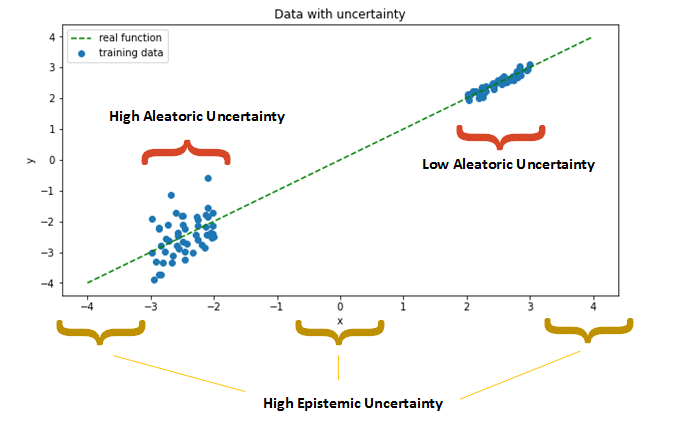
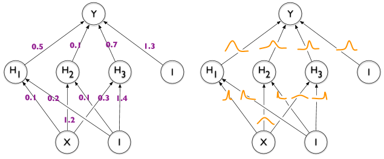

<h1 align="center">Bayesian Neural Networks</h1>

## Uncertainty

#### Problem: 2 Types of uncertainties

- **Epistemic uncertainty**: When there is no data in that combinations of x Variables
- **Aleatoric uncertainty**: When the data has noise (Random or Gaussian noise for example)

#### Solution

- Solution to Epistemic uncertainty: Get more data
- Solutions to Aleatoric uncertainty:
  - Bayesian Deep Lerning (BDD)
  - Droput at inference time [paper](https://arxiv.org/abs/1506.02142)
  - Predict as output the mean and std

## Bayesian Deep Lerning

**Weights & biases are distributions** intead of fixed values.
So, BNNs act like a kind of ensemble!

#### Training

1. Start initializing wieght distributions with mean=0 and std=1.
2. For each batch during your training loop:
  - Sample your weights according to the distributions associated to each layer.
  - Do the forward pass with these weights, as with a regular network
  - Backpropagate the loss to the parameters of the distribution that generated the weights

## Dropout at inference time

- At training time: Train with Droput
- At inference time: Use different cofigurations of droput for each sample (like TTA). Therefore you get several predictions per sample. Use the mean for final prediction and use the std for measure the uncertency.

## Reference

- [Keras: example: Probabilistic Bayesian Neural Networks](https://keras.io/examples/keras_recipes/bayesian_neural_networks/)
- Medium: [Uncertainty in Deep Learning. How To Measure?](https://towardsdatascience.com/my-deep-learning-model-says-sorry-i-dont-know-the-answer-that-s-absolutely-ok-50ffa562cb0b)
- [TensorFlow Probability](https://www.tensorflow.org/probability)
