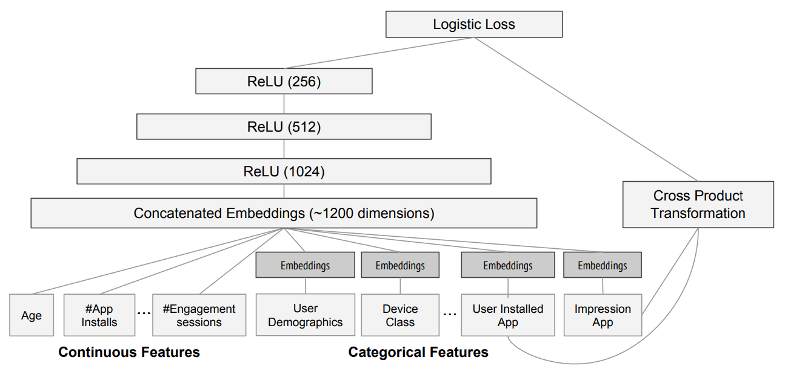

<h1 align="center">Neural Networks</h1>

# TODO
- Parameters and activations
- Random initialization and transfer learning
- SGD, Momentum, Adam, and other optimizers
- Convolutions
- Batch normalization
- Dropout y DropConnect
- Data augmentation
- Label smoothing
- Weight decay
- Entity embeddings
- Recurrent neural networks (RNNs)
- Segmentation
- Collaborative filtering (ej. movie recommendation)
- [arbitrary order (>=2) Factorization Machine](https://github.com/geffy/tffm)

# Model

# Loss

# Train Hyperparms

# Advice for Tabular data

### Neural Network

Take the longest time to train, and require extra preprocessing such as normalisation; this normalisation needs to be used at inference time as well. They can provide great results, and extrapolate well, but only if you are careful with your hyperparameters, and are careful to avoid overfitting.

### Conclusion

We suggest starting your analysis with a random forest. This will give you a strong baseline, and you can be confident that it's a reasonable starting point. You can then use that model for feature selection and partial dependence analysis, to get a better understanding of your data.

From that foundation, you can try Gradient Boosting and Neural Nets, and if they give you significantly better results on your validation set in a reasonable amount of time, you can use them.

### Aprende más
- [Ejemplos oficiales de Keras](https://keras.io/examples)
