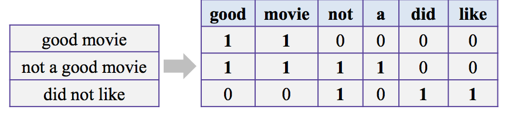
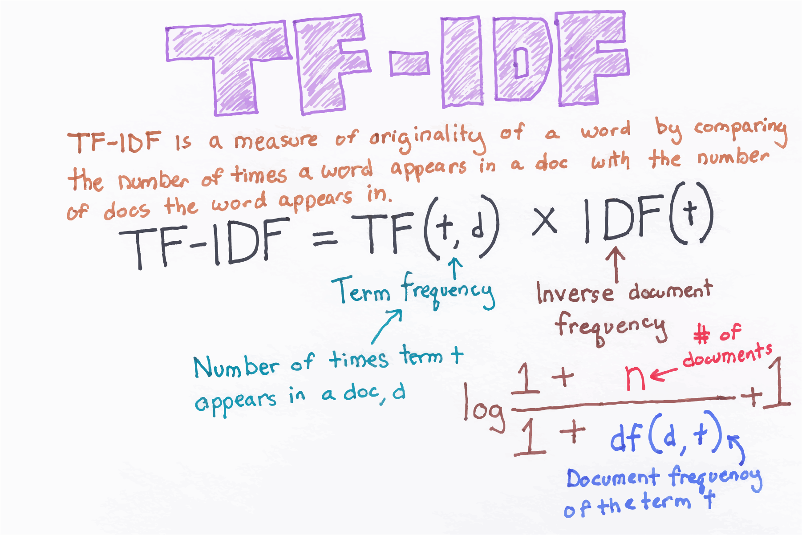
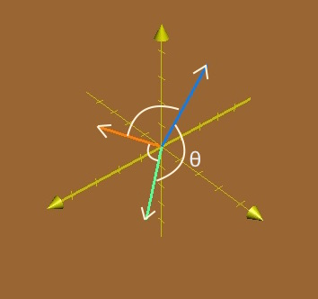
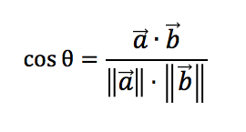

<h1 align="center">Natural Language Processing</h1>

# Bag of words (Term Frequency)

# TF-IDF

# Word embeddings

| Space | Formula |
|-------|--------|
|  | |

## References
- [Topic Modeling with SVD and Truncated SVD](https://medium.com/@george.drakos62/nlp-tutorial-topic-modeling-with-singular-value-decomposition-svd-and-truncated-svd-fbpca-and-5fa612277c22)
- [Spacy + Scikit-learn](https://www.kdnuggets.com/2019/10/extend-scikit-learn-bring-sanity-machine-learning-workflow.html)
