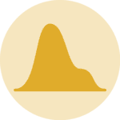
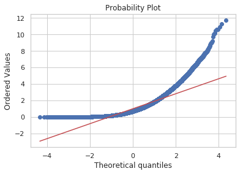
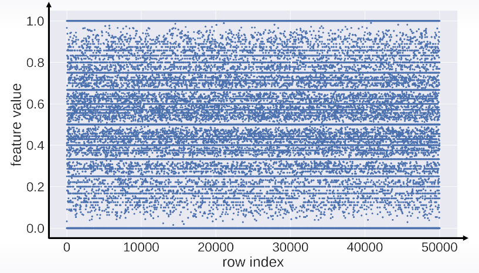
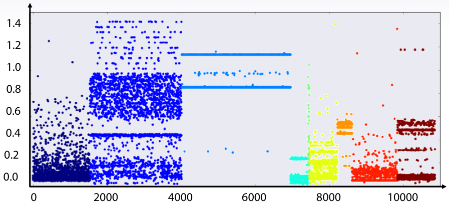
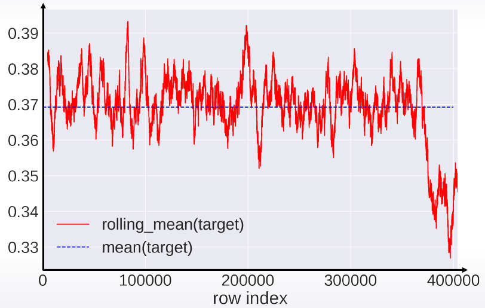

## Variable numérica: Distribución


<table>
<tr>
    <td> <a href="https://python-graph-gallery.com/histogram">     </a> </td>
    <td> <a href="https://python-graph-gallery.com/density-plot">  </a> </td>
    <td> <a href="https://python-graph-gallery.com/boxplot">       </a> </td>
    <td> <a href="https://python-graph-gallery.com/violin-plot">   </a> </td>
</tr>
<tr>
    <th>Histogram</th>
    <th>Density plot</th>
    <th>Box plot</th>
    <th>Violin plot</th>
</tr>
<tr>
    <td>df.plot.hist()<br>sns.distplot()</td>
    <td>df.plot.kde()<br>sns.kdeplot()</td>
    <td>df.plot.box()<br>sns.boxplot()</td>
    <td>sns.violinplot()</td>
</tr>
</table>


### Probplots
Una forma más avanzada de ver si la distribucion sigue una distribución normal, son los probability plots (o simplemente probplots). Existen 2 tipos
- QQ plot: "Quantile-Quantile" plot
- PP plot:



```python
import scipy.stats as stats
stats.probplot(x=df.variable, dist=stats.norm(), plot=plt)
```
Ejercicio: Coger una varible con distribucion no normal, palicarle el **log** y el **boxcox** para ver cual ajusta mejor a una distr normal.


### Skewness `.skew()`
Otra forma de ver si la variable no sigue una distribucion normal es ver su Skewness.

```python
skewed_feats = df[num_feats].apply(lambda x: x.dropna().skew()).sort_values(ascending=False)
```

## Variable Numérica: Evolución
<table>
  <tr>
    <td></td>
    <td></td>
    <td></td>
    <td></td>
  </tr>
  <tr>
    <th>Line chart</th>
    <th>Area chart</th>
    <th>Stacked area chart</th>
    <th>Stream graph</th>
  </tr>
</table>

El grafico de index vs value, es decir, el numero de la fila contra el valor de la variable es especialmente util para:
- Ver la evolucion de una variable, si hay alg'un patron temporal
- Ver si el dataset fue mezlado o no (shuffled)

<table>
  <tr>
    <td></td>
    <td></td>
    <td></td>
  </tr>
  <tr>
    <td>plt.plot(x,".")</td>
    <td>plt.scatter(range(len(x)), x, c=y)</td>
  </tr>
</table>