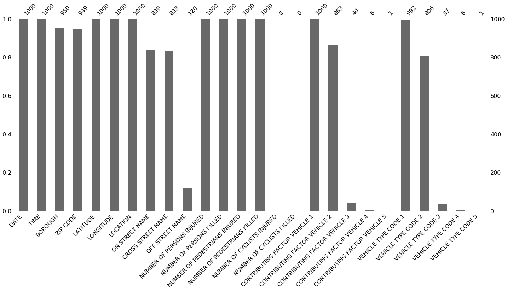
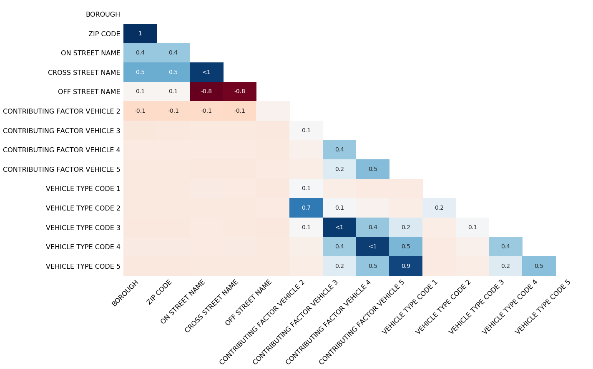

- Missings de cada **celda** `df.isnull()`
  - Plot `sb.heatmap(df.isnull())`
- Missings de cada **variable** `df.isnull().sum(axis=0)` o `df.isnull().sum()`
  - Ordenados: `df.isnull().sum().sort_values(ascending=False)`
  - En porcentaje: `df.isnull().sum() / len(df) * 100`
- Missings de cada **fila** `df.isnull().sum(axis=1)`


## Paquete [missingno](https://github.com/ResidentMario/missingno)

Los ejemplos que se muestran hacen uso del dataset [NYPD Motor Vehicle Collisions Dataset](https://data.cityofnewyork.us/Public-Safety/NYPD-Motor-Vehicle-Collisions/h9gi-nx95).


```python
import missingno
import pandas as pd

df = pd.read_csv("https://raw.githubusercontent.com/ResidentMario/missingno-data/master/nyc_collision_factors.csv")
```


### Bar

```python
missingno.bar(df)
```




### Matrix

```python
missingno.matrix(df)
```


### Heatmap

```python
missingno.heatmap(df)
```




### Dendrogram

```python
missingno.dendrogram(df)
```


