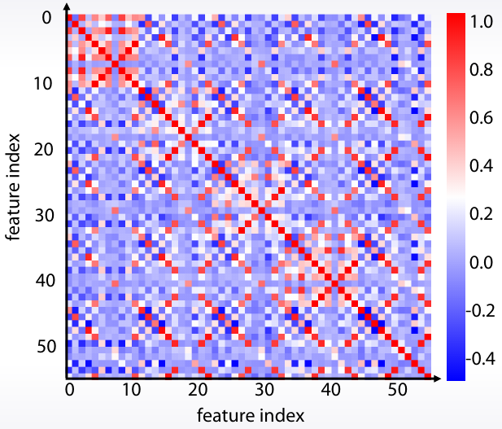
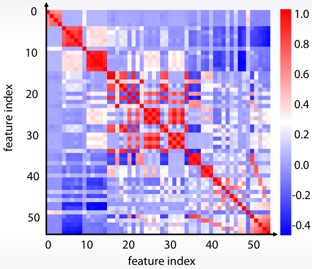
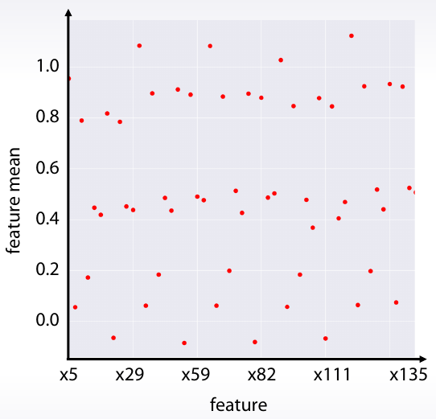
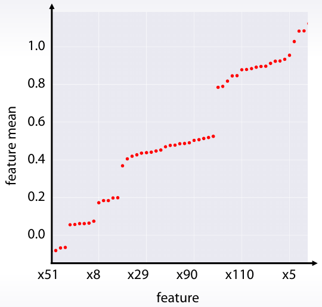

## Matriz de correlación

**Correlación**: cuánto se paracen las variables entre sí. Es decir, calcular **distancias entre N variables** y guardarlas en una matriz de tamaño NxN. Existen distintas formas de calcularla:

| Entre variables                                 | Método                               | Rango   |
|-------------------------------------------------|--------------------------------------|---------|
| **numérica**   vs **numérica**                  |  Pearson, Spearman, Kendall          | [-1, 1] |
| **categórica** vs **categórica** (simétrica)    |  Cramér's V (Cramér's phi)           | [0, 1]  |
| **categórica** vs **categórica** (no simétrica) |  Theil’s U (Uncertainty coefficient) | [0, 1]  |
| **categórica** vs **numérica**                  |  Correlation ratio                   | [0, 1]  |

> [The Search for Categorical Correlation](https://towardsdatascience.com/the-search-for-categorical-correlation-a1cf7f1888c9)

La funcion `df.corr()` de `pandas` sólo calcula la correlacion entre las variables numéricas:
- Standard correlation coefficient: `df.corr()` o `df.corr(method='pearson')`
- Spearman rank correlation: `df.corr(method='spearman')`
- Kendall Tau correlation coefficient: `df.corr(method='kendall')`
  
La funcion `associations(df)` del paquete `dython` calcula todas las correlaciones de la siguiente manera:
- **Pearson** para los pares continuous-continuous.
- **Correlation Ratio** para los pares categorical-continuous.
- **Cramer's V** o **Theil's U** para los pares categorical-categorical.

```python
from dython.nominal import associations

associations(df, theil_u=True, figsize=(15, 15), mark_columns=True);
```

Otra forma de calcualar la corrlacion de variables categ'oricas como numérricas es convertiral a OneHot con `df_oh = pd.get_dummies(df)`

- A parte de la correlación, se pueden calcular otras matrices:
  - Cuántas veces una variable es más grande que otra. `fn = mean(feat1 > feat2)`
  - Cuántas combinaciones distintas tienen 2 variables.

Una vez calculada la matriz de correlación se puede **ordenar por grupos** gracias al clustering. Seaborn lo hace por nosostros con `clustermap`.

| Matriz de correlación    | Matriz de correlación ordenada por grupos |
|--------------------------|-------------------------------------------|
|         |                   |
| `sb.heatmap(df.corr())`  | `clustermap(df.corr())`                   |


## Plot de una agragación

| Media de cada variable      | Media de cada variable (ordenada)         |
|-----------------------------|-------------------------------------------|
|             |                    |
| `df.mean().plot(style=".")` | `df.mean().sort_values().plot(style=".")` |