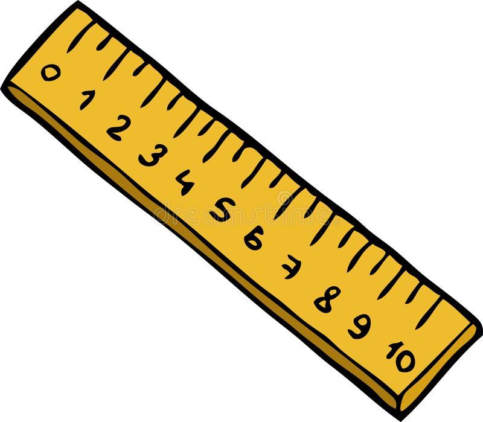

<table>
  <thead>
    <tr>
      <th></th>
      <th><h3>Regresión</h3></th>
      <th><h3>Clasificación</h3></th>
      <th>Clasificación binaria</th>
      <th>Clasificacón multietiqueta</th>
    </tr>
  </thead>
  <tbody>
    <!------------------------------------- Imagen -------------------------------->
    <tr>
      <td></td>
      <td></td>
      <td></td>
      <td></td>
      <td></td>
    </tr>
    <!------------------------------------- Descripción -------------------------------->
    <tr>
      <th>Descripción</th>
      <td>Predecir cualquier valor medible</td>
      <td>Predecir 1 clase entre muchas</td>
      <td>Predecir sí/no</td>
      <td>Predecir varias clases entre muchas</td>
    </tr>
    <!------------------------------------- Métricas -------------------------------->
    <tr>
      <th>Métricas comunes</th>
      <td>
        <ul>
          <li><b>MAE</b>: Error medio</li>
          <li><b>MSE</b>: Error cuadrático medio</li>
          <li><b>RMSE</b>: Raíz cuadrada del MSE</li>
        </ul>
      </td>
      <td>
        <ul>
          <li><b>Accuracy</b>: Número de aciertos</li>
          <li><b>Bal Accuracy</b></li>
        </ul>
      </td>
      <td>
        <ul>
          <li><b>Accuracy</b></li>
          <li><b>AUC</b></li>
          <li><b>F1</b></li>
        </ul>
      </td>
      <td></td>
    </tr>
     <!------------------------------------- Datasets -------------------------------->
    <tr>
      <th>Datasets</th>
      <td>
        <ul>
          <li><a href="https://www.kaggle.com/c/house-prices-advanced-regression-techniques">House Prices</a></li>
          <li><a href="https://www.kaggle.com/c/competitive-data-science-predict-future-sales">Predict Future Sales</a></li>
        </ul>
      </td>
      <td>
        <ul>
          <li><a href="https://www.kaggle.com/uciml/iris">Iris Species</a></li>
        </ul>
      </td>
      <td>
        <ul>
          <li><a href="https://www.kaggle.com/c/titanic">Titanic</a></li>
          <li><a href="https://www.kaggle.com/wenruliu/adult-income-dataset">Adult Income</a></li>
          <li><a href="https://www.kaggle.com/c/word2vec-nlp-tutorial">IMDB sentiment analysis</a></li>
        </ul>
      </td>
      <td>
        <ul>
          <li><a href="https://www.kaggle.com/c/jigsaw-toxic-comment-classification-challenge/overview/evaluation">Toxic Comment</a></li>
        </ul>
      </td>
    </tr>
  </tbody>
</table>

- Series temporales
  - [Hourly Energy Consumption](https://www.kaggle.com/robikscube/hourly-energy-consumption)

Estos son los tipos de problema más comunes a resolver.

<h1 align="center">Métricas</h1>

## Métricas de clasificación
- AUC no es derivable

## Métricas de regresión

| Mean Absolute Error (MAE)   |  Mean Squared Error (MSE) |
|-----------------------------|---------------------------|
|        |      |

|          |  Métrica                         | Error plot for 5, 6, 8, 9, 27        | Derivable | Mejor Constante        | Equivalente         |
|:--------:|----------------------------------|--------------------------------------|-----------|-------------------------|--------------------|
| **MAE**  | Mean Absolute Error              |                      | ✔️        | Median (8)          |                    |
| **MSE**  | Mean Squared Error               |                      | ✔️        | Mean (11)           | RMSE, R-squared |
| **MAPE** | Mean Absolute Percentage Error   |                     | ✔️        | Weighted median (6) |              |
| **MSPE** | Mean Square Percentage Error     |                     | ✔️        | Weighted mean (6.6) |              |
| **MSLE** | Mean Square Logarithmic Error    |  | ✔️        | log(mean) (9.11)    | RMSLE        |
| **R2**   | R-squared                        |                                      | ✔️        | |
| **r**    | Spearman's Rank Correlation Coef |                                      | ❌        | |
| **p**    | Pearson Correlation Coef         |                                      | ?          | |

> #### Información adicional
>
> - Métricas de Clasificación
>   - [Evaluation Metrics for Classification Problems: Quick Examples + References](https://queirozf.com/entries/evaluation-metrics-for-classification-quick-examples-references)
>   - [Decision Trees: “Gini” vs. “Entropy” criteria](https://www.garysieling.com/blog/sklearn-gini-vs-entropy-criteria)
>   - [Understanding ROC curves](http://www.navan.name/roc)
> - Métricas de Regresión
>   - [Metrics used for regression](https://safjan.com/kaggle-evaluation-metrics-used-for-regression-problems)
> - Métricas de Ranking
>   - [Learning to Rank Overview](https://wellecks.wordpress.com/2015/01/15/learning-to-rank-overview/)
>   - Paper [Learning to Rank using Gradient Descent](https://icml.cc/2015/wp-content/uploads/2015/06/icml_ranking.pdf): Original paper about pairwise method for AUC optimization
>   - Paper [From RankNet to LambdaRank to LambdaMART](https://www.microsoft.com/en-us/research/wp-content/uploads/2016/02/MSR-TR-2010-82.pdf): Overview of further developments of RankNet
>   - [RankLib](https://sourceforge.net/p/lemur/wiki/RankLib): Implementación de los 2 papers anteriores.
> - Métricas de Clustering
>   - Paper [Evaluation metrics for clustering](http://nlp.uned.es/docs/amigo2007a.pdf)

<h1 align="center">Fuga de datos</h1>

La fuga de datos conocida como **Data Leakage** en inglés, es cuando se introducen datos los cuales son imposibles de disponer en la vida real.

> - [Perfect score script](https://www.kaggle.com/olegtrott/the-perfect-score-script) used to probe leaderboard
> - [Page about data leakages on Kaggle](https://www.kaggle.com/docs/competitions#leakage)
> - [Another page about data leakages on Kaggle](https://www.kaggle.com/dansbecker/data-leakage)

