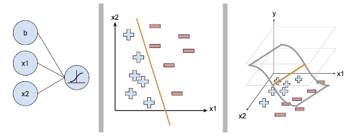

Logistic regression is very similar to linear regression but has a categorical outcome instead. So rather than modeling a continuous dependent variable, it models a binary classification - yes or no, true or false, 1 or 0. This is still a linear model as it assumes a linear relationship between the independent variables and the link function.  

To learn more about Logistic Regression, try to following resources:
- [Beginners guide to Logistic Regression](https://www.analyticsvidhya.com/blog/2015/11/beginners-guide-on-logistic-regression-in-r/): A good overview of the theory and mathematics behind the algorithm
- [Logistic Regression in Python](http://blog.yhat.com/posts/logistic-regression-python-rodeo.html): A thorough tutorial on a publicly available dataset in Python
