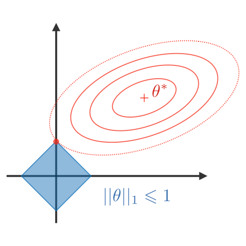

Both linear and logistic regression have a tendancy to overfit when there are a large number of features. Therefore it is important that we choose the features which have the most predictive power but how do we choose these features? We can use our EDA to a certain extent but that only goes so far.

This is where ridge and lasso regularization techniques come into play! Both of these techniques can be used to identify which features explain the most variance and should therefore be kept in the model.

Visualmente, los coeficientes (w) solo pueden tomar un valor de su eje dentro de la región azul que más se acerque al mínimo.

| L1 (LASSO)          | L2 (Ridge)          | Elastic Net               |
|---------------------|---------------------|---------------------------|
|   |   |   |
| Acerca coefficientes a 0. Good for variable selection | **Más usado**. Makes coefficients smaller | Tradeoff between variable selection and small coefficients |
| Penalizes the sum of absolute weights | Penalizes the sum of squared weights | Combination of 2 before |
| `loss + wd * weights.abs().sum()` | `loss + wd * weights.pow(2).sum()` |

> ### Más información:
> - [Complete tutorial on ridge and lasso regression in python](https://www.analyticsvidhya.com/blog/2016/01/complete-tutorial-ridge-lasso-regression-python/): A broad tutorial explaining why we use regularization techniques, touching on the mathematics behind the algorithms and giving a few examples in python.
> - [An Introduction to Statistical Learning, Chapter 6.2](http://www-bcf.usc.edu/%7Egareth/ISL/ISLR%20Sixth%20Printing.pdf): A comprehensive explanation of both Lasso and Ridge and their application in the context of statistical learning.

