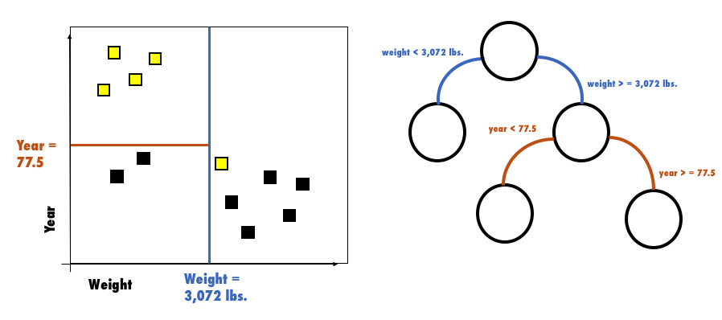
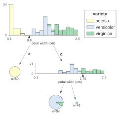
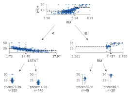

 

|                           | CHAID      | CART (Sklearn) | ID3              | C4.5       | C5.0       |
|---------------------------|------------|----------------|------------------|------------|------------|
| **Año de cración**        | 1980       | 1984           | 1986             | 1993       | 1993       |
| **Variables numéricas**   | ✔️         | ✔️             | ❌               | ✔️         | ✔️         |
| **Variables categóricas** | ✔️         | ❌ (nota)      | ✔️               | ✔️         | ✔️         |
| **Missings**              |            | ❌             | ❌               | ✔️         | ✔️         |
| **Ramas No Binarias**     | ❌         | ❌             | ✔️               | ✔️         | ✔️         | 
| **Para clasificación**    | ✔️         | ✔️             |                  | ✔️         | ✔️         |
| **Para regresión**        | ❌         | ✔️             |                  |            |            |
| **Criterío para split**   | Chi-square | GINI index     | Information Gain | Gain Ratio | Gain Ratio |
| **Vídeo (teoría)**        | [video](https://youtu.be/cu0ZdZNCbKo) | [video](https://youtu.be/NtQpKgkkdsQ) | [video](https://youtu.be/NF9Z3oECvaA) | [video](https://youtu.be/344jy4Stusg) | |
| **Vídeo (código con Chefboost)** | [video](https://youtu.be/dcnFuS4QILg) | [video](https://youtu.be/CSApBetgukM) | [video](https://youtu.be/Z93qE5eb6eg) | [video](https://youtu.be/kjhQHmtDaAA) | |

(nota) No soporta las categorias pero con NominalEncoder sí

> #### Curiosidades
> - Sklearn solo implemneta CART pero Chefboost tiene todos
> - C4.5 en Weka se llama J48
> - C5.0 está patentado, por eso no se ve en las librerías.
> - XGBoost usa CART.

### Visualización del Árbol de Decisión con `dtreeviz`

| [Arbol de clasificación](https://github.com/parrt/dtreeviz#classification-decision-tree) | [Arbol de regresión](https://github.com/parrt/dtreeviz#regression-decision-tree)       | 
|---------------------------|---------------------------|
|  |  |

### Árbol de Decisión + Modelo Lineal = M5

Existe una variante rara del árbol de decisión llamada **Model Tree** o **M5** (M5P en Weka) que consiste en un árbol donde **las hojas son modelos** (como una regresión lineal) en lugar de constantes. [Implementación en Python](https://github.com/ankonzoid/LearningX/tree/master/advanced_ML/model_tree).

