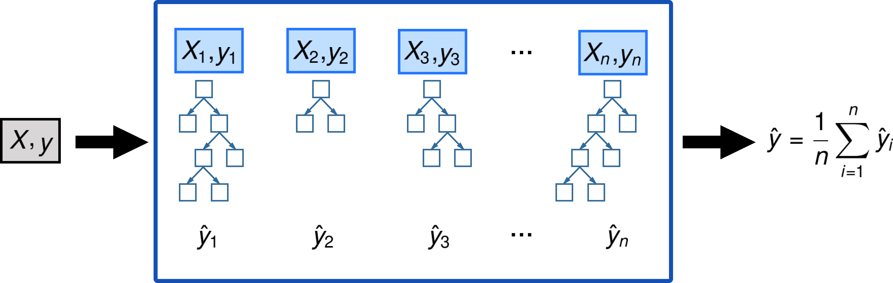

Are the easiest to train, because they are extremely resilient to hyperparameter choices, and require very little preprocessing. They are very fast to train, and should not overfit, if you have enough trees. But, they can be a little less accurate, especially if extrapolation is required, such as predicting future time periods

### Regularized Greedy Forest (RGF)

> - Paper: [Learning Nonlinear Functions Using Regularized Greedy Forest](https://arxiv.org/pdf/1109.0887.pdf)
> - https://www.kaggle.com/carlmcbrideellis/introduction-to-the-regularized-greedy-forest

