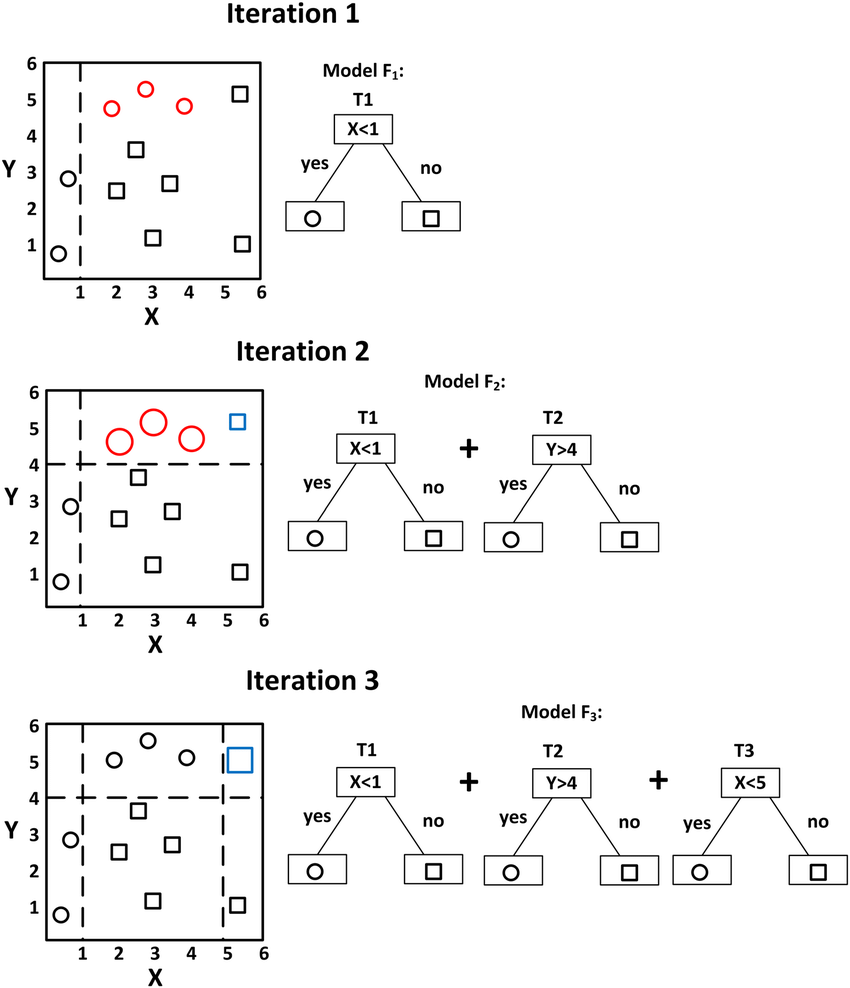

# Gradient Boosting (GBM)

In theory are just as fast to train as random forests, but in practice you will have to try lots of different hyperparameters. They can overfit. At inference time they will be less fast, because they cannot operate in parallel. But they are often a little bit more accurate than random forests.

