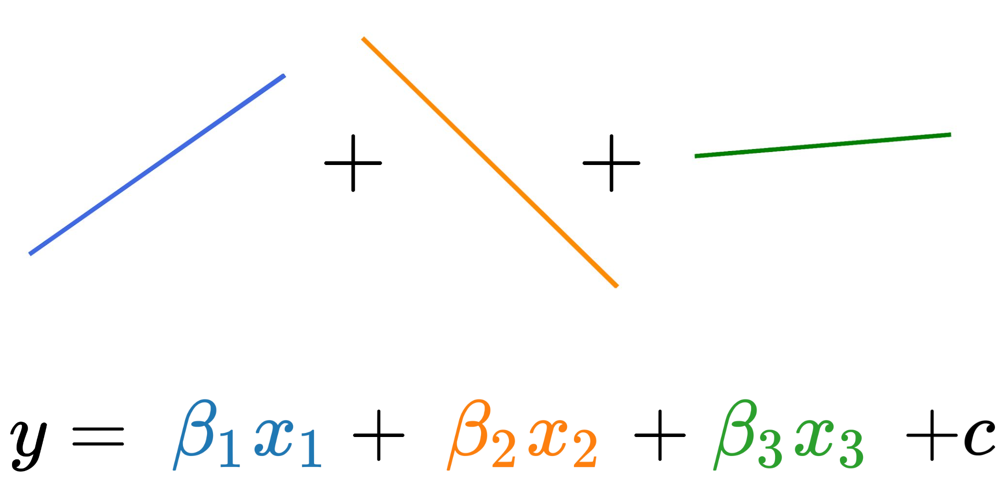

Linear Regression is a parametric model which predicts a continuous outcome feature (**Y**) from one or more explanatory features (**X**).  

beta_0 is called the intercept term, and represents the expected mean value of Y when all explanatory features equal 0.  
beta_1 is called a beta coefficient, and represents the expected change in the value of Y that results from a one unit change in X.

This is module fits a straight line to your data, where the value of the outcome feature can be calculated as a linear combination of the explanatory features. Sounds relatively simple? Afraid not, there are many nuances and conditions that need to be understood before using linear regression! We are going to delve into these assumptions and conditions and then demonstrate how to use this algorithm on the kiva dataset.

### Resources
- [Comprehensive Guide to Regression](https://www.analyticsvidhya.com/blog/2015/08/comprehensive-guide-regression/)
- [Understanding key regression statistics](http://connor-johnson.com/2014/02/18/linear-regression-with-python/)
