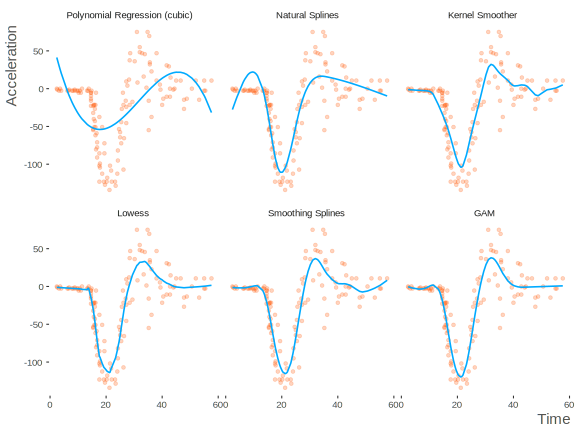
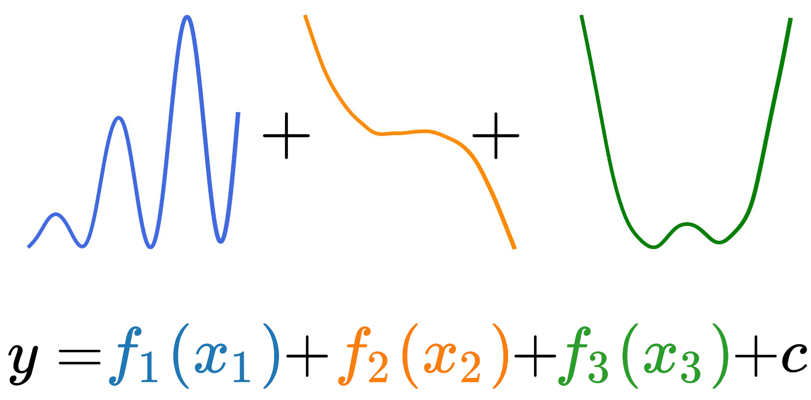

<p align="center"></p>


GAM captura los patrones no lineales de cada variable (que la regresión lineal no puede capturar) y los suma (como la regresión lineal).
<p align="center"></p>

Tradicionalemente, las no-linearidades son caputuras por binning o polinomios. Pero GAM las captura automaticamnte (mediante splines).

Lo mejor de GAM es la explicabilidad de cada variable mediante gráficos de PDP (Partial Dependency Plot):
<p align="center"></p>


Parámetros a tener en cuenta para optimizar:
- **`n_splines`**: Número de trozos para componer y juntar. (25 por defecto)
- **`lam`**: Término de penalización. (0.6 por defecto)
- **`constraints`**: Monotonically constraint. ("none" por defcto)

<p align="center"></p>


Instalar pyGAM:
```
pip install pygam
```

Ejemplo:
```python
from pygam import LinearGAM    # Para regresión
from pygam import LogisticGAM  # Para clasificación

x = df[['var1', 'var2', 'var3']]
y = df[target_var]

gam = LogisticGAM().fit(x, y)
```

#### Referencias
- [Video explicativo](https://www.youtube.com/watch?v=XQ1vk7wEI7c)
- [Blog explicativo 1](https://multithreaded.stitchfix.com/blog/2015/07/30/gam)
- [Blog explicativo 2](https://codeburst.io/pygam-getting-started-with-generalized-additive-models-in-python-457df5b4705f)
- [Blog explicativo 3](https://medium.com/just-another-data-scientist/building-interpretable-models-with-generalized-additive-models-in-python-c4404eaf5515)
- [H20 GAM documentation](https://docs.h2o.ai/h2o/latest-stable/h2o-docs/data-science/gam.html)
- [pyGAM documentation](https://pygam.readthedocs.io/en/latest/index.html)
