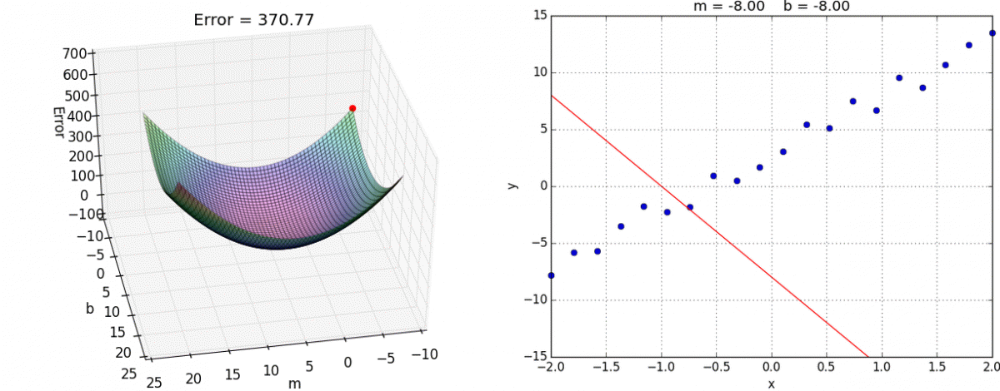

1. **Linear Regression**: Modelo lineal para regresión
   - How to split the data between training and test
   - Ordinary Least Squares
   - Analyzing the results of the model
2. **Logistic Regression**: Modelo lineal para clasificación
   - Sigmoid function
3. **Regulated linear models** (Penalized regression)
   - LASSO Regression (L1 Regularization)
   - Ridge Regression (L2 Regularization)
   - ElasticNet Regression (L1 & L2 Regularization)
   - LARS: Least-Angle Regression
4. **SGD**: Otra forma de modelos lineales
   - Perceptron
   - Vowpal Wabbit
5. **Variantes No Lineales**
   - Regresión Polinómica
   - Generalized Additive Models (GAM)

---

### Sowftware

#### Modelos lineales

|                                   |  Sklearn (CPU)                            | RAPIDS  (GPU)                   |
|-----------------------------------|-------------------------------------------|---------------------------------|
| Linear Regression                 | `sklearn.linear_model.LinearRegression`   | `cuml.LinearRegression`         |
| Logistic Regression               | `sklearn.linear_model.LogisticRegression` | `cuml.LogisticRegression`       |
| Ridge Regression                  | `sklearn.linear_model.Ridge`              | `cuml.Ridge`                    |
| Lasso Regression                  | `sklearn.linear_model.Lasso`              | `cuml.Lasso`                    |
| ElasticNet Regression             | `sklearn.linear_model.ElasticNet`         | `cuml.ElasticNet`               |
| MiniBatch SGD Classifier          | `sklearn.linear_model.SGDClassifier`      | `cuml.MBSGDClassifier`          |
| MiniBatch SGD Regressor           | `sklearn.linear_model.SGDRegressor`       | `cuml.MBSGDRegressor`           |
| Mutinomial Naive Bayes            |                                           | `cuml.MultinomialNB`            |
| Stochastic Gradient Descent       |                                           | `cuml.SGD`                      |
| Coordinate Descent                |                                           | `cuml.CD`                       |
| Quasi-Newton                      |                                           | `cuml.QN`                       |
| Support Vector Machine Classifier |                                           | `cuml.svm.SVC(kernel="linear")` |
| Support Vector Machine Regressor  |                                           | `cuml.svm.SVR(kernel="linear")` |

#### Modelos lineales parecidos
|                                    |  Sklearn (CPU)                            | RAPIDS  (GPU)                   |
|------------------------------------|-------------------------------------------|---------------------------------|
| Support Vector Machines Classifier | |                               cuml.svm.SVC(kernel="rbf") |
| Support Vector Machines Regressor  | |                               cuml.svm.SVR(kernel="rbf") |
| Nearest Neighbors Classification   | |                               cuml.neighbors.KNeighborsClassifier |
| Nearest Neighbors Regression       | |                               cuml.neighbors.KNeighborsRegressor |

<h3 align="center">Clasificación o Regresión?</h3>

# 4. Descenso por Gradiente (SGD)

