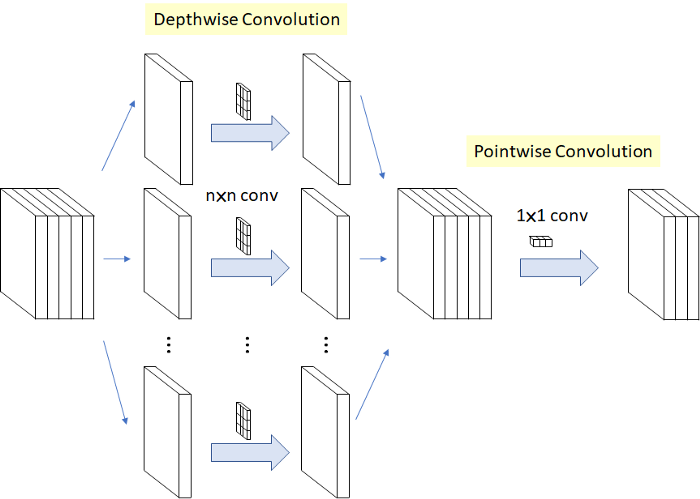
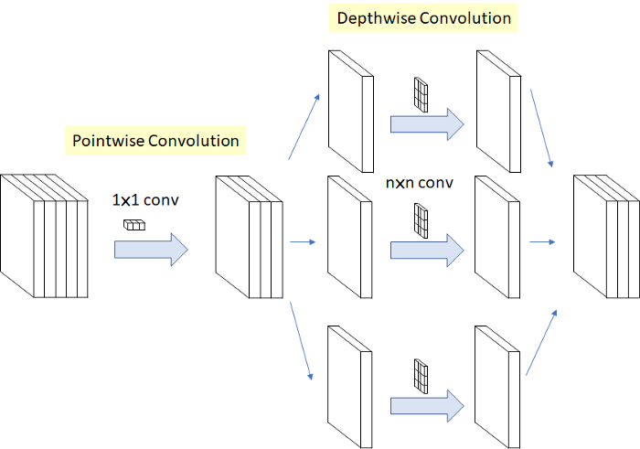
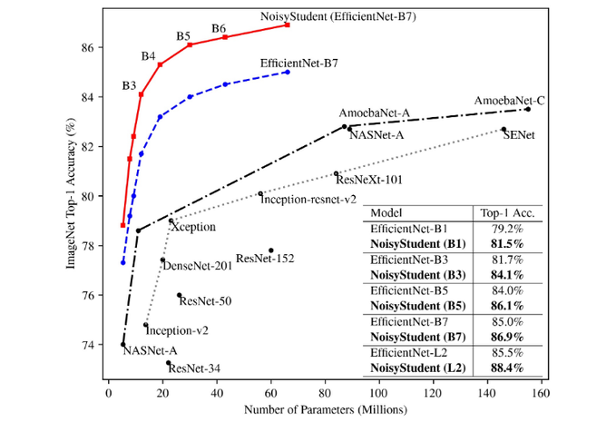
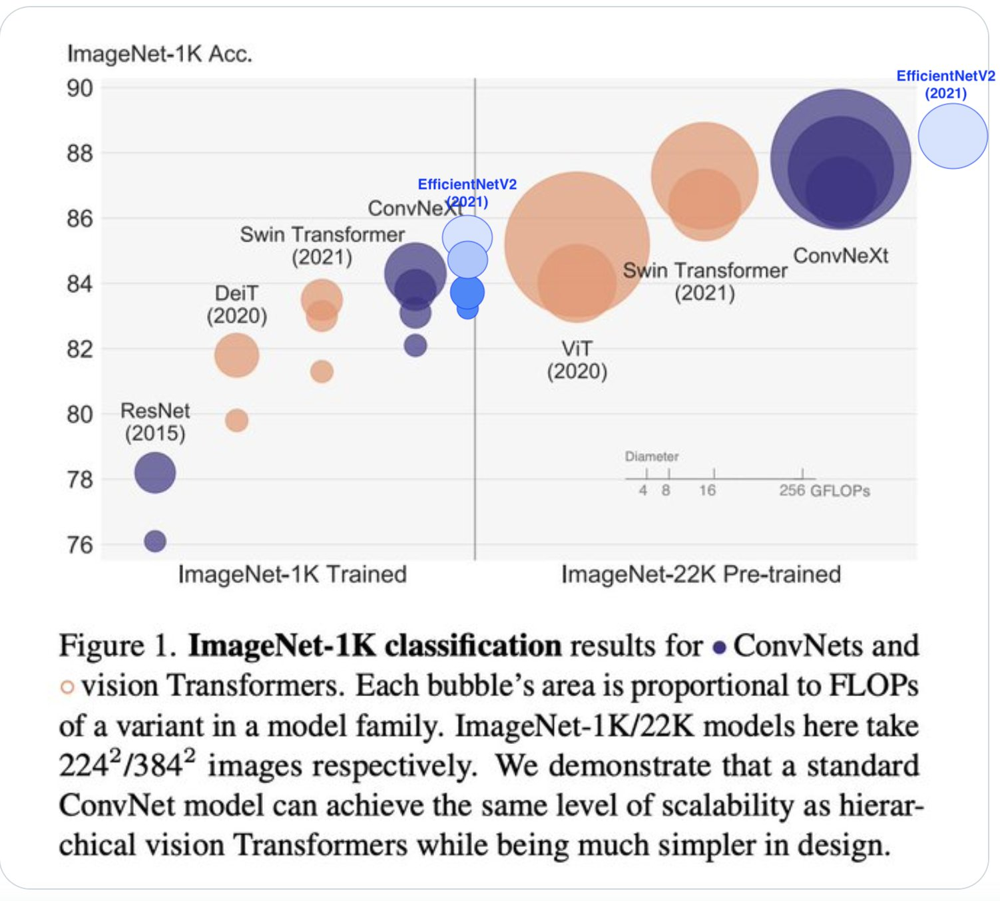

## Variable image size -> use **global pooling**:
- Option 1: `GlobalPool2d` -> `Linear(num_features, num_classes)` (less computation)
- Option 2: `Conv2d(num_features, num_classes, 3, padding=1)` -> `GlobalPool2d`

> Note in Pytorch. global pooling is done by `AdaptiveAvgPool2d`


## Separable convolution (less computation)


| [MobileNet](https://arxiv.org/abs/1704.04861) style | [Xception](https://arxiv.org/abs/1610.02357) style |
|:---------------------------------------------------:|:--------------------------------------------------:|
|                            |                            |


## Sota CNNs

|                         | Description                               | Paper                                        |
|:-----------------------:|:------------------------------------------|:--------------------------------------------:|
| **Inception v3**        |                                           | [Dec 2015](https://arxiv.org/abs/1512.00567) |
| **Resnet**              | After 2 convs (3x3->3x3) sum block input  | [Dec 2015](https://arxiv.org/abs/1512.03385) |
| **SqueezeNet**          |                                           | [Feb 2016](https://arxiv.org/abs/1602.07360) |
| **Densenet**            | Concatenate previous layers               | [Aug 2016](https://arxiv.org/abs/1608.06993) |
| **Xception**            | Depthwise Separable Convolutions          | [Oct 2016](https://arxiv.org/abs/1610.02357) |
| **ResNext**             |                                           | [Nov 2016](https://arxiv.org/abs/1611.05431) |
| **DPN**                 | Dual Path Network                         | [Jul 2017](https://arxiv.org/abs/1707.01629) |
| **SENet**               | Squeeze and Excitation (channels weights) | [Sep 2017](https://arxiv.org/abs/1709.01507) |
| **EfficientNet**        | Rethinking Model Scaling                  | [May 2019](https://arxiv.org/abs/1905.11946) |
| **Noisy Student**       | Self-training                             | [Nov 2019](https://arxiv.org/abs/1911.04252) |
| **NFNet**               | Normalization Free Convnets               | [Feb 2021](https://arxiv.org/abs/2102.06171) |
| **EfficientNetV2**      | Smaller Models and Faster Training        | [Apr 2021](https://arxiv.org/abs/2104.00298) |
| **ResNet strikes back** | An improved training procedure in timm    | [Oct 2021](https://arxiv.org/abs/2110.00476) |
| **ConvNeXt**            | A ConvNet for the 2020s                   | [Jan 2022](https://arxiv.org/abs/2201.03545) | 






## Check TIMM bencmark results

- [tweet](https://twitter.com/wightmanr/status/1484236491412832257)
- [github repo](https://github.com/rwightman/pytorch-image-models/tree/master/results)
- [Interactive google colab](https://colab.research.google.com/drive/1yPpAtsibYw8jkzOarLBhdXnWvJR0Uqlo?usp=sharing)

Code of the Interactive google colab:

```python
! pip install pandas duckdb plotly
! git clone https://github.com/rwightman/pytorch-image-models.git
%cd pytorch-image-models/results

import pandas as pd
import plotly.express as px
import duckdb

db = duckdb.connect()
data = db.execute("""
SELECT * 
FROM 'model_benchmark_amp_nhwc_rtx3090.csv' b 
  JOIN 'results-imagenet-real.csv' r
  ON b.model = r.model
WHERE b.infer_batch_size = 256;
""").fetch_df()

data['family'] = data.model.map(lambda name: sorted(name.split('_'), key=len)[-1])

px.scatter(
    # data,
    data[data.infer_step_time < 250], 
    x='infer_step_time', 
    y='top1', 
    color='family',
    size='param_count',
    width=1200, 
    height=1000, 
    hover_name='model',
    hover_data=['infer_samples_per_sec', 'infer_img_size']
)
```
