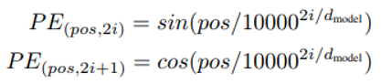
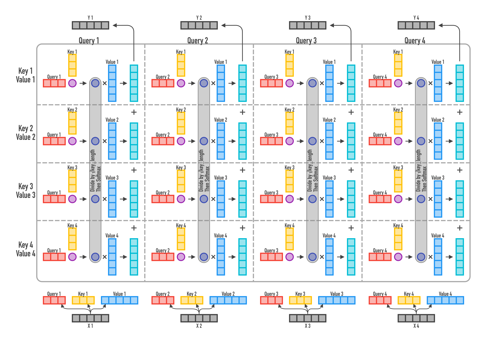
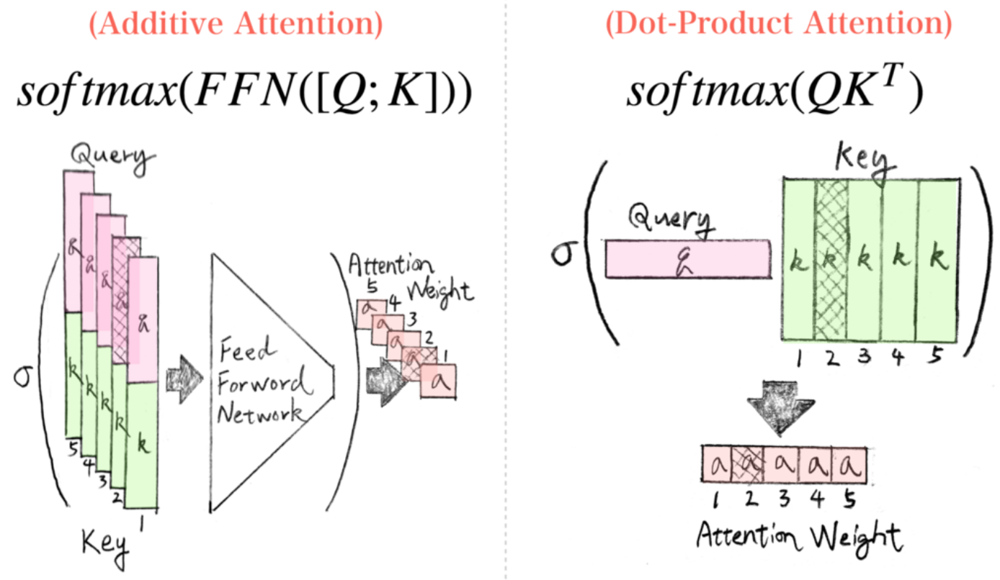

[If You Don't Understand Transformers: see these 3D charts](https://www.kaggle.com/c/jigsaw-toxic-severity-rating/discussion/286655)

### Positional Encoding


### Dot-Product Attention


### Additive Attention


## Better initialization: [T-Fixup](http://www.cs.toronto.edu/~mvolkovs/ICML2020_tfixup.pdf)

- Cosas que quitar que ya no hacen falta gracias a usar T-Fixup
  - Learning Rate WarmUp (se puede entrenar con el LR maximo desde el principio)
  - Capas LayerNorm
- La inicializacíon de los pesos es la siguiente:
  - **Gaussian initialization** N(0,d^(-1/2)) for input embeddings where d is the embedding dimension.
  - **Xavier initialization** for the rest of parameters:
    - Scale embedding layer and decode parameters by (9N)^(-1/4)
    - Scale encode parameters by (0.67 * N)^(-1/4)
    
```python
for n,p in model.named_parameters():
        if re.match(r'.*bias$|.*bn\.weight$|.*norm.*\.weight',n): continue
        gain = 1.
        if re.match(r'.*decoder.*',n): 
            gain = (9*H.trf_dec)**(-1./4.)
            if re.match(f'.*in_proj_weight$',n): gain *= (2**0.5)
        elif re.match(r'.*encoder.*',n): 
            gain = 0.67*(H.trf_enc**(-1./4.))
            if re.match(f'.*in_proj_weight$',n): gain *= (2**0.5)
        if re.match(r'^embeds|^tagembeds', n): 
            trunc_normal_(p.data,std=(4.5*(H.trf_enc+H.trf_dec))**(-1./4.)*H.trf_dim**(-0.5))
        else:                                  
            nn.init.xavier_normal_(p,gain=gain)
```

## Theory Reference

- [The Illustrated Transformer](http://jalammar.github.io/illustrated-transformer/) (Jay Alammar)
- Towards Data Science: Transformers Explained Visually
  - [Part 1: Overview of Functionality](https://towardsdatascience.com/transformers-explained-visually-part-1-overview-of-functionality-95a6dd460452)
  - [Part 2: How it works, step-by-step](https://towardsdatascience.com/transformers-explained-visually-part-2-how-it-works-step-by-step-b49fa4a64f34)


## Code Refernce

- Low Level code (from scratch): Useful for understand the transformer and make custom changes
  - [Transformers from Scratch](http://peterbloem.nl/blog/transformers)
  - [How to code The Transformer in Pytorch (Towards Data Science)](https://towardsdatascience.com/how-to-code-the-transformer-in-pytorch-24db27c8f9ec)
  - [The Annotated Transformer](http://nlp.seas.harvard.edu/2018/04/03/attention.html) (Harvard’s NLP group)
  - [Dive into Deep Learning: Transformer chapter](https://d2l.ai/chapter_attention-mechanisms/transformer.html)
- High Level code: Usful for quick use and train
  - [Simple PyTorch-Lightning Transformer Example with Greedy Decoding](https://colab.research.google.com/drive/1swXWW5sOLW8zSZBaQBYcGQkQ_Bje_bmI)
  - [Solución de competición Riid de kaggle](https://github.com/jamarju/riiid-acp-pub/blob/main/02_train.ipynb) por Javier Martín y Andrés torrubia (Transformer en Pytorch con T-Fixup init)
  - [**x-transformers**](https://github.com/lucidrains/x-transformers) por lucidrains
