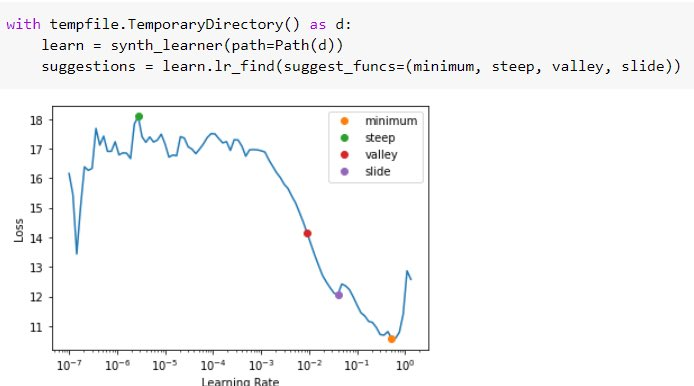
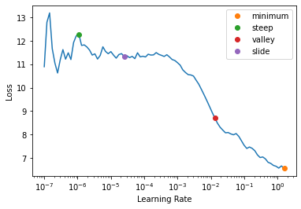

## Data augmenttion (High impact)

RandAugment
MixUp
CutMix

## Input data representation

| Hyperparameter                 | Impact | Examples                                                               |
|--------------------------------|--------|------------------------------------------------------------------------|
| Numerical  encoding            |  High  | **Normalization**: StandardScaler, QuantileTransformer, RankGauss      |
| Categorical  encoding          |  High  | Onehot with embedding layer (squre root od number of categories)       |
| Image enc. (from scratch)      |  High  | StandardScaling: Compute manually (per RGB channel) the mean and std   |
| Image enc. (transfer learning) |  High  | StandardScaling: Use the original mean and std !!!                     |
| Image data agumentation        |  High  | See ...                                                                |
| Image size (resolution)        | Medium | 120x120, 224x224, 512x512  (the higher the better)                     |
| CoordConv                      |  Low   | Encode sequence order for CNNs or tranformers (useful for spectograms) |
| Positional Encoding            |  Low   | Encode sequence order for CNNs or tranformers                          |

## Model hyperparameters

| Hyperparameter         | Impact | Examples                                       |
|------------------------|--------|------------------------------------------------|
| Layer size             | High   |                                                |
| Num of layers (depth)  | Medium |                                                |
| Weight Initialization  | Medium | Xavier (Dense+tanh), Kaiming He (Dense+ReLU)   |
| Transfer Learning      | High   | Pretrained model frozen, new layers unfrozen   |
| Nonlinearity (act fn)  | Low    | ReLU, GELU, Swish, Mish, GLU                   |
| Residual connections   | Low    | Needed if there are a lot of layers (>3)       |
| - Stochastic Depth     | Low    | If there are residual cons, add this. [paper](https://arxiv.org/abs/1603.09382) |
| Regularization         | Medium |                                                |
| - Dropout              | Medium | Scale after dropout to maintain std=1          |
| - Dropconect           | Low    |                                                |
| Inner normalization    |        |                                                |
| - Batch normalization  |        |                                                |
| - Layer normalization  |        | Usually before each layer                      |
| Weght tiying           |        | If same input & output: Langmodel, Autoencoder |
| Squeeze and Excitation |       | [paper](https://amaarora.github.io/2020/07/24/SeNet.html) |

## Training hyperparameters

| Hyperparameter         | Impact | Examples                                            |
|------------------------|--------|-----------------------------------------------------|
| Epochs                 | High   | 3..6 if transfer learning, 20..40 if from scratch   |
| BS                     | Medium | 16,32,64                                            |
| LR                     | High   | 0.001 is usally good but use Learning Rate Finder   |
| LR sched               | Medium | Constant, linear warmup + cosine decay              |
| Opimizer               | Low    | Adam or LAMB are good                               |
| Early stopping         | Low    | Not neccesary usaully                               |
| loss (Regression)      | High   | MAE, MSE, MAPE, MSLE, Huber                         |
| loss (Classification)  | High   | BinaryCrossentropy, CategCrossentropy, Hinge, Focal |
| loss + weight decay    | Low    |                                                     |
| loss + label smoothing | Low    |                                                     |

## LR Finder

There are sevaral ways of computing the lr automatically:

|                  | Developed by          | Task in mind |
|------------------|-----------------------|--------------|
| Steep (green)    | Leslie Smith (Fastai) | All tasks    |
| Minimun (orange) | Leslie Smith (Fastai) | All tasks    |
| Valley (red)     | ESRI (defualt Fastai) | Vision tasks |
| Slide (purple)   | Novetta               | NLP tasks    |

> - https://www.novetta.com/2021/03/learning-rate/
> - https://forums.fast.ai/t/automated-learning-rate-suggester/44199

## References

- Paper: [Revisiting ResNets: Improved Training and Scaling Strategies](https://arxiv.org/abs/2103.07579) (Mar 2021)
- Paper: [ResNet strikes back: An improved training procedure in timm](https://arxiv.org/abs/2110.00476) (Oct 2021)