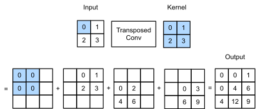

## Convolution


## Transpose Convolution (stride=1)

<p align="center"></p>

```python
X = torch.tensor([[0.0, 1.0], [2.0, 3.0]])
K = torch.tensor([[0.0, 1.0], [2.0, 3.0]])
X, K = X.reshape(1, 1, 2, 2), K.reshape(1, 1, 2, 2)

tconv = nn.ConvTranspose2d(1, 1, kernel_size=2, bias=False)
tconv.weight.data = K
tconv(X)
```

> Reference: [Dive into Deep Learning book: Transposed Convolution](https://d2l.ai/chapter_computer-vision/transposed-conv.html)


## Transpose Convolution (stride=2)

<p align="center"></p>


```python
X = torch.tensor([[0.0, 1.0], [2.0, 3.0]])
K = torch.tensor([[0.0, 1.0], [2.0, 3.0]])
X, K = X.reshape(1, 1, 2, 2), K.reshape(1, 1, 2, 2)

tconv = nn.ConvTranspose2d(1, 1, kernel_size=2, stride=2, bias=False)
tconv.weight.data = K
tconv(X)
```

#### Common issue
<p align="center"></p>


> Reference: [Dive into Deep Learning book: Transposed Convolution](https://d2l.ai/chapter_computer-vision/transposed-conv.html)


## References

- [Keras layers API](https://keras.io/api/layers)
- [Pytorch layers API](https://pytorch.org/docs/stable/nn.html)