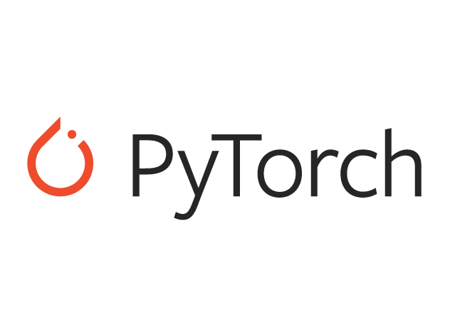

## Software

<table>
  <tr>
    <th ></th>
    <td>TensorFlow es la librería de código abierto para el aprendizaje profundo desarrollada por Google.</td>
  </tr>
  <tr>
    <th ></th>
    <td>Keras es una librería popular de redes neuronales basada en TensorFlow. Está especialmente diseñada para facilitar la creación de redes neuronales. Actualmente forma parte de la librería TensorFlow.</td>
  </tr>
  <tr>
    <th></th>
    <td>Es una librería de Deep Learning diseñada por Facebook. Muchos la consideran superior a Tensorflow por su flexibilidad y facilidad. Además permite su ejecución en GPU (y varias GPUs) para acelerar los cálculos. Es la libreria más usada entre investigadores para probar sus experimentos.</td>
  </tr>
  <tr>
    <th width="200"></th>
    <td>Fast.ai es una librería ¡y un curso! dirigido por Jeremy Howard donde se pretende hacer el Deep Learning accesible a todo el mundo. Su librería, basada en Pytorch, tiene como máxima la simplicidad y facilitar el uso de los modelos más avanzados de redes neuronales.</td>
  </tr>
</table>

# Problems

| Problem                    | Description             | Output layer          | Loss                       | 
|----------------------------|-------------------------|-----------------------|----------------------------|
| Regression                 | Real number             | 1 neuron without act  | Mean Squared Error (MSE)   |
| Binary Classification      | 2 exclusive classes     | 1 neuron + Sigmoid    | Binary Cross Entropy (BCE) |
| Multi-Class Classification | N exclusive classes     | N neurons + Softmax   | Cross-Entropy (CE)         |
| Multi-Label Classification | N non-exclusive classes | N neurons + Sigmoid   | Binary Cross Entropy (BCE) |

You can just consider the multi-label classifier as a combination of multiple independent binary classifiers

Regression losses

| Loss                                  | Pytorch               | Tensorflow            | Keras
|---------------------------------------|-----------------------|-----------------------|--------------
| Mean Absolute Error (MAE)             | torch.nn.L1Loss       | tf.keras.losses.MAE   | "mean_absolute_error"
| Mean Squared Error (MSE)              | torch.nn.MSELoss      | tf.keras.losses.MSE   |
| Mean Absolute Percentage Error (MAPE) |                       | tf.keras.losses.MAPE  | "mean_absolute_percentage_error"
| Mean Squared Logarithmic Error (MSLE) |                       | tf.keras.losses.MSLE  |
| Huber loss                            | torch.nn.SmoothL1Loss | tf.keras.losses.Huber |

Classification losses

| Loss                          | Pytorch                 | Tensorflow            | Keras
|-------------------------------|-------------------------|-----------------------|--------------
| Binary Cross Entropy (y: 0,1) | nn.BCELoss()            | tf.keras.losses.BinaryCrossentropy              "binary_crossentropy"
| Cross Entropy (y: one hot)    | nn.CrossEntropyLoss()   | tf.keras.losses.CategoricalCrossentropy         "categorical_crossentropy" 
| Cross Entropy (y: integer)    |                         | tf.keras.losses.SparseCategoricalCrossentropy   "sparse_categorical_crossentropy" 
| Hinge                         | nn.HingeEmbeddingLoss() | tf.keras.losses.Hinge                           "hinge"
| Squared Hinge                                           | tf.keras.losses.SquaredHinge                    "squared_hinge"
| Focal loss                      -                       | tfa.losses.SigmoidFocalCrossEntropy

## Backpropagation

 

### Aprende más
- [Ejemplos oficiales de Keras](https://keras.io/examples)
