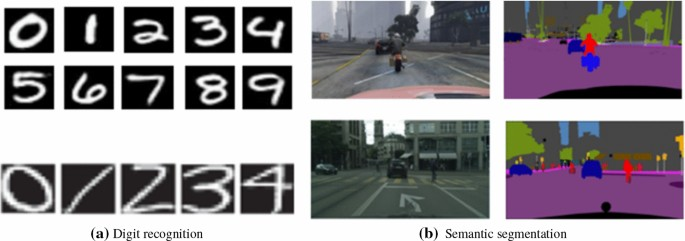

We have 2 datasets where:

- Source domain/dataset is fully labeled (Usuallay a simulation, eg GTA5)
- Target domain/dataset is unlabeled (Usuallay real life)
- Both represent the same classes
- Huge discrepancy in the pixels distribution

## Papers

- [Unsupervised Domain Adaptation by Backpropagation](https://arxiv.org/abs/1409.7495)
- [DANN: Gradient Reversal Layer](https://arxiv.org/abs/1505.07818)
- [AdaptSegNet](https://arxiv.org/abs/1802.10349)