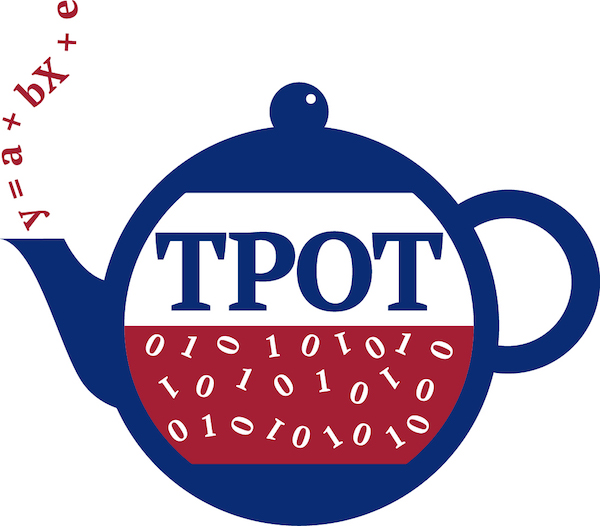

<h1 align="center">AutoML</h1>

### Problema

La tarea de optimización para maximizar la precisión de un modelo es un proceso es complicado y requiere diferentes tipos de habilidades:
1. Preprocesamiento y limepieza de los de los datos
2. La ingeniería de características
3. Conocer gran variedar de modelos y sus fortalezas y devilidades
4. La optimización de los hiperparámetros de cada modelo.
3. Habilidades de ingeniería de software para que el desarrollo del código.

### Qué hace autoML

AutoML trata de encontrar convinaciones de modelos y de hiperparámetros que maximicen la precisión de los modelos. Para ello:

1. AutoML elige una estrategia para preprocesar los datos:
   - Cómo tratar los datos desbalanceados
   - Cómo tratar los valores perdidos (missings) (eliminar, imputar,...)
   - Eliminar, reemplazar o mantener valores atípicos (outliers)
   - Cómo codificar categorías y columnas de categorías múltiples,
   - Cómo prevenir errores de memoria...
2. AutoML genera nuevas variables y selecciona las más significativas.
3. AutoML selecciona el modelo (modelos lineales, K-vecinos más cercanos, aumento de gradiente, redes neuronales...)
4. AutoML ajusta los hiperparámetros de los modelos
5. AutoML crea un conjunto estable de modelos para aumentar la puntuación si es posible

### Herramientas de AutoML

<table>
  <tr>
    <th width="200"></th>
    <td>H2o.ai es un framework de Machine Learning que implementa una función muy interesante llamada AutoML. AutoML es una abstracción que nos permite olvidarnos de elegir nosotros el mejor modelo para nuestros datos, ya que lo hace automáticamente.</td>
  </tr>
  <tr>
    <th></th>
    <td></td>
  </tr>
  <tr>
    <th></th>
    <td></td>
  </tr>
  <tr>
    <th></th>
    <td>MLjar Supervised es una herramienta de AutMl de codigo abierto de MLjar</td>
  </tr>
</table>

|  |  |  |
|--|--|--|
|  |  |  |

# Pycaret

PyCaret es una herramienta de automatización del flujo de trabajo para el aprendizaje automático supervisado y no supervisado.

Todos los módulos en PyCaret admiten la preparación de datos (más de 25 técnicas de preprocesamiento esenciales, ajuste automático de hiperparámetros, análisis e interpretación de modelos, selección automática de modelos, registro de experimentos y opciones de implementación en la nube)

# TPOT

Es una herramienta de aprendizaje automático automatizado de Python que optimiza los procesos de aprendizaje automático mediante **programación genética**.

- **[Documentación](http://epistasislab.github.io/tpot)**
- **[Github](https://github.com/EpistasisLab/tpot)**

TPOT automatizará la parte más tediosa del aprendizaje automático mediante la exploración inteligente de miles de posibles conbinaciones para encontrar la mejor para sus datos.

Una vez que TPOT ha terminado de buscar (o se cansa de esperar), le proporciona el código Python para la mejor canalización que encontró para que pueda jugar con la canalización desde allí.

**Es una biblioteca de alto nivel construida sobre numpy, pandas, tqdm, sklearn, DEAP, etc., por lo que es muy fácil de usar.**

Generar un modelo con TPOT es como si se entrenara utilizando el mejor modelo para nuestro caso de la libreria de scikit-learn, ya que se ha construido sobre él. Este modelo estará altamente optimizado y brindará los mejores resultados. 

Cada vez que ejecutemos el kernel obtendremos diferentes modelos para los mismos datos porque cada vez que ejecuta el kernel, debido al enfoque de programación genética de TPOT, pueden aparecer diferentes modelos cada vez.

### ¿Cómo funcionan los algoritmos genéticos durante generaciones?

