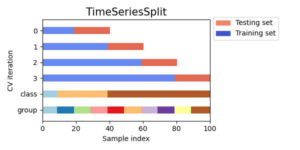

<h1 align="center">🔮 Time Series</h1>


## OPTION A: Generic models

1. **Feature engeeering**: Generate a lot of possible useful features
   - Generating 500 or 1000 features is normal
   - [Tsfresh](https://tsfresh.readthedocs.io): Automatic calculates time series features
   - [Trane](https://github.com/HDI-Project/Trane)
2. **Feature selecetion**: Pick only useful features
   - Recursive Feature Elimination (RFE)
   - Shapley feature importances
   - [shap-hypetune](https://github.com/cerlymarco/shap-hypetune) 
3. **Train any ML/DL model**
   - Gradient Boosting (LightGBM)
   - Neural Network (FeedFoward, TabNet)


## OPTION B: TimeSeries-specific models (see [Darts](https://github.com/unit8co/darts))

- Classic models (Univariate)
  - ARIMA
  - ARIMAX
  - Fractal Analysis
- Classic models (Multiivariate interpretable)
  - GAM
  - Facebook Prophet
    - [Predict Future Sales](https://www.kaggle.com/williammcmillan/predict-future-monthly-sales-with-prophet)
    - [Hourly Energy Consumption](https://www.kaggle.com/robikscube/time-series-forecasting-with-prophet)
- Deep Learning
  - LSTM
  - [N-BEATS](https://arxiv.org/abs/1905.10437)


## 🛠 Feature engeeering del tiempo

```python
# Simple
def featEng_date(df, varName):
    df['year']         = df[varName].dt.year.astype(np.int16)
    df['month']        = df[varName].dt.month.astype(np.int8)
    df['week']         = df[varName].dt.weekofyear.astype(np.int8)
    df['day_of_year']  = df[varName].dt.dayofyear.astype(np.int16)
    df['day_of_month'] = df[varName].dt.day.astype(np.int8)
    df['day_of_week']  = df[varName].dt.dayofweek.astype(np.int8)
    df['hour']         = df[varName].dt.hour.astype(np.int8)
    df['minute']       = df[varName].dt.minute.astype(np.int8)
    df['is_weekend']   = # To do
    df['is_vacation']  = # To do

# Advanced: Agregregates
periods   = ["15T", "1H", "3H"]
agregates = ["count", "mean", "std", "min", "max", "sum", "median"]
```

> - [Tsfresh](https://tsfresh.readthedocs.io): Automatic calculates time series features
> - [Trane](https://github.com/HDI-Project/Trane)


## Validación

<p align="center"></p>


## Aprende a extrapolar

[Kaggle discussion](https://www.kaggle.com/questions-and-answers/72639)

```python
import numpy as np
import matplotlib.pyplot as plt

x = np.random.uniform(low=-10, high=10, size=1000) # np.arange(-10, 10, 0.1)
y = np.sin(x) + np.random.normal(scale=0.2, size=x.shape)
plt.scatter(x,y, s=5)
```

Read this article: [Caution with Random Forest](https://medium.com/datadriveninvestor/why-wont-time-series-data-and-random-forests-work-very-well-together-3c9f7b271631)


## References

- Kaggle competition: [Optiver Realized Volatility Prediction](https://www.kaggle.com/c/optiver-realized-volatility-prediction/overview)
  - [Top 1 solution](https://www.kaggle.com/c/optiver-realized-volatility-prediction/discussion/278588)