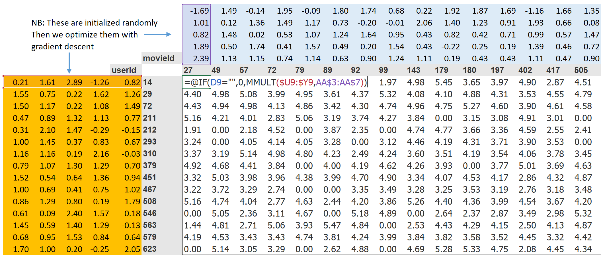

<h1 align="center">Recommendation Systems</h1>

> Existen 2 opciones
> - **Collaborative Filtering**: Para cuando hay algunas reseñas de los usuarios hacia los productos
>   - Solución lineal: [TruncatedSVD](https://scikit-learn.org/stable/modules/generated/sklearn.decomposition.TruncatedSVD.html)
>   - Solución no lineal: Red neuronal [Keras](https://keras.io/examples/structured_data/collaborative_filtering_movielens/) o [Fast.ai](https://github.com/fastai/fastbook/blob/master/08_collab.ipynb) (mejor opción)
> - Cuando no hay reseñas
>
> #### Recuerda
> Cuando un nuevo usario entra, la tienda le ofrecerá los productos más vendidos. Cuando ya compre algo, se usarán las técnicas de collaborative filtering.

# Collaborative Filtering

Se basa en la idea de que con unas pocas interacciones de USER + ITEM (por ejemplo un espectador que califica una película). Poder predecir el resto de pares USER + ITEM (cuánto le gustará esta película a este espectador que nunca la ha visto).

### Solución lineal: Descomposición matricial

Los datos que se disponen incialmente son unos pocos ejemplos. A este tipo de información se le denomina **matriz dispersa** (sparse matrix).

### Solución no lineal: Red Neuronal

La idea es para cada usuario e item crear su vector semantico que lo identifique.

### Cómo se entrena?

Se crea una red neuronal con los 2 embeddings de entrada (user e item). Y se entrena con los datos (no ceros) que disponemos en la matriz dispersa.

### Mejora: Más datos

- De un USER podemos saber su edad, sexo, productos comprados,...
- De un ITEM podemos saber su categoría, precio,...

Si metemos esa información a sus respectivos **embeddings** seguro que mejoramos las predicciones.

### Referencias
- https://www.kaggle.com/shawamar/product-recommendation-system-for-e-commerce
- https://github.com/fastai/fastbook/blob/master/08_collab.ipynb
- https://keras.io/examples/structured_data/collaborative_filtering_movielens/
- https://nipunbatra.github.io/blog/ml/2017/12/29/neural-collaborative-filtering.html
- Next Product to Buy (NPtB)

