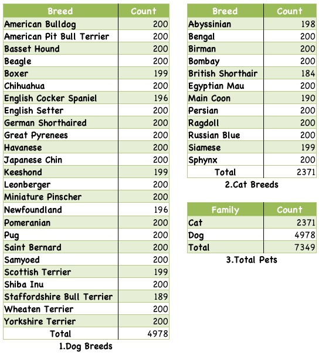

The [**Oxford-IIIT Pet Dataset**](https://www.robots.ox.ac.uk/~vgg/data/pets/) has 37 classes of pets with roughly 200 images for each class. The images have a large variations in scale, pose and lighting.

