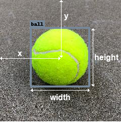

## Introduction

Get Bounding boxes around each object.

<p align="center"></p>


## 2 Tasks

- **Regression**: Find the position (`x`,`y`) and size (`w`,`h`) of each bounding box.
- **Classification**: Classify each box as a known `class` (c1,c2,c3,...).


<p align="center"></p>


## Datasets

- COCO_TINY: 200 images
- COCO_SAMPLE
- PASCAL_2007
- PASCAL_2012
- [Roboflow public datasets](https://public.roboflow.com/)


## 🏷️ Bounding Boxes Labeling Formats

- JSON
  - COCO
  - CreateML
- XML
  - Pascal VOC
- TXT
  - YOLO Darknet
  - YOLO v3 Keras
  - YOLO v4 PyTorch
  - Scaled-YOLOv4
  - YOLO v5 PyTorch
- CSV
  - Tensorflow Object Detection
  - RetinaNet Keras
  - Multiclass Classification
- Others
  - OpenAI CLIP Classification
  - Tensorflow TFRecord (binary format)


### YOLO labeling format

- One `.txt` file per image.
- If no objects in image, no `.txt` file is required.
- One row per bounding box (`class_id` `center_x` `center_y` `width` `height`).
- XYWH numbers must be normalized from 0 to 1.
- Class numbers are zero-indexed (start from 0).

<p align="center">  </p>

<p align="center">  </p>

> Source:
> - [Roboflow Formats for Bounding Boxes](https://roboflow.com/formats)
> - [YOLOv5: Train Custom Data](https://github.com/ultralytics/yolov5/wiki/Train-Custom-Data)


### Labeling Tools

- [labelImg](https://github.com/tzutalin/labelImg)
  - https://blog.roboflow.com/labelimg/
- [Computer Vision Annotation Tool (CVAT)](https://github.com/openvinotoolkit/cvat)
  - https://blog.roboflow.com/cvat/
- [Roboflow Annotate](https://docs.roboflow.com/annotate)


# Models

> - **Region-based** (Sparse Prediction) (two-stage): First determine the regions of interest (boxes), then classify the object.
> - **Single-shot** (Dense Prediction) (one-stage): Solve the two tasks together.


| Name                                                 | Description                | Date     | Type         | Grid size           | Anchors |
|:----------------------------------------------------:|----------------------------|:--------:|:------------:|---------------------|---------|
| [**R-CNN**       ](https://arxiv.org/abs/1311.2524)  |                            | Nov 2013 | Region-based |                     |        |
| [**Fast R-CNN**  ](https://arxiv.org/abs/1504.08083) |                            | Apr 2015 | Region-based |                     |        |
| [**Faster R-CNN**](https://arxiv.org/abs/1506.01497) |                            | Jun 2015 | Region-based |                     |        |
| [**YOLO v1**     ](https://arxiv.org/abs/1506.02640) | You Only Look Once         | Jun 2015 | Single-shot  | 7x7                 |        |
| [**SSD**         ](https://arxiv.org/abs/1512.02325) | Single Shot Detector       | Dec 2015 | Single-shot  |                     |        |
| [**FPN**         ](https://arxiv.org/abs/1612.03144) | Feature Pyramid Network    | Dec 2016 | Single-shot  |                     |        |
| [**YOLO v2**     ](https://arxiv.org/abs/1612.08242) | Better, Faster, Stronger   | Dec 2016 | Single-shot  |                     |        |
| [**Mask R-CNN**  ](https://arxiv.org/abs/1703.06870) |                            | Mar 2017 | Region-based |                     |        |
| [**RetinaNet**   ](https://arxiv.org/abs/1708.02002) | Focal Loss                 | Aug 2017 | Single-shot  |                     |        |
| [**PANet**       ](https://arxiv.org/abs/1803.01534) | Path Aggregation Network   | Mar 2018 | Single-shot  |                     |        |
| [**YOLO v3**     ](https://arxiv.org/abs/1804.02767) | An Incremental Improvement | Apr 2018 | Single-shot  | 13x13, 26x26, 52x52 |    3   |
| [**EfficientDet**](https://arxiv.org/abs/1911.09070) | Based on EfficientNet      | Nov 2019 | Single-shot  |                     |        |
| [**YOLO v4**     ](https://arxiv.org/abs/2004.10934) | Optimal Speed and Accuracy | Apr 2020 | Single-shot  |                     |        |
| [**PP-YOLO**     ](https://arxiv.org/abs/2007.12099) | PaddlPaddle YOLO           | Jul 2020 | Single-shot  |                     |        |
| [**YOLO v5**     ](https://github.com/ultralytics/yolov5) | No official version   | Oct 2020 | Single-shot  | 20x20, 40x40, 80x80 |    3   |

> #### Models not based on anchor boxes
> - CornerNet
> - CenterNet
> - MatrixNet
> - FCOS
> - RepPoints


## Model output = Fixed number of anchor boxes

<p align="center"></p>

Each anchor boxes consist of:

- **P**: Probability of the box
  - Needs to be **between [0,1]**
  - Final P = sigmoid(P)
-  **X** & **Y**: Position of the box
  - It's the position of the center of the box
  - Needs to be **between [0,1]**
  - Final X = sigmoid(X)
  - Final Y = sigmoid(Y)
- **W** & **H**: Size of the box
  - Needs to be **positive**
  - Final W = eᵂ
  - Final H = eᴴ
- Probability of each Class
  - One hot encoded vector
  - 80 classes by default in YOLO

> ## Post-processing (Only at inference time)
> Choose these 2 thresholds
> 1. Probability of the box threshold
> 2. IoU threshold for NMS (Non Maximum Suppression)


## Ground truth label

We place ground truth boxes in the nearest anchor box accordind to the grid.


## YOLOv5

|            | Number of anchor boxes                         | Anchor box size              | Final shape |
|------------|------------------------------------------------|------------------------------|-------------|
| **YOLOv5** | (3x20x20) + (3x40x40) + (3x80x80) = **25200**  | X+Y+W+H+P+80classes = **85** | 25200 x 85  |

<p align="center"></p>


| Model        | size<sup>(pixels) |mAP<sup>val<br>0.5:0.95 |mAP<sup>val<br>0.5 |Speed<br><sup>CPU b1<br>(ms) |params<br><sup>(M) |FLOPs<br><sup>@640 (B)
|:------------:|:---------:|-----:|:----:|:----:|:-----:|:-----:|
| **YOLOv5n**  |  640x640  | 28.4 | 46.0 |   45 |   1.9 |   4.5 |
| **YOLOv5s**  |  640x640  | 37.2 | 56.0 |   98 |   7.2 |  16.5 |
| **YOLOv5m**  |  640x640  | 45.2 | 63.9 |  224 |  21.2 |  49.0 |
| **YOLOv5l**  |  640x640  | 48.8 | 67.2 |  430 |  46.5 | 109.1 |
| **YOLOv5x**  |  640x640  | 50.7 | 68.9 |  766 |  86.7 | 205.7 |
|              |           |      |      |      |       |       |
| **YOLOv5n6** | 1280x1280 | 34.0 | 50.7 |  153 |   3.2 |   4.6 |
| **YOLOv5s6** | 1280x1280 | 44.5 | 63.0 |  385 |  16.8 |  12.6 |
| **YOLOv5m6** | 1280x1280 | 51.0 | 69.0 |  887 |  35.7 |  50.0 |
| **YOLOv5l6** | 1280x1280 | 53.6 | 71.6 | 1784 |  76.8 | 111.4 |
| **YOLOv5x6** | 1280x1280 | 54.7 | 72.4 | 3136 | 140.7 | 209.8 |


```python
model = torch.hub.load('ultralytics/yolov5', 'yolov5n', pretrained=True)

x = torch.rand(1, 3, 640, 640)
y = model(x)

# Y:   ____compressed pred_____     ______uncompressed pred______
#    ( torch.Size([1, 25200, 85]) , (torch.Size([1, 3, 80, 80, 85]),   <-- grid=80x80, #anchors=3, xyhwp+80classes = 85
#                                    torch.Size([1, 3, 40, 40, 85]),   <-- grid=40x40, #anchors=3, xyhwp+80classes = 85
#                                    torch.Size([1, 3, 20, 20, 85])) ) <-- grid=20x20, #anchors=3, xyhwp+80classes = 85
#
# Number of total boxes predicted = (3x80x80) + (3x40x40) + (3x20x20) = 25200 boxes

# THEN APPLY NMS (Non Max Suppression)
```

## Metric: mAP (mean Average Precision)

- Mean Average Precision is the **area under the precision-recall curve**
- F1 find the optimal confidence threshold in the **precision-recall curve**
- In objet detection the threshold is the **IoU threshold**.

<p align="center"></p>

> Source: Roboflow
> - [Blog post](https://blog.roboflow.com/mean-average-precision)
> - [Youtube video](https://www.youtube.com/watch?v=oqXDdxF_Wuw)


## Get more classes from classification datasets!

- Paper: [Detecting Twenty-thousand Classes using Image-level Supervision](https://arxiv.org/abs/2201.02605)
- [Github code](https://github.com/facebookresearch/Detic)
- [Twit de Ivan Prado](https://twitter.com/ivanprado/status/1480898468394713088)

## References

- Theory
  - AndrewNG videos
    - [C4W3L08 Anchor Boxes](https://www.youtube.com/watch?v=RTlwl2bv0Tg&t=4s)
    - [C4W3L09 YOLO Algorithm](https://www.youtube.com/watch?v=9s_FpMpdYW8)
  - [Decoding: State Of The Art Object Detection](https://towardsdatascience.com/decoding-state-of-the-art-object-detection-99f79d97b75d?gi=96374331d71c)
  - YOLOv4
    - https://blog.roboflow.com/a-thorough-breakdown-of-yolov4/
  - [**detectron 2**](https://ai.facebook.com/blog/-detectron2-a-pytorch-based-modular-object-detection-library-).
    - [Digging into Detectron 2 (part 4)](https://medium.com/@hirotoschwert/digging-into-detectron-2-part-4-3d1436f91266)
    - [*FPN slides*](http://presentations.cocodataset.org/COCO17-Stuff-FAIR.pdf)
- Practical Projects
  - Roboflow video porject [Detect rebbits](https://www.youtube.com/watch?v=oPvqKgq3ppc)
  - [Counting-Fish](https://github.com/jshaffer94247/Counting-Fish)
  - [IceVision](https://airctic.com)
    - [Models](https://airctic.com/0.8.1/models)
  - Video: [Tensorflow: Object Detection in 5 Hour](https://www.youtube.com/watch?v=yqkISICHH-U)
  - Video: [Pytorch: YOLOv3 from scratch](https://www.youtube.com/watch?v=Grir6TZbc1M)
  - Paperspace blog: [YOLOv3 from scratch in PyTorch](https://blog.paperspace.com/tag/series-yolo)
    - [Part 1: Understanding How YOLO works](https://blog.paperspace.com/how-to-implement-a-yolo-object-detector-in-pytorch)
    - [Part 2: Creating the layers of the network architecture](https://blog.paperspace.com/how-to-implement-a-yolo-v3-object-detector-from-scratch-in-pytorch-part-2)
    - [Part 3: Implementing the the forward pass of the network](https://blog.paperspace.com/how-to-implement-a-yolo-v3-object-detector-from-scratch-in-pytorch-part-3)
    - [Part 4: Objectness score thresholding and Non-maximum suppression](https://blog.paperspace.com/how-to-implement-a-yolo-v3-object-detector-from-scratch-in-pytorch-part-4)
    - [Part 5: Designing the input and the output pipelines](https://blog.paperspace.com/how-to-implement-a-yolo-v3-object-detector-from-scratch-in-pytorch-part-5)

