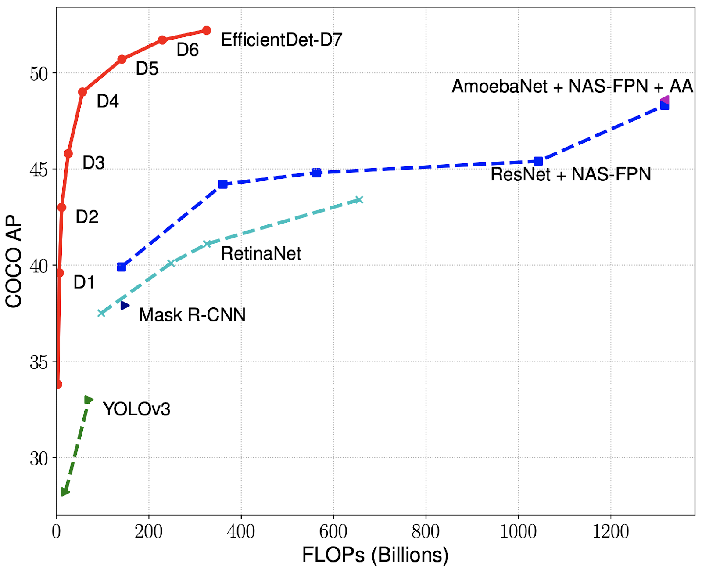

## Introduction

Get Bounding boxes around each object.

## 2 Tasks

- **Regression**: Find the position (`x`,`y`) and size (`w`,`h`) of each bounding box.
- **Classification**: Classify each box as a known `class` (c1,c2,c3,...).

## Types of models

> - **Region-based**: First determine the regions of interest (boxes), then classify the object.
> - **Single-shot**: Solve the two tasks together.

| Name                                                 | Description                | Date     | Type         |
|:----------------------------------------------------:|----------------------------|:--------:|:------------:|
| [**R-CNN**       ](https://arxiv.org/abs/1311.2524)  |                            | Nov 2013 | Region-based |
| [**Fast R-CNN**  ](https://arxiv.org/abs/1504.08083) |                            | Apr 2015 | Region-based |
| [**Faster R-CNN**](https://arxiv.org/abs/1506.01497) |                            | Jun 2015 | Region-based |
| [**YOLO v1**     ](https://arxiv.org/abs/1506.02640) | You Only Look Once         | Jun 2015 | Single-shot  |
| [**SSD**         ](https://arxiv.org/abs/1512.02325) | Single Shot Detector       | Dec 2015 | Single-shot  |
| [**FPN**         ](https://arxiv.org/abs/1612.03144) | Feature Pyramid Network    | Dec 2016 | Single-shot  |
| [**YOLO v2**     ](https://arxiv.org/abs/1612.08242) | Better, Faster, Stronger   | Dec 2016 | Single-shot  |
| [**Mask R-CNN**  ](https://arxiv.org/abs/1703.06870) |                            | Mar 2017 | Region-based |
| [**RetinaNet**   ](https://arxiv.org/abs/1708.02002) | Focal Loss                 | Aug 2017 | Single-shot  |
| [**PANet**       ](https://arxiv.org/abs/1803.01534) | Path Aggregation Network   | Mar 2018 | Single-shot  |
| [**YOLO v3**     ](https://arxiv.org/abs/1804.02767) | An Incremental Improvement | Apr 2018 | Single-shot  |
| [**EfficientDet**](https://arxiv.org/abs/1911.09070) | Based on EfficientNet      | Nov 2019 | Single-shot  |
| [**YOLO v4**     ](https://arxiv.org/abs/2004.10934) | Optimal Speed and Accuracy | Apr 2020 | Single-shot  |
| [**YOLO v5**     ](https://github.com/ultralytics/yolov5) | No official version   | Oct 2020 | Single-shot  |

## Common datasets

- COCO_TINY: 200 images
- COCO_SAMPLE
- PASCAL_2007
- PASCAL_2012

## References

- [IceVision](https://airctic.com)
  - [Models](https://airctic.com/0.8.1/models)
- [Decoding: State Of The Art Object Detection](https://towardsdatascience.com/decoding-state-of-the-art-object-detection-99f79d97b75d?gi=96374331d71c)
- [**detectron 2**](https://ai.facebook.com/blog/-detectron2-a-pytorch-based-modular-object-detection-library-).
  - [Digging into Detectron 2 (part 4)](https://medium.com/@hirotoschwert/digging-into-detectron-2-part-4-3d1436f91266)
  - [*FPN slides*](http://presentations.cocodataset.org/COCO17-Stuff-FAIR.pdf)
