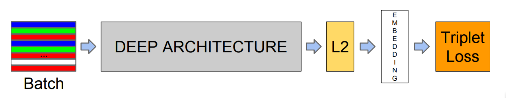
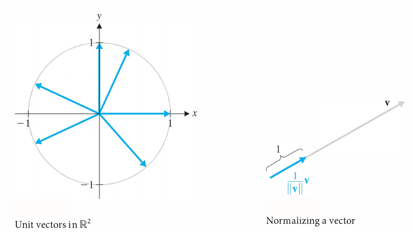
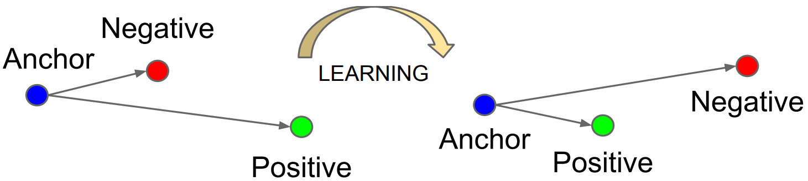
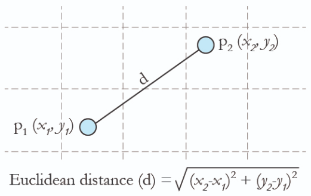

## [FaceNet](https://arxiv.org/abs/1503.03832)

Returns an embeding of 128 numbers (L2 normalized) that encodes that face. Then you find the most similar embeding to create a Face classifier.

The **L2 normalization** layer means that the embeding vector has length equals 1 (unit vector) like touching the surface of the 128-dimesional hypersphere.

The **Triplet loss** means that the training procedure is a metric learning/contrastive learning aproach. To make:
- the embedding of the same person very similar
- the embedding of the different persons very different

The distance used to compare embeddings is the **L2 distance** also known as **Euclidean distance**.

## [OpenFace](https://cmusatyalab.github.io/openface)

Pretrained models that returns the face embedding.

The following overview shows the workflow for a single input image of Sylvestor Stallone from the publicly available [LFW dataset](http://vis-www.cs.umass.edu/lfw/person/Sylvester_Stallone.html).

1. Detect faces with a pre-trained models from dlib or OpenCV.
2. Transform the face for the neural network. This repository uses dlib's real-time pose estimation with OpenCV's affine transformation to try to make the eyes and bottom lip appear in the same location on each image.
3. Use a deep neural network to represent (or embed) the face on a 128-dimensional unit hypersphere. The embedding is a generic representation for anybody's face. Unlike other face representations, this embedding has the nice property that a larger distance between two face embeddings means that the faces are likely not of the same person. This property makes clustering, similarity detection, and classification tasks easier than other face recognition techniques where the Euclidean distance between features is not meaningful.
4. Apply your favorite clustering or classification techniques to the features to complete your recognition task. See below for our examples for classification and similarity detection, including an online web demo.

## Datasets

- [CelebA Dataset](https://mmlab.ie.cuhk.edu.hk/projects/CelebA.html): Large-scale CelebFaces Attributes

