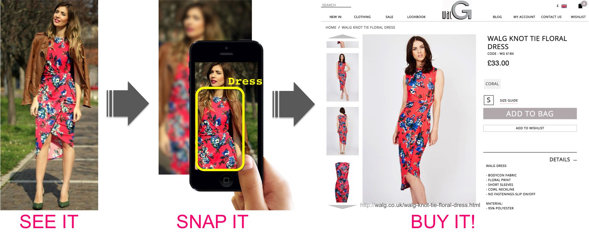

## Datasets of clothes retrieval (picture2shopitem)

| Dataset                                                                      | # pairs | # imgs  | # classes | train imgs | val imgs | test imgs |
| -----------------------------------------------------------------------------|---------|---------|-----------|------------|----------|-----------|
| [DeepFashion2](https://github.com/switchablenorms/DeepFashion2) (2019)       | 873,234 | 491,895 |      801K |       391K |      34k |       67k |
| DARN                                                                         |  91,390 | 182,780 |           |            |          |           |
| [Street2Shop](http://www.tamaraberg.com/street2shop)                         |  39,479 | 416,840 |   204.795 |            |          |           |
| Zalando                                                                      |  16,253 |  32,642 |           |            |          |           |
| MVC                                                                          |  36,656 | 156,449 |           |            |          |           |
| MPV                                                                          |  13,524 |  50,290 |           |            |          |           |
| [DeepFashion](https://mmlab.ie.cuhk.edu.hk/projects/DeepFashion.html) (2016) |         | 239.557 |   33.881  |            |          |           |

|             | WTBI | DARN | DeepFashion | ModaNet | FashionAI | DeepFashion2 |
|-------------|------|--------------------|---------|-----------|--------------|
| year        | 2015 | 2015 |        2016 |    2018 |      2018 |         2019 |
| #images     | 425K | 182K |        800K |     55K |      357K |         491K |
| #categories |   11 |   20 |          50 |      13 |        41 |           13 |
| #bboxes     |  39K |   7K |           × |       × |         × |         801K |
| #landmarks  |    × |    × |        120K |       × |      100K |         801K |
| #masks      |    × |    × |           × |    119K |         × |         801K |
| #pairs      |  39K |  91K |        251K |       × |         × |         873K |

## Models

- Review Paper [Smart Fashion: A Review of AI Applications in the Fashion & Apparel Industry](https://arxiv.org/pdf/2111.00905.pdf) Oct 2021
- Paper [On the Unreasonable Effectiveness of Centroids in Image Retrieval](https://arxiv.org/pdf/2104.13643.pdf) Apr 2021
- Competition Paper [An Effective Pipeline for a Real-world Clothes Retrieval System](https://arxiv.org/pdf/2005.12739.pdf) May 2020
- Zelando blog [Shop the Look with Deep Learning](https://engineering.zalando.com/posts/2018/09/shop-look-deep-learning.html)
  - Zalando paper [Studio2Shop](https://arxiv.org/pdf/1807.00556.pdf)