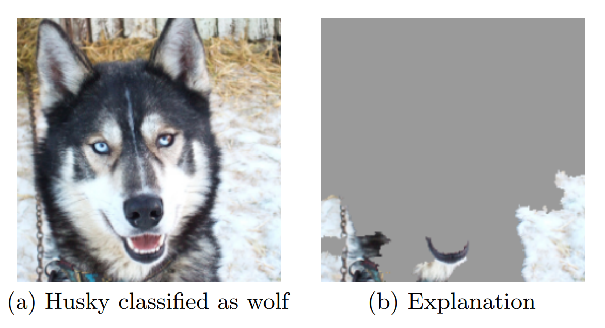

## Why explainability?

## Ways of explainability

- **AM**: Global Activation Map. Average feature map on the channel axis.
  - This shows a map all classes detected.
  - [Video by Jeremy Howard](https://youtu.be/hkBa9pU-H48?t=6005)
- **CAM**: Class Activation Map. Final feature map followed by a 1x1 convolution with the weights of the final FullyConnected.
  - This shows activation map per class.
  - Paper: [Learning Deep Features for Discriminative Localization](https://arxiv.org/abs/1512.04150)
  - Paper: [Fully Convolutional Networks for Semantic Segmentation](https://arxiv.org/abs/1411.4038)
  - [Notebook deepcourse](https://colab.research.google.com/drive/1ExOslncMdmGd3ya2hG5TXYIuShNoe2HK?usp=sharing#scrollTo=IV0MYPR_eoRE)  
- **Grad-CAM**: Final features multiplied by class gradients and the averaged.
  - [*paper*](https://arxiv.org/abs/1610.02391)
  - [Keras example](https://keras.io/examples/vision/grad_cam)
- **SmoothGrad**
  - [*paper*](https://arxiv.org/abs/1706.03825)
- **Integrated gradients**
  - [Keras example](https://keras.io/examples/vision/integrated_gradients)
- LIME
  - Paper ["Why Should I Trust You?": Explaining the Predictions of Any Classifier](https://arxiv.org/abs/1602.04938)
- Extra: [Distill: feature visualization](https://distill.pub/2017/feature-visualization)
- Extra: [Distill: building blocks](https://distill.pub/2018/building-blocks)

## References
- [*link 1*](https://github.com/utkuozbulak/pytorch-cnn-visualizations)
- [*link 2*](https://ramprs.github.io/2017/01/21/Grad-CAM-Making-Off-the-Shelf-Deep-Models-Transparent-through-Visual-Explanations.html)
- Libraries
  - [Captum](https://www.captum.ai) by Pytorch
  - [Lucid](https://github.com/tensorflow/lucid) by Tensorflow