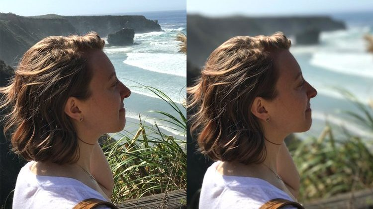

## Introduction

Predict weather each pixel belongs to the person or to the background. Then blur the background.

## Reference

- [walkwithfastai.com: Binary_Segmentation](https://walkwithfastai.com/Binary_Segmentation)