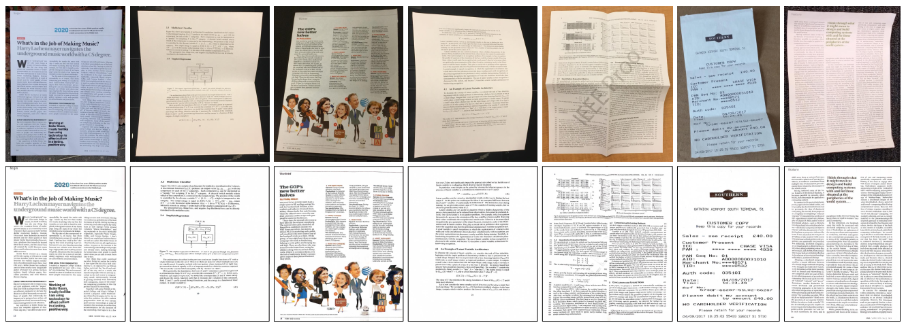
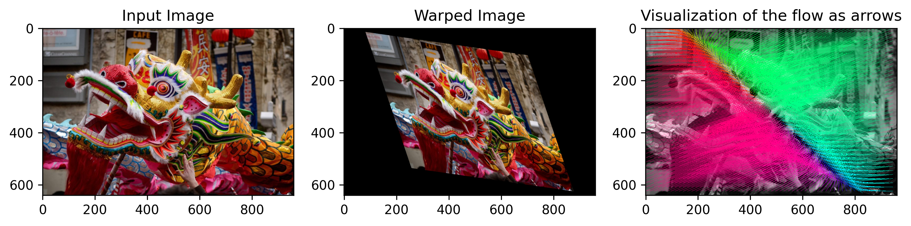

## Papers

| Paper | Year | Code | Unwarp | Light |
|:------|:----:|:----:|:------:|:-----:|
| [**DocUNet**: Document Image Unwarping via A Stacked U-Net](https://openaccess.thecvf.com/content_cvpr_2018/papers/Ma_DocUNet_Document_Image_CVPR_2018_paper.pdf) | 2018 | [Pytorch](https://github.com/teresasun/docUnet.pytorch) | ✅ | ❌ |
| [**DewarpNet**: Single-Image Document Unwarping With Stacked 3D and 2D Regression Networks](https://openaccess.thecvf.com/content_ICCV_2019/papers/Das_DewarpNet_Single-Image_Document_Unwarping_With_Stacked_3D_and_2D_Regression_ICCV_2019_paper.pdf) | 2019 | [Pytorch](https://github.com/cvlab-stonybrook/DewarpNet) | ✅ | ✅ |
| [**DocProj**: Document Rectification and Illumination Correction using a Patch-based CNN](https://arxiv.org/pdf/1909.09470.pdf) ⭐ | 2019 | [Pytorch](https://github.com/xiaoyu258/DocProj) | ✅ | ✅ |
| [**Rectinet**: A Gated and Bifurcated Stacked U-Net Module for Document Image Dewarping](https://arxiv.org/pdf/2007.09824v1.pdf) | 2020 | [Pytorch](https://github.com/DVLP-CMATERJU/RectiNet) | ✅ | ❌ |
| [**RectiNet-v2**: A stacked network architecture for document image dewarping](https://arxiv.org/pdf/2102.01120v1.pdf) | 2021 |  | ✅ | ❌ |
| [**DocTr**: Document Image Transformer for Geometric Unwarping and Illumination Correction](https://arxiv.org/pdf/2110.12942v1.pdf) ⭐⭐ | Oct 2021 | [Coming soon](https://github.com/fh2019ustc/doctr) | ✅ | ✅ |

  
## Unwarp:
- Problem formulation:
  - Input: RGB image (img of 3 channels)
  - Output: Flow displacement on the x and y axis (img of 2 channels)
    - The pixel-level 2D displacement vector field between the distorted image and the corresponding corrected image.
    - Regression per pixel

## Dataset
- https://www.kaggle.com/c/denoising-dirty-documents/data

## Other links
- https://stackoverflow.com/questions/62492457/what-could-be-the-solution-for-automatically-document-image-unwarping-caused-by
- https://github.com/thomasjhuang/deep-learning-for-document-dewarping
- https://expressexpense.com/blog/free-receipt-images-ocr-machine-learning-dataset/
- https://way2vat.com/receipt-data-augmentation-using-virtual-people-for-real-image-analysis/
- http://kth.diva-portal.org/smash/get/diva2:1463587/FULLTEXT01.pdf
