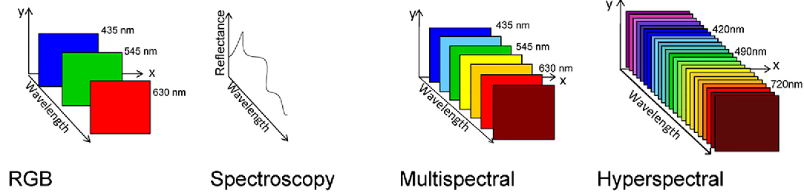
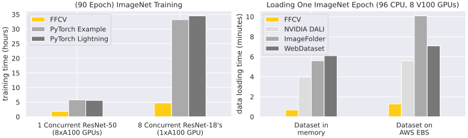
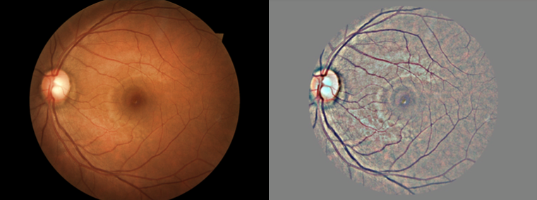
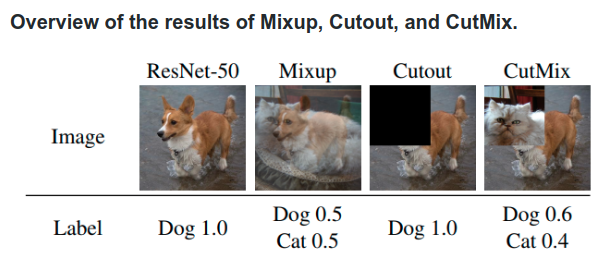

## What is an Iamge
<p align="center"></p>


## 💾 Formats

- JPG: To speed up jpeg image I/O from the disk one should not use PIL, skimage and even OpenCV but look for **`libjpeg-turbo`** or **`PyVips`**.
- PNG:
- DICOM (Medical Image)
  - [Some DICOM gotchas to be aware of (fastai)](https://www.kaggle.com/jhoward/some-dicom-gotchas-to-be-aware-of-fastai)
  - [DON'T see like a radiologist! (fastai)](https://www.kaggle.com/jhoward/don-t-see-like-a-radiologist-fastai)

## 🐇 (Fast) Dataloaders

**`ffcv`** is a dataloader that dramatically increases data throughput in model training

- [Github repo](https://github.com/libffcv/ffcv)
- [Documentation](https://docs.ffcv.io)
- [Tweet](https://twitter.com/aleks_madry/status/1483523047273512978)



> Realted work: [DeepSpeed](deepspeed.ai)

## 🔨 Image preprocessing
    
### Normalization
1. **Mean subtraction**: Center the data to zero. `x = x - x.mean()`
2. **Standardize**: Put the data on the same scale. `x = x / x.std()`
<p align="center"></p>

### PCA and Whitening
1. **Mean subtraction**: Center the data in zero. `x = x - x.mean()`
2. **Decorrelation** or **PCA**: Rotate the data until there is no correlation anymore.
3. **Whitening**: Put the data on the same scale. `whitened = decorrelated / np.sqrt(eigVals + 1e-5)`
<p align="center"></p>

> #### ZCA Whitening with Zero component analysis (ZCA) is a very similar process.

### Subtract Local Mean
<p align="center"></p>

### CLAHE: Contrast Limited Adaptive Histogram Equalization
<p align="center"></p>


## Data Augmentation

5 Libraries Options:

- Fastai
- TIMM
- Torchvision
- Albumentation
- Kornia

<p align="center"></p>


## TIMM

https://medium.com/towards-data-science/getting-started-with-pytorch-image-models-timm-a-practitioners-guide-4e77b4bf9055


## OpenCV basics

#### Write text
```python
# Put text
cv2.putText(img       = frame,
			text      = resolution_str,
			org       = (50, 100) ,
			fontFace  = cv2.FONT_HERSHEY_SIMPLEX,
			fontScale = 1,  
			color     = (255, 255, 255),
			thickness = 2)
```


# Reference

- [Cheatsheet CNN](https://stanford.edu/~shervine/teaching/cs-230/cheatsheet-convolutional-neural-networks)
- [Google tutorial image classification](https://codelabs.developers.google.com/codelabs/keras-flowers-tpu/)
- Paper:
  - [Bag of Tricks for Image Classification with CNNs](https://arxiv.org/abs/1812.01187) (2018)
  - [Compounding the Performance Improvements of Assembled Techniques in a CNN](https://arxiv.org/abs/2001.06268) (2020)
- ML training video: [Bag of Tricks](https://youtu.be/JDwAlbr1IB4) (2020)
- [awesome-data-augmentation](https://github.com/CrazyVertigo/awesome-data-augmentation)
- http://szeliski.org/Book
- A year in computer vision
  - [Part 1](https://towardsdatascience.com/a-year-in-computer-vision-part-1-of-4-eaeb040b6f46)
  - [Part 2](https://towardsdatascience.com/a-year-in-computer-vision-part-2-of-4-893e18e12be0)
  - [Part 3](https://towardsdatascience.com/a-year-in-computer-vision-part-3-of-4-861216d71607)
  - [Part 4](https://towardsdatascience.com/a-year-in-computer-vision-part-4-of-4-515c61d41a00)
- Others
  - Inceptionism
  - Capsule net
- [pyimagesearch: Start here](https://www.pyimagesearch.com/start-here)
- [Pretrained models in pytorch](https://github.com/Cadene/pretrained-models.pytorch)
- [Ranking](https://openreview.net/pdf?id=Hyzq4ZKa97),
- [comparison paper](https://arxiv.org/pdf/1810.00736.pdf)
- [Little tricks paper](https://arxiv.org/abs/1812.01187)
- [GPipe](https://arxiv.org/pdf/1811.06965v4.pdf)
