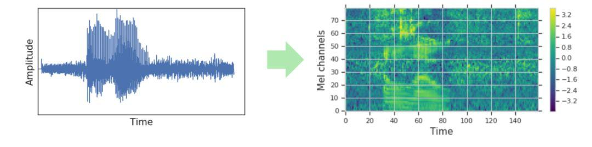
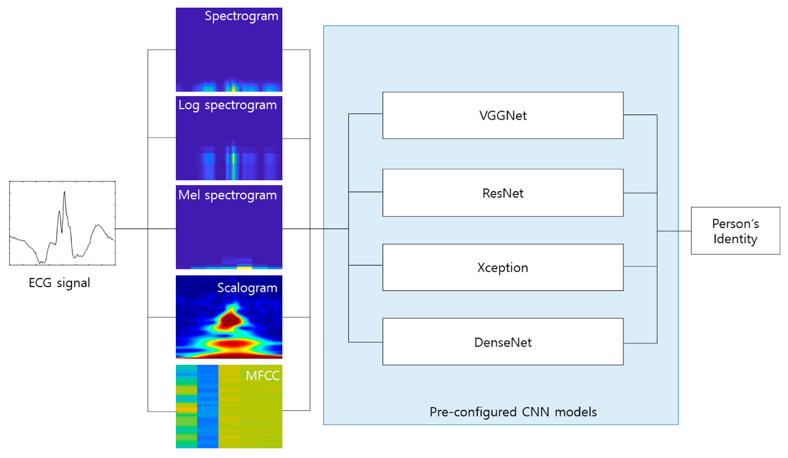
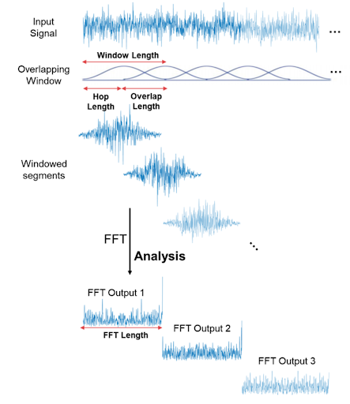

## De onda a imagen

El sonido se captura y se almacena en forma de ondas. Esta representación del sonido es la mas optima para:

- Ocupar la menor memoria posible.
- Poder ser reproducido posteriormente.

Pero esta representación de ondas (que matemáticamente se puede ver como un vector unidimensional), no es la más idónea para los sistemas de Deep Learning. Para poder sacar más información de la onda, es muy conveniente preprocesar estas ondas para tener una representación de 2 dimensiones, es decir, una representación temporal (eje x) de todas las frecuencias que aparecen (eje y).

## Tipos de espctorgramas

- **Espectrograma**: Es la transformación más conocida. Se basa en la aplicación de la transformada Fourier (FFT) en cada instante de tiempo.
- **Logaritmo del espectrograma** en el eje y. Se basa en la idea de dar más resolución a la frecuencias bajas
- **Espectograma de Mel**: Transformación similar a calcular el logaritmo del espectrograma.
- **Escalograma**: Transformación basada en Wavelets en lugar de Fourier.
- **MFCC**: Coeficientes Cepstrales en las Frecuencias de Mel

## Espectogramas

## Espectogramas de Mel

De todos estas transformaciones de sonido (de onda a espectrograma) los espectrogramas de Mel son los que mejor resultados dan en las aproximaciones de Deep Learning.

Competiciones donde las soluciones ganadoras están basadas en especs. de Mel:
- [Freesound Audio Tagging 2019](https://www.kaggle.com/c/freesound-audio-tagging-2019)
- [Rainforest Connection Species Audio Detection](https://www.kaggle.com/c/rfcx-species-audio-detection)

Buscar una representación del sonido similar a la humana es lo que se conoce como sesgo inductivo (Inductive Bias). Esto quiere decir que presuponemos algo como cierto.

Por ejemplo, para hacer un clasificador del dictado (speech recognition) o para clasificar canciones puede resultar ventajoso este Inductive Bias de aplicar la Escala Mel, ya que transforma las frecuencias según las escuchamos los humanos.

Pero para otro tipo de problemas de sonido como un clasificador de distintos tipos de sonidos de ballenas, no sería la mejor opción.

En 2018 un estudio de Google identificó los distintos sonidos de las ballenas del océano Pacífico usando solamente espectrogramas (sin la escala Mel) para sus sistemas de deep Learning.

### Time parameters (X axis):

|                   | Decription                                    | Librosa      | Usually     |
|:-----------------:|:----------------------------------------------|:------------:|-------------|
| **Sampling Rate** | Constant: Depends how the signal was recorded | `sr`         | 22kHz, 44.1kHz, 48kHz |
| **Window size**   | Number of 1D points to compute the FourTrans  | `n_fft`      | 40ms...100ms |
| **Hop size**      | Window displacement. Usually win_size // 4    | `hop_length` | 512         |
| **Window shape**  | Uniform, Normal, hann                         | `window`     | 'hann'      |

### Frequencies parameters (Y axis):

|                   | Decription                                    | Librosa      | Usually       |
|:-----------------:|:----------------------------------------------|:------------:|---------------|
| **Min frequency** | Lowest frequency (in Hz)                      | `fmin`       | 0.0           |
| **Max frequency** | Highest frequency (in Hz). If None: sr / 2.0  | `fmax`       | None          |
| **Resolution**    | Number of freqs from minFreq to maxFreq       | `n_mels`     | 224, 256, 512 |
| **Y scale**       | linear, log, mel                              |              |               |

> Why log or mel scale instead of linear?
> - The difference between 500 and 1000 Hz is obvious
> - whereas the difference between 7500 and 8000 Hz is barely noticeable.