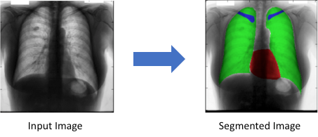
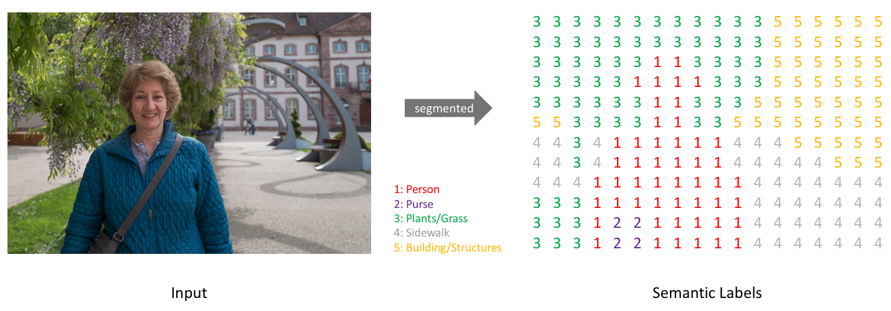
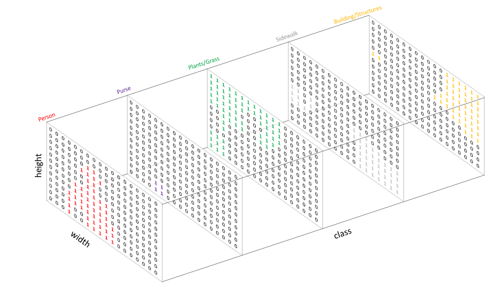
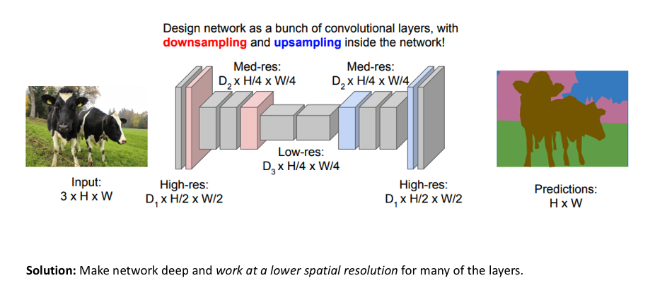
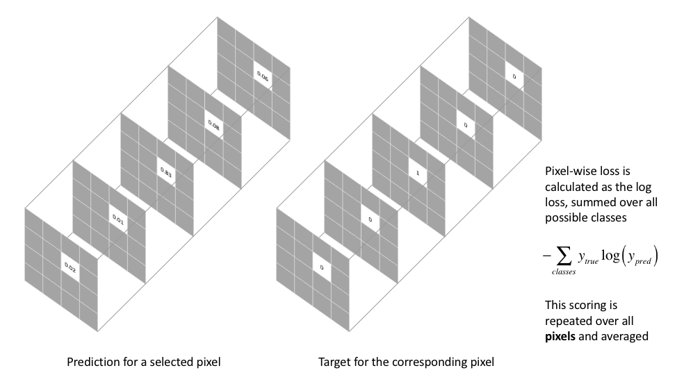
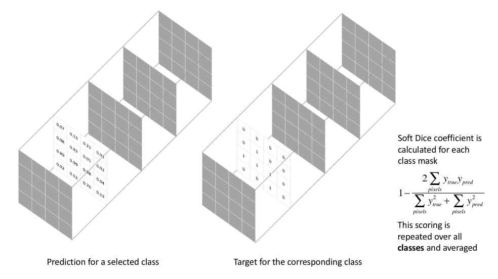
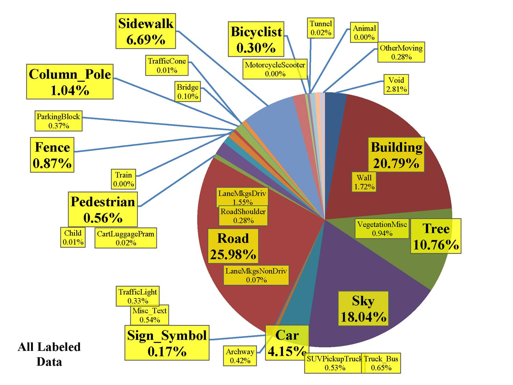

## Introduction

Instead of predicting one label (cat, dog, etc.) per image, we will predict **one label per pixel!**

Each pixel should belong to a class (cat, dog, etc.) or to a background class.

## Applications

| Autonomous driving       | Medicine                  |
|:------------------------:|:-------------------------:|
|  |  |

## Representing the task

Similar to how we treat standard categorical values, we'll create our target by one-hot encoding the class labels - essentially creating an output channel for each of the possible classes.

## Models

Note that the model backbone can be a resnet, densenet, inception...

#### Naive model: Convolutions + Transpose Convolutions (stride=2)

#### Better model: Convs + TransposeConvs(stride=2) + Residual connections = UNET

#### History of the styate of the art

| Name                                              | Description                           | Date     | Instances |
|:-------------------------------------------------:|---------------------------------------|:--------:|:---------:|
| [**FCN**      ](https://arxiv.org/abs/1411.4038)  | Fully Convolutional Network           | 2014     |           |
| [**SegNet**   ](https://arxiv.org/abs/1511.00561) | Encoder-decorder                      | 2015     |           |
| [**Unet**     ](https://arxiv.org/abs/1505.04597) | Concatenate like a densenet           | 2015     |           |
| [**DeepLab**  ](https://arxiv.org/abs/1606.00915) | Atrous Convolution and CRF            | 2016     |           |
| [**ENet**     ](https://arxiv.org/abs/1606.02147) | Real-time **video** segmentation      | 2016     |           |
| [**PSPNet**   ](https://arxiv.org/abs/1612.01105) | Pyramid Scene Parsing Net             | 2016     |           |
| [**FPN**      ](https://arxiv.org/abs/1612.03144) | Feature Pyramid Networks [**slides**](http://presentations.cocodataset.org/COCO17-Stuff-FAIR.pdf) | 2016     | Yes       |
| [**DeepLabv3**](https://arxiv.org/abs/1706.05587) | Increasing dilatation & field-of-view | 2017     |           |
| [**LinkNet**  ](https://arxiv.org/abs/1707.03718) | Adds like a resnet                    | 2017     |           |
| [**DeepLabv3+**](https://arxiv.org/abs/1802.02611)|                                       | 2018     |           |
| [**PANet**    ](https://arxiv.org/abs/1803.01534) | Path Aggregation Network              | 2018     | Yes       |
| [**Panop FPN**](https://arxiv.org/abs/1901.02446) | Panoptic Feature Pyramid Networks     | 2019     | ?         |
| [**PointRend**](https://arxiv.org/abs/1912.08193) | Image Segmentation as Rendering       | 2019     | ?         |

## Metric ands losses

- **[Pixel-wise cross entropy](posts/img/Pixel-wise-CE.png)**
- **IoU** (F0): `(Pred ∩ GT)/(Pred ∪ GT)` = `TP / TP + FP * FN`
- **[Dice](posts/img/Dice.png)** (F1): `2 * (Pred ∩ GT)/(Pred + GT)` = `2·TP / 2·TP + FP * FN`
  - Range from `0` (worst) to `1` (best)
  - In order to formulate a loss function which can be minimized, we'll simply use `1 − Dice`

### Pixel-wise cross entropy

### Dice loss

## Notebook: CAMVID dataset

## Reference

- Blog: [An overview of semantic image segmentation](https://www.jeremyjordan.me/semantic-segmentation)
- [Image Segmentation Using Deep Learning: A Survey](https://arxiv.org/abs/2001.05566)  Nov 2020
- https://www.jeremyjordan.me/semantic-segmentation
- https://www.jeremyjordan.me/evaluating-image-segmentation-models
- Check [Res2Net](https://arxiv.org/abs/1904.01169)
- Check [catalyst segmentation tutorial (Ranger opt, albumentations, ...)](https://colab.research.google.com/github/catalyst-team/catalyst/blob/master/examples/notebooks/segmentation-tutorial.ipynb#scrollTo=Zm7JsNrczOQG)
- [this repo](https://github.com/qubvel/segmentation_models)