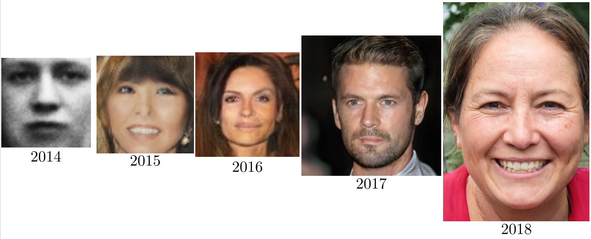

> #### Reference
> - Check this [kaggle competition](https://www.kaggle.com/c/generative-dog-images)
> - [Fast.ai decrappify & DeOldify](https://www.fast.ai/2019/05/03/decrappify)

### Applications:
- Image to image problems
  - Super Resolution
  - Black and white colorization
    - [Colorful Image Colorization](https://arxiv.org/abs/1603.08511) 2016
    - [DeOldify](https://github.com/jantic/DeOldify) 2018, SotA
  - Decrappification
  - Artistic style
  - Data augmentation:
-  New images
   - From latent vector
   - From noise image
  
### Training
0. Generate **labeled dataset**
   - Edit ground truth images to become the input images.
   - This step depend of the problem: input data could be crappified, black & white, noise, vector ...
1. Train the **GENERATOR** (most of the time)
   - Model: **UNET** with pretrained **ResNet** backbone + **self attention** + spectral normalization
   - Loss: Mean squared pixel error or L1 loss
   - Better Loss: Perceptual Loss (aka Feature Loss)
2. Save generated images.
3. Train the **DISCRIMINATOR** (aka Critic) with real vs generated images.
   -  Model: Pretrained **binary classifier** + spectral normalization
4. Train **BOTH** nets (ping-pong) with 2 losses (original and discriminator).
   - With a **NoGAN** approach, this step is very quick (a 5% of the total training time, more o less)
   - With a traditional progressively-sized GAN approach, this step is very slow.
   - If train so much this step, you start seeing artifacts and glitches introduced in renderings.

### Tricks
- **Self-Attention** GAN ([SAGAN](https://arxiv.org/abs/1805.08318)): For spatial coherence between regions of the generated image
- Spectral normalization
- Video
  - pix2pixHD
  - COVST: Naively add temporal consistency.
  - [Video-to-Video Synthesis](https://tcwang0509.github.io/vid2vid/)
  
#### GANs (order chronologically)

| Paper                                            | Name                        | Date     | Creator     |
|:------------------------------------------------:|-----------------------------|:--------:|:-----------:|
| [**GAN**     ](https://arxiv.org/abs/1406.2661)  | Generative Adversarial Net  | Jun 2014 | Goodfellow  |
| [**CGAN**    ](https://arxiv.org/abs/1411.1784)  | Conditional GAN             | Nov 2014 | Montreal U. |
| [**DCGAN**   ](https://arxiv.org/abs/1511.06434) | Deep Convolutional GAN      | Nov 2015 | Facebook    |
| [**GAN v2**  ](https://arxiv.org/abs/1606.03498) | Improved GAN                | Jun 2016 | Goodfellow  |
| [**InfoGAN** ](https://arxiv.org/abs/1606.03657) |                             | Jun 2016 | OpenAI      |
| [**CoGAN**   ](https://arxiv.org/abs/1606.07536) | Coupled GAN                 | Jun 2016 | Mitsubishi  |
| [**Pix2Pix** ](https://arxiv.org/abs/1611.07004) | Image to Image              | Nov 2016 | Berkeley    |
| [**StackGAN**](https://arxiv.org/abs/1612.03242) | Text to Image               | Dec 2016 | Baidu       |
| [**WGAN**    ](https://arxiv.org/abs/1701.07875) | Wasserstein GAN             | Jan 2017 | Facebook    |
| [**CycleGAN**](https://arxiv.org/abs/1703.10593) | Cycle GAN                   | Mar 2017 | Berkeley    |
| [**ProGAN**  ](https://arxiv.org/abs/1710.10196) | Progressive growing of GAN  | Oct 2017 | NVIDIA      |
| [**SAGAN**   ](https://arxiv.org/abs/1805.08318) | Self-Attention GAN          | May 2018 | Goodfellow  |
| [**BigGAN**  ](https://arxiv.org/abs/1809.11096) | Large Scale GAN Training    | Sep 2018 | Google      |
| [**StyleGAN**](https://arxiv.org/abs/1812.04948) | Style-based GAN             | Dec 2018 | NVIDIA      |

> 2014 (GAN) → 2015 (DCGAN) → 2016 (CoGAN) → 2017 (ProGAN) → 2018 (StyleGAN)
> 

#### GANS (order by type)
- Better error function
  - LSGAN https://arxiv.org/abs/1611.04076
  - RaGAN https://arxiv.org/abs/1807.00734
  - GAN v2 (Feature Matching) https://arxiv.org/abs/1606.03498
- **CGAN**: Only one particular class generation (instead of blurry multiclass).
- **InfoGAN**: Disentaged representation (Dec. 2016, OpenAI)
  - **CycleGAN**: Domain adaptation (Oct. 2017, Berkeley)
  - **SAGAN**: Self-Attention GAN (May. 2018, Google)
  - **Relativistic GAN**: Rethinking adversary (Jul. 2018, LD Isntitute)
  - **Progressive GAN**: One step at a time (Oct 2017, NVIDIA)
- **DCGAN**: Deep Convolutional GAN (Nov. 2016, Facebook)
  - **BigGAN**: SotA for image synthesis. Same GAN techiques, but larger. Increase model capacity & batch size.
  - **BEGAN**: Balancing Generator (May. 2017, Google)
  - **WGAN**: Wasserstein GAN. Learning distribution (Dec. 2017, Facebook)
- **VAEGAN**: Improving VAE by GANs (Feb. 2016, TU Denmark)
- **SeqGAN**: Sequence learning with GANs (May 2017, Shangai Univ.)

## Resources

- [10 types of GANs](https://amp.reddit.com/r/MachineLearning/comments/8z97mx/r_math_insights_from_10_gan_papers_infogans)
- [floydhub: GANs, the Story So Far](https://blog.floydhub.com/gans-story-so-far)
- [infoGAN](http://www.depthfirstlearning.com/2018/InfoGAN)