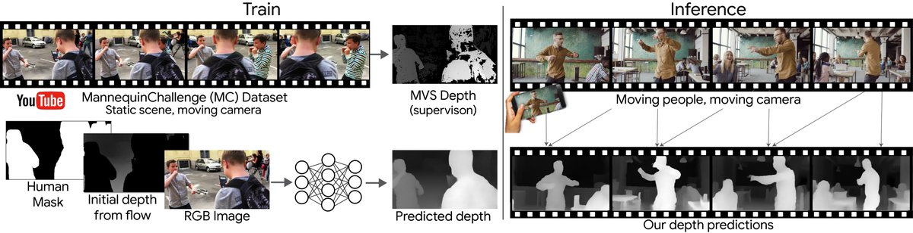
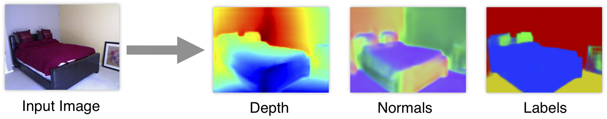

### Depth segmentation

Learning the Depths of Moving People by Watching Frozen People (mannequin challenge) [paper](https://arxiv.org/abs/1904.11111)

### Surface normal segmentation

[paper](https://arxiv.org/abs/1411.4958) (2014)

